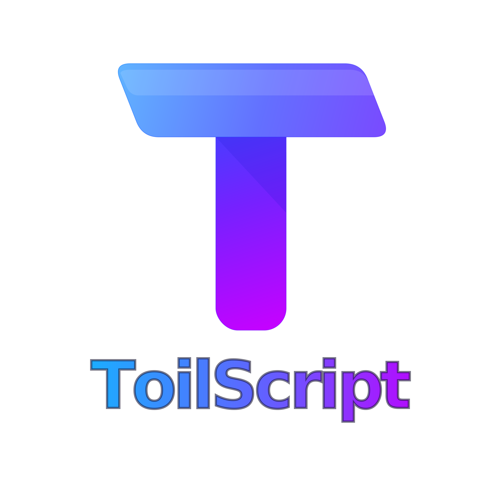

<p align="center">
  <a href="https://toil.org" target="_blank" rel="noopener"></a>
</p>

<p align="center">
  <a href="https://www.npmjs.com/package/toilscript"></a>
  <a href="https://github.com/dacely-cloud/toilscript/releases"></a>
</p>

---

## ToilScript

**ToilScript is a fork of [AssemblyScript](https://github.com/AssemblyScript/assemblyscript)** that tracks the latest upstream and adds language features not yet available in the official release.

---

## Installation

```sh
npm install toilscript
```

### Usage

This fork is a drop-in replacement for ToilScript. Simply replace your import:

```json
{
  "dependencies": {
    "toilscript": "^0.1.0"
  }
}
```

Or if migrating from official ToilScript:

```sh
npm uninstall toilscript
npm install toilscript
```

The CLI is `toilscript` (with `toilinit` to scaffold a project):

```sh
npx toilscript your-file.ts --outFile output.wasm
```

---

## Development instructions

A development environment can be set up by cloning the repository:

```sh
git clone https://github.com/dacely-cloud/toilscript.git
cd toilscript
npm install
npm link
```

The link step is optional and makes the development instance available globally. The full process is documented as part of the repository:

* [Compiler instructions](./src)
* [Runtime instructions](./std/assembly/rt)
* [Test instructions](./tests)
