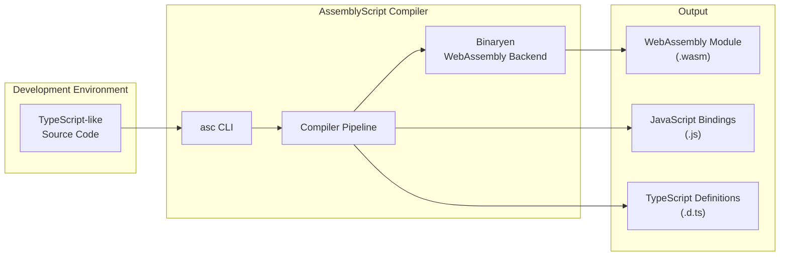
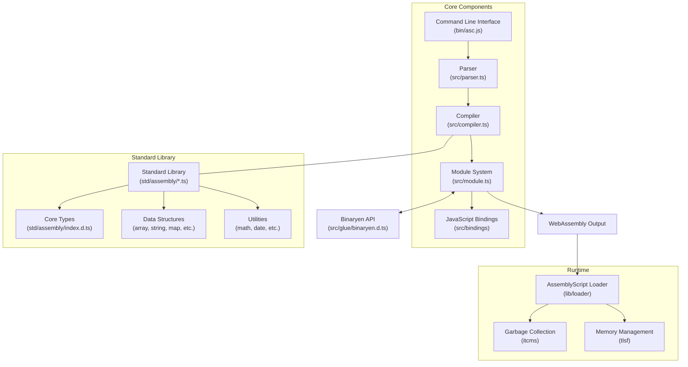
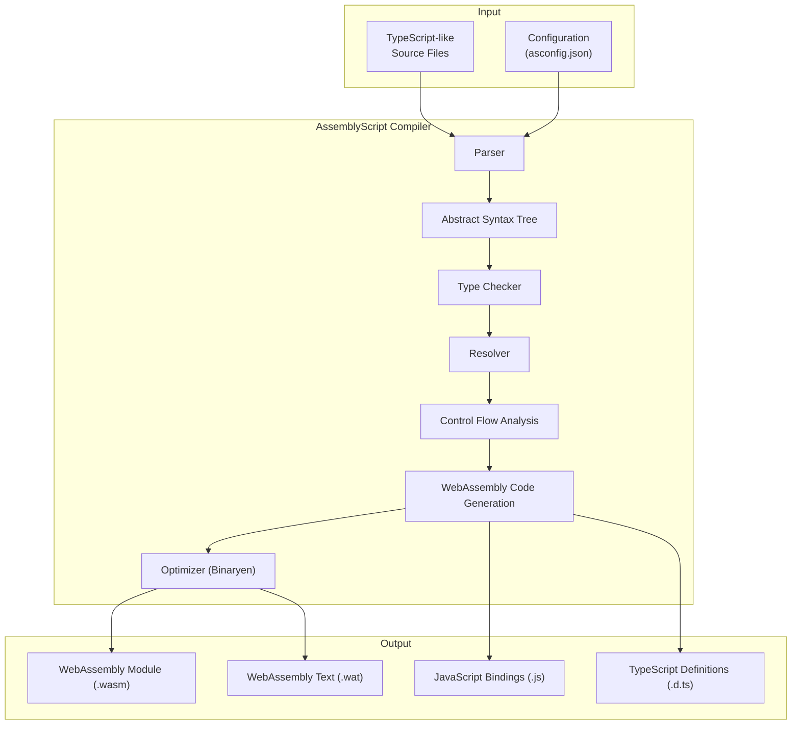
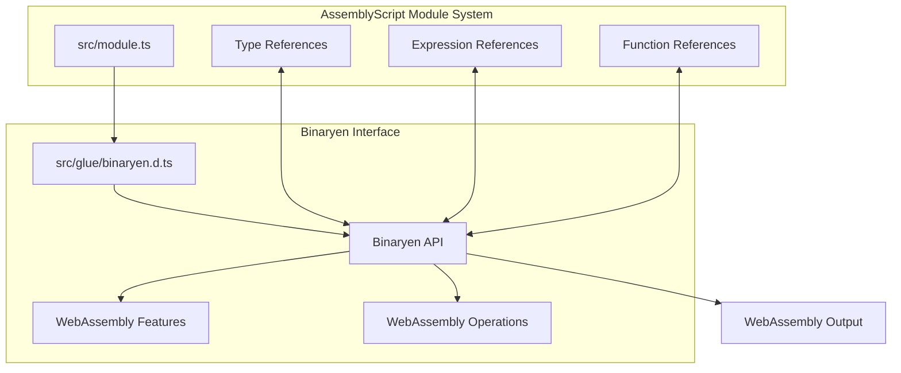
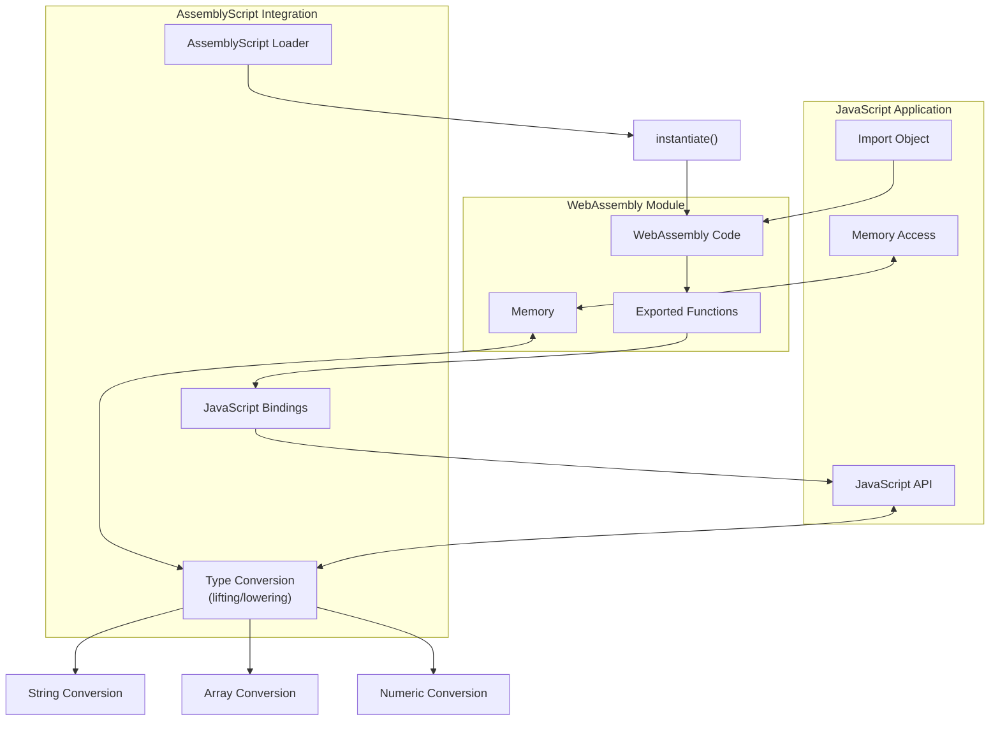
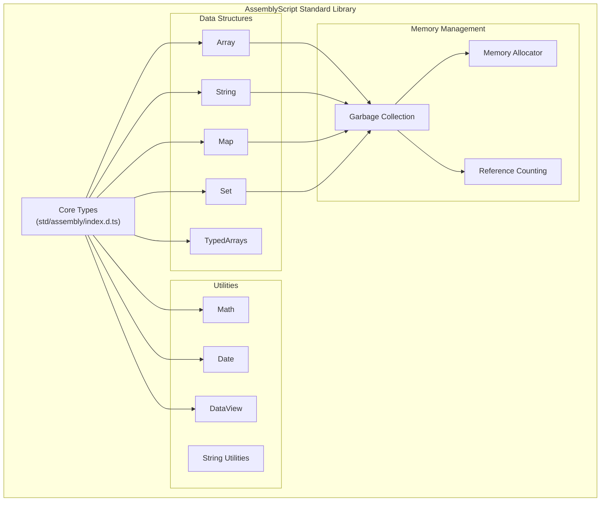
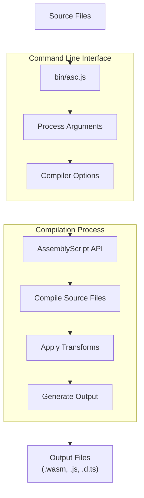

# Overview

Relevant source files

The following files were used as context for generating this wiki page:

- [README.md](https://github.com/AssemblyScript/assemblyscript/blob/4e7734b8/README.md)
- [bin/asc.js](https://github.com/AssemblyScript/assemblyscript/blob/4e7734b8/bin/asc.js)
- [package-lock.json](https://github.com/AssemblyScript/assemblyscript/blob/4e7734b8/package-lock.json)
- [package.json](https://github.com/AssemblyScript/assemblyscript/blob/4e7734b8/package.json)
- [src/glue/binaryen.d.ts](https://github.com/AssemblyScript/assemblyscript/blob/4e7734b8/src/glue/binaryen.d.ts)
- [src/module.ts](https://github.com/AssemblyScript/assemblyscript/blob/4e7734b8/src/module.ts)

AssemblyScript is a TypeScript-like language that compiles to WebAssembly. This document provides a high-level overview of the AssemblyScript repository architecture and its key components, serving as an entry point to understand the codebase.

For detailed information about specific components, refer to their respective wiki pages:
- For compiler architecture details, see [Compiler Architecture](#2)
- For standard library information, see [Standard Library](#3) 
- For CLI usage, see [Command Line Interface](#4)
- For JavaScript integration, see [JavaScript Integration](#5)
- For memory management, see [Memory Management](#6)

## What is AssemblyScript?

AssemblyScript compiles a strict variant of TypeScript (essentially TypeScript with precise numeric types) to WebAssembly. It leverages the Binaryen compiler infrastructure to generate optimized WebAssembly modules while providing a familiar developer experience through TypeScript-like syntax.

Sources: [package.json:2-4](https://github.com/AssemblyScript/assemblyscript/blob/4e7734b8/package.json#L2-L4), [README.md:13-14](https://github.com/AssemblyScript/assemblyscript/blob/4e7734b8/README.md#L13-L14)

## Repository Architecture

The AssemblyScript codebase is organized into several major components that work together to compile TypeScript-like code to WebAssembly.

Sources: [package.json:42-67](https://github.com/AssemblyScript/assemblyscript/blob/4e7734b8/package.json#L42-L67), [src/module.ts:1-10](https://github.com/AssemblyScript/assemblyscript/blob/4e7734b8/src/module.ts#L1-L10), [bin/asc.js:1-36](https://github.com/AssemblyScript/assemblyscript/blob/4e7734b8/bin/asc.js#L1-L36)

## Compilation Pipeline

The AssemblyScript compiler converts TypeScript-like source code into WebAssembly modules in several stages. The entire pipeline integrates closely with Binaryen for WebAssembly generation and optimization.

Sources: [bin/asc.js:29-33](https://github.com/AssemblyScript/assemblyscript/blob/4e7734b8/bin/asc.js#L29-L33), [package.json:72-96](https://github.com/AssemblyScript/assemblyscript/blob/4e7734b8/package.json#L72-L96)

## Module System and Binaryen Integration

The AssemblyScript module system is a core part of the compiler that interfaces with Binaryen to generate WebAssembly. It acts as a thin wrapper around Binaryen's C-API.

Sources: [src/module.ts:1-20](https://github.com/AssemblyScript/assemblyscript/blob/4e7734b8/src/module.ts#L1-L20), [src/glue/binaryen.d.ts:1-11](https://github.com/AssemblyScript/assemblyscript/blob/4e7734b8/src/glue/binaryen.d.ts#L1-L11), [package.json:27-29](https://github.com/AssemblyScript/assemblyscript/blob/4e7734b8/package.json#L27-L29)

## JavaScript Integration and Interoperability

AssemblyScript provides seamless integration with JavaScript through generated bindings and a loader. This enables efficient communication between WebAssembly modules and JavaScript host environments.

Sources: [package.json:42-60](https://github.com/AssemblyScript/assemblyscript/blob/4e7734b8/package.json#L42-L60)

## Standard Library

AssemblyScript includes a comprehensive standard library that provides essential data structures and utilities similar to TypeScript's standard library but optimized for WebAssembly.

Sources: [package.json:98-106](https://github.com/AssemblyScript/assemblyscript/blob/4e7734b8/package.json#L98-L106)

## Project Requirements and Development

AssemblyScript requires Node.js 18+ and npm 10+ for development. The project uses:

| Dependency | Purpose |
|------------|---------|
| Binaryen | WebAssembly compiler infrastructure |
| Long | 64-bit integer support |
| TypeScript | Type checking and development |
| ESBuild | Bundling |
| ESLint | Code quality |

To set up a development environment:

1. Clone the repository
2. Install dependencies with `npm install`
3. Optionally link globally with `npm link`
4. Build the compiler with `npm run build`

Sources: [package.json:22-39](https://github.com/AssemblyScript/assemblyscript/blob/4e7734b8/package.json#L22-L39), [README.md:37-52](https://github.com/AssemblyScript/assemblyscript/blob/4e7734b8/README.md#L37-L52)

## Command Line Interface

The AssemblyScript compiler is accessible through the `asc` command-line interface, which provides various options for compiling AssemblyScript code.

Sources: [bin/asc.js:1-36](https://github.com/AssemblyScript/assemblyscript/blob/4e7734b8/bin/asc.js#L1-L36), [package.json:68-71](https://github.com/AssemblyScript/assemblyscript/blob/4e7734b8/package.json#L68-L71)

## Summary

AssemblyScript provides a TypeScript-like development experience for WebAssembly, bridging the gap between high-level TypeScript and low-level WebAssembly. Its architecture is designed to leverage the strengths of both languages while providing efficient compilation and runtime performance.