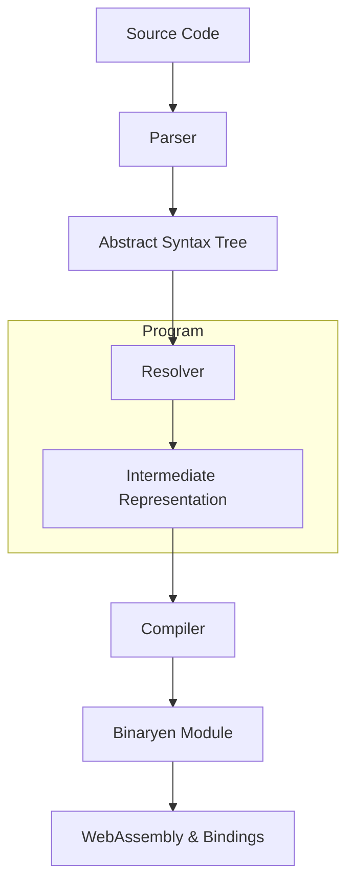
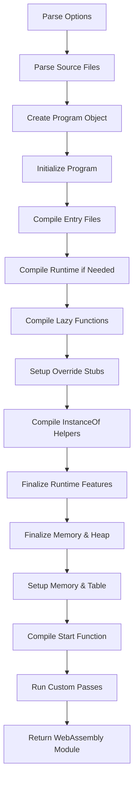
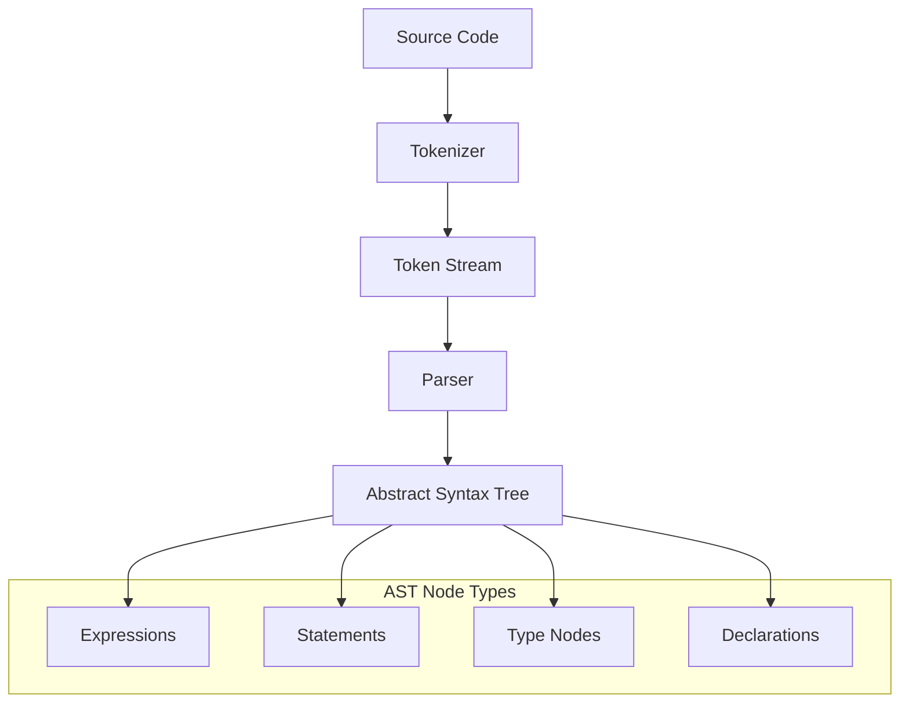
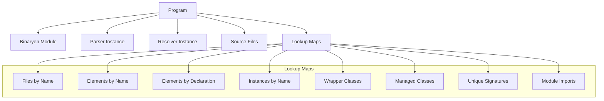
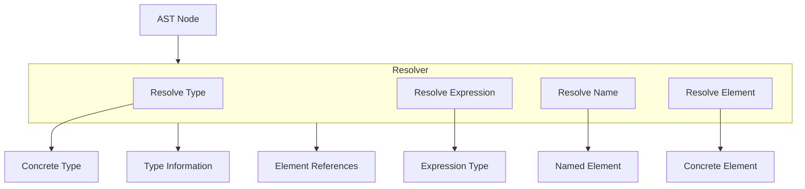
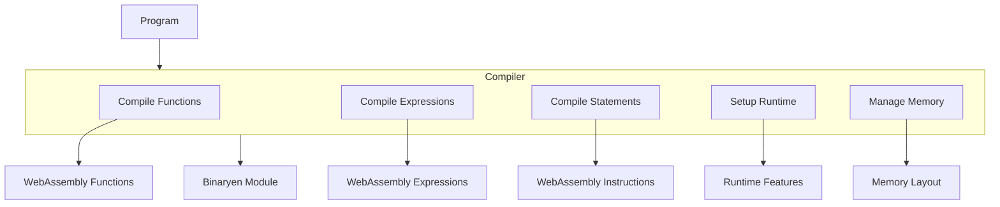
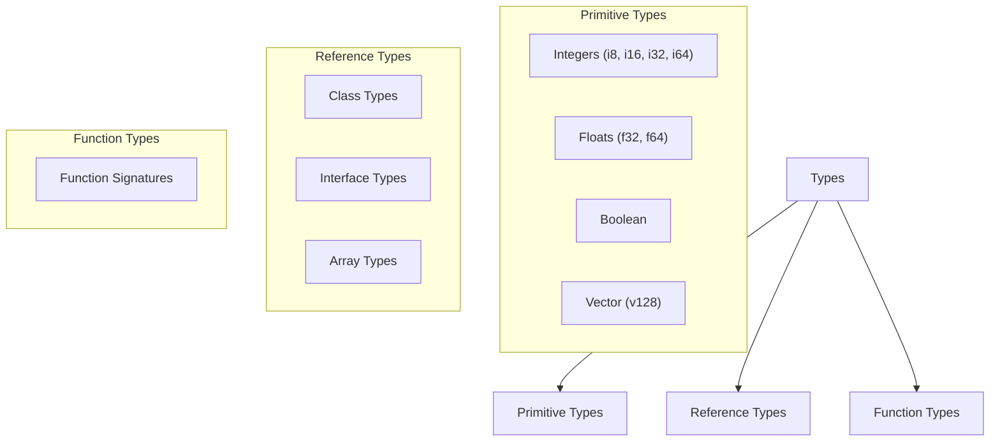
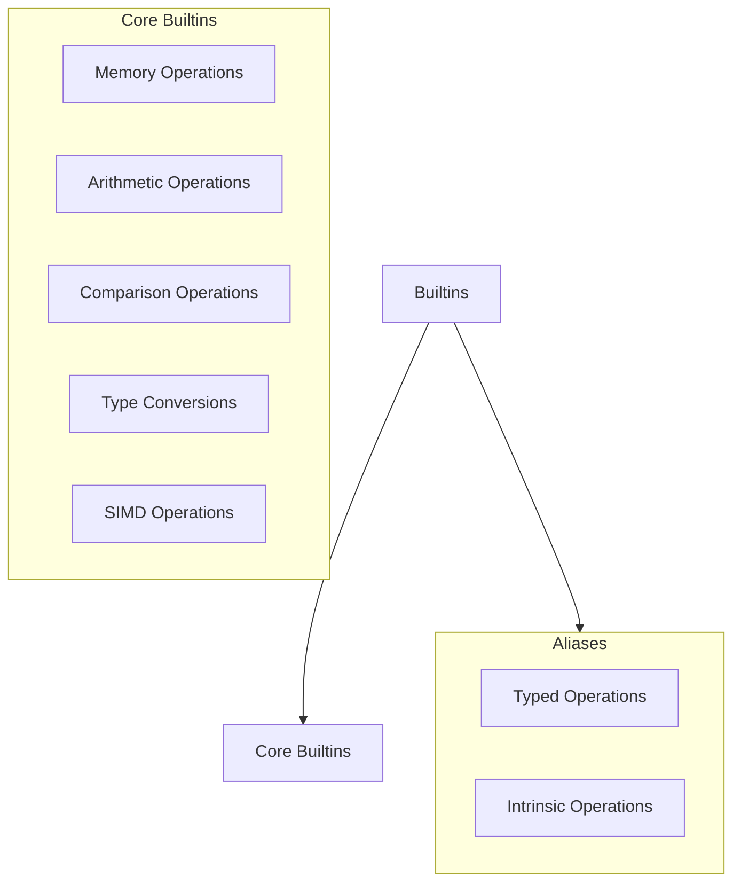
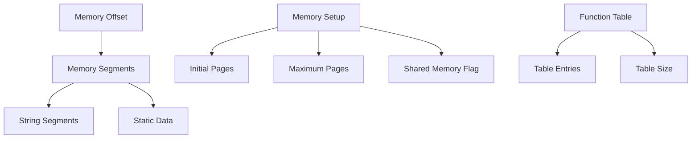
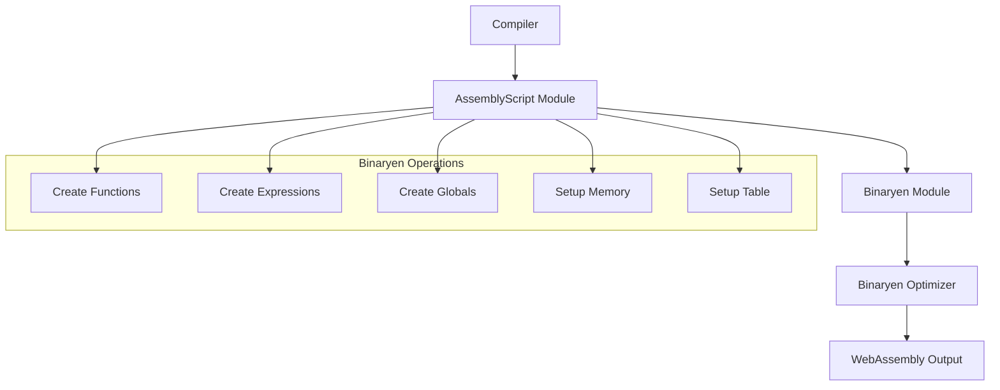

# Compiler Architecture

Relevant source files

The following files were used as context for generating this wiki page:

- [src/ast.ts](https://github.com/AssemblyScript/assemblyscript/blob/4e7734b8/src/ast.ts)
- [src/builtins.ts](https://github.com/AssemblyScript/assemblyscript/blob/4e7734b8/src/builtins.ts)
- [src/common.ts](https://github.com/AssemblyScript/assemblyscript/blob/4e7734b8/src/common.ts)
- [src/compiler.ts](https://github.com/AssemblyScript/assemblyscript/blob/4e7734b8/src/compiler.ts)
- [src/diagnosticMessages.json](https://github.com/AssemblyScript/assemblyscript/blob/4e7734b8/src/diagnosticMessages.json)
- [src/diagnostics.ts](https://github.com/AssemblyScript/assemblyscript/blob/4e7734b8/src/diagnostics.ts)
- [src/extra/ast.ts](https://github.com/AssemblyScript/assemblyscript/blob/4e7734b8/src/extra/ast.ts)
- [src/parser.ts](https://github.com/AssemblyScript/assemblyscript/blob/4e7734b8/src/parser.ts)
- [src/program.ts](https://github.com/AssemblyScript/assemblyscript/blob/4e7734b8/src/program.ts)
- [src/resolver.ts](https://github.com/AssemblyScript/assemblyscript/blob/4e7734b8/src/resolver.ts)
- [src/tokenizer.ts](https://github.com/AssemblyScript/assemblyscript/blob/4e7734b8/src/tokenizer.ts)
- [src/types.ts](https://github.com/AssemblyScript/assemblyscript/blob/4e7734b8/src/types.ts)

The AssemblyScript compiler transforms TypeScript code into WebAssembly binary modules. This page documents the architecture of the compiler, its core components, and how they interact to transform source code into executable WebAssembly. For information about using the compiler API programmatically, see [Compiler API](#4.1).

## Core Components

The AssemblyScript compiler is composed of several key components that work together in a pipeline:

- **Parser**: Transforms source code into an Abstract Syntax Tree (AST)
- **Resolver**: Resolves types, symbols, and references from the AST
- **Program**: Holds the intermediate representation (IR) of the code
- **Compiler**: Transforms the IR into WebAssembly via Binaryen
- **Module**: Interface to Binaryen for WebAssembly generation

Sources: [src/parser.ts:103-443](https://github.com/AssemblyScript/assemblyscript/blob/4e7734b8/src/parser.ts:103-443#L103-L443), [src/resolver.ts:118-177](https://github.com/AssemblyScript/assemblyscript/blob/4e7734b8/src/resolver.ts:118-177#L118-L177), [src/program.ts:429-481](https://github.com/AssemblyScript/assemblyscript/blob/4e7734b8/src/program.ts:429-481#L429-L481), [src/compiler.ts:429-1084](https://github.com/AssemblyScript/assemblyscript/blob/4e7734b8/src/compiler.ts:429-1084#L429-L1084)

## Compilation Pipeline

The compilation process involves multiple stages, from parsing to output generation:

The pipeline starts with parsing options and source files, creates a Program object, and then proceeds through various compilation stages before producing a WebAssembly module.

Sources: [src/compiler.ts:480-756](https://github.com/AssemblyScript/assemblyscript/blob/4e7734b8/src/compiler.ts:480-756#L480-L756)

## Parser

The Parser transforms source code into an Abstract Syntax Tree (AST) that represents the structure of the program. The AssemblyScript parser is specialized for the AssemblyScript subset of TypeScript.

Key responsibilities:
- Tokenizing source code
- Building AST nodes
- Handling imports and exports
- Parsing declarations, expressions, and statements

The parser uses a tokenizer to break source code into tokens, which are then combined into AST nodes. The AST represents the syntactic structure of the program and forms the basis for further compilation steps.

Sources: [src/parser.ts:103-443](https://github.com/AssemblyScript/assemblyscript/blob/4e7734b8/src/parser.ts:103-443#L103-L443), [src/ast.ts:47-428](https://github.com/AssemblyScript/assemblyscript/blob/4e7734b8/src/ast.ts:47-428#L47-L428), [src/tokenizer.ts:41-177](https://github.com/AssemblyScript/assemblyscript/blob/4e7734b8/src/tokenizer.ts:41-177#L41-L177)

## Program

The Program class serves as the intermediate representation container, holding all the elements, types, and signatures used during compilation.

Key responsibilities:
- Managing source files
- Maintaining the element hierarchy
- Storing type information
- Providing lookups for elements and types

The Program maintains various lookup maps for efficient access to elements and types. It also holds references to the Parser, Resolver, and Binaryen Module, serving as the central hub of the compilation process.

Sources: [src/program.ts:429-481](https://github.com/AssemblyScript/assemblyscript/blob/4e7734b8/src/program.ts:429-481#L429-L481)

## Resolver

The Resolver is responsible for resolving names, types, and expressions from the AST, turning symbolic references into concrete element references.

Key responsibilities:
- Resolving type nodes to types
- Resolving expressions
- Looking up elements
- Handling type parameters

The Resolver works closely with the Program, looking up elements by name and resolving types based on type nodes in the AST.

Sources: [src/resolver.ts:118-177](https://github.com/AssemblyScript/assemblyscript/blob/4e7734b8/src/resolver.ts:118-177#L118-L177), [src/types.ts:136-332](https://github.com/AssemblyScript/assemblyscript/blob/4e7734b8/src/types.ts:136-332#L136-L332)

## Compiler

The Compiler transforms the Program's intermediate representation into a WebAssembly module using Binaryen.

Key responsibilities:
- Compiling functions, classes, and exports
- Managing memory layout
- Setting up the runtime
- Emitting WebAssembly code

The Compiler uses the Resolver to resolve types and elements while generating WebAssembly code. It manages memory layout, sets up the runtime, and handles exports.

Sources: [src/compiler.ts:429-1084](https://github.com/AssemblyScript/assemblyscript/blob/4e7734b8/src/compiler.ts:429-1084#L429-L1084)

## Type System

AssemblyScript's type system bridges TypeScript's static typing with WebAssembly's runtime types. The compiler represents types using the Type class, which contains information about type size, flags, and relationships.

Type kinds include primitive types (like i32, f64), reference types (for classes and interfaces), and function types.

Each type has flags indicating its capabilities (signed, unsigned, integer, float, reference, etc.) and information about its size and alignment.

Sources: [src/types.ts:28-332](https://github.com/AssemblyScript/assemblyscript/blob/4e7734b8/src/types.ts:28-332#L28-L332)

## Built-ins

The compiler incorporates built-in elements that provide core WebAssembly functionality. These include operations like memory access, arithmetic, comparisons, and conversions.

When the compiler encounters a built-in function call, it recognizes the `@builtin` decorator, looks up the handler, and emits the appropriate WebAssembly instructions.

Sources: [src/builtins.ts:117-463](https://github.com/AssemblyScript/assemblyscript/blob/4e7734b8/src/builtins.ts:117-463#L117-L463)

## Diagnostics

The compiler uses a diagnostic system to report errors, warnings, and informational messages. Each diagnostic has a code, category, message, and optional source range.

Diagnostics are categorized as:
- Errors: Prevent compilation
- Warnings: Indicate potential issues
- Info: Provide information
- Pedantic: Highly strict warnings

The compiler collects diagnostics during parsing, resolution, and compilation, and reports them to the user.

Sources: [src/diagnostics.ts:34-442](https://github.com/AssemblyScript/assemblyscript/blob/4e7734b8/src/diagnostics.ts:34-442#L34-L442), [src/diagnosticMessages.json:2-212](https://github.com/AssemblyScript/assemblyscript/blob/4e7734b8/src/diagnosticMessages.json:2-212#L2-L212)

## Memory Management

The compiler handles memory management for the generated WebAssembly module, including:

- Static memory layout
- Memory segments for constants
- String segments
- Function table setup

It also supports various memory-related options like initial/maximum memory, shared memory, and memory import/export.

The compiler aligns memory properly and ensures that the memory layout adheres to WebAssembly's requirements.

Sources: [src/compiler.ts:758-885](https://github.com/AssemblyScript/assemblyscript/blob/4e7734b8/src/compiler.ts:758-885#L758-L885)

## Compilation Flags and Options

The compiler's behavior is controlled by various flags and options:

| Category | Options | Description |
|----------|---------|-------------|
| Target | `target` | WebAssembly target (Wasm32/Wasm64) |
| Runtime | `runtime` | Runtime type (Incremental GC) |
| Debug | `debugInfo` | Whether to emit debug information |
| Memory | `initialMemory`, `maximumMemory` | Memory size in pages |
| Memory | `sharedMemory`, `importMemory`, `exportMemory` | Memory configuration |
| Table | `importTable`, `exportTable` | Function table configuration |
| Features | `features` | WebAssembly features to enable |
| Optimization | `optimizeLevelHint`, `shrinkLevelHint` | Optimization levels |

These options can be set via the command line interface or programmatically.

Sources: [src/compiler.ts:234-300](https://github.com/AssemblyScript/assemblyscript/blob/4e7734b8/src/compiler.ts:234-300#L234-L300)

## Common Flags

Elements in the compiler can have various flags that indicate their characteristics:

| Flag | Description |
|------|-------------|
| `Export` | Exported to the WebAssembly module |
| `Import` | Imported from the host environment |
| `Const` | Immutable value |
| `Static` | Static member |
| `Readonly` | Read-only property |
| `Private` | Private member |
| `Protected` | Protected member |
| `Instance` | Instance member |
| `Generic` | Generic type or function |
| `Compiled` | Successfully compiled |
| `Inlined` | Inlined at call sites |
| `Closure` | Part of a closure |

These flags help the compiler determine how to handle each element during compilation.

Sources: [src/common.ts:7-86](https://github.com/AssemblyScript/assemblyscript/blob/4e7734b8/src/common.ts:7-86#L7-L86)

## Integration with Binaryen

AssemblyScript uses Binaryen as its backend for WebAssembly code generation and optimization. The Module class provides an interface to Binaryen's API.

Binaryen provides a C-like API for WebAssembly code generation and optimization. The Module class wraps this API to make it easier to use from AssemblyScript.

Sources: [src/compiler.ts:480-756](https://github.com/AssemblyScript/assemblyscript/blob/4e7734b8/src/compiler.ts:480-756#L480-L756), [src/module.ts:referenced in other files](https://github.com/AssemblyScript/assemblyscript/blob/4e7734b8/src/module.ts)

## Summary

The AssemblyScript compiler architecture follows a traditional compiler design with a frontend (Parser), middle-end (Resolver, Program), and backend (Compiler, Module). 

It transforms TypeScript code into an AST, resolves types and symbols, builds an intermediate representation, compiles to WebAssembly via Binaryen, and produces WebAssembly binaries along with JavaScript bindings and TypeScript definitions.

The compiler's modular design allows for various optimizations and extensions while maintaining a clean separation of concerns between different compilation phases.