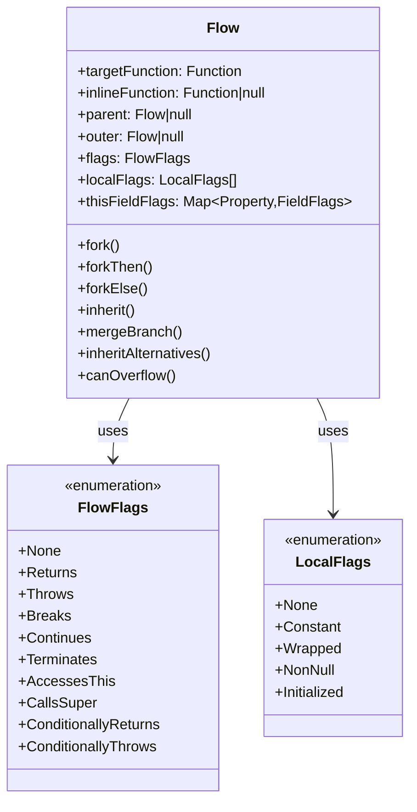
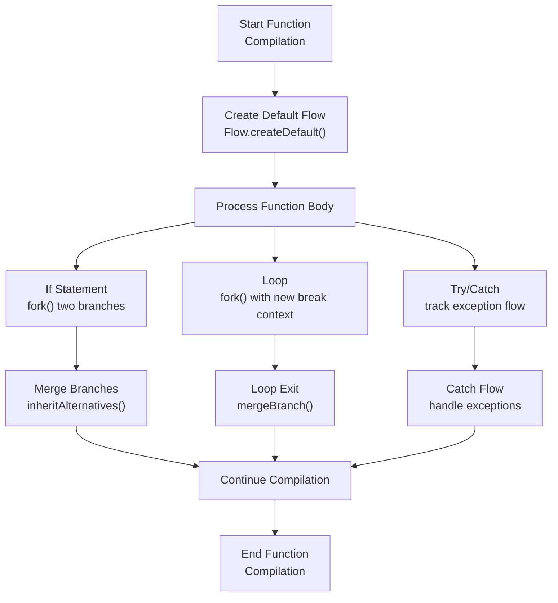
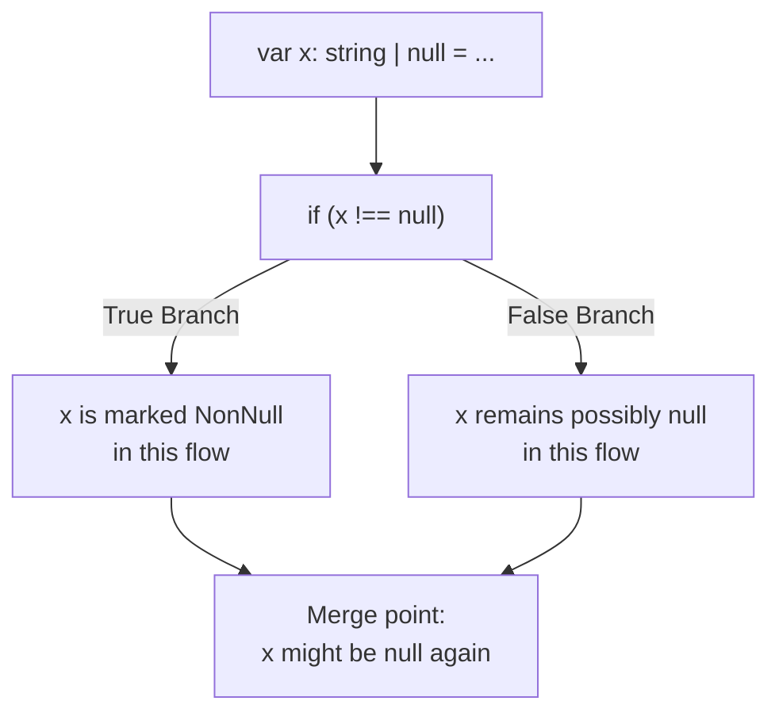
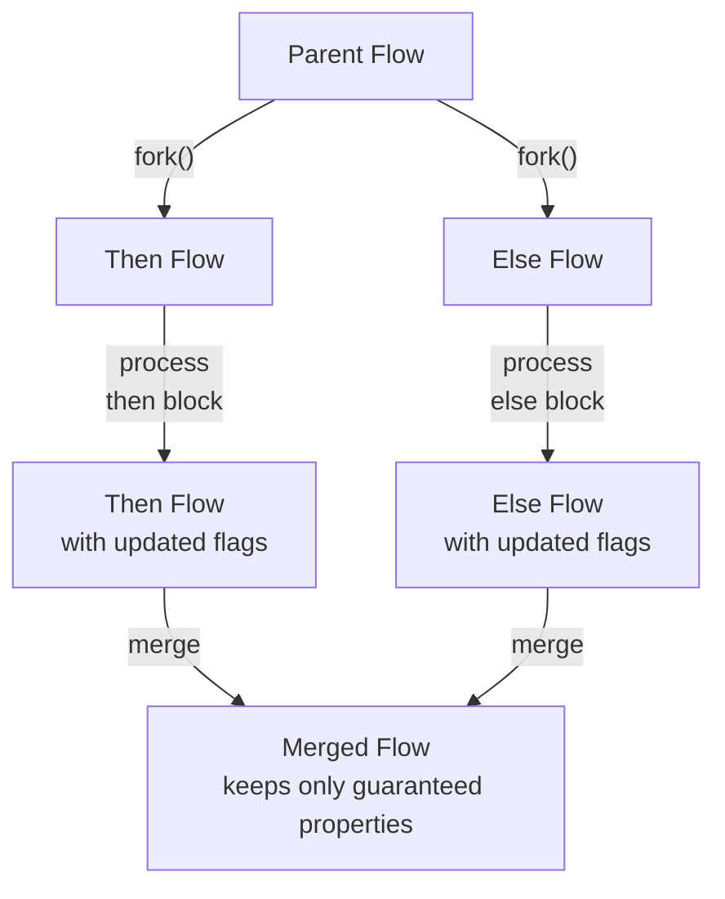
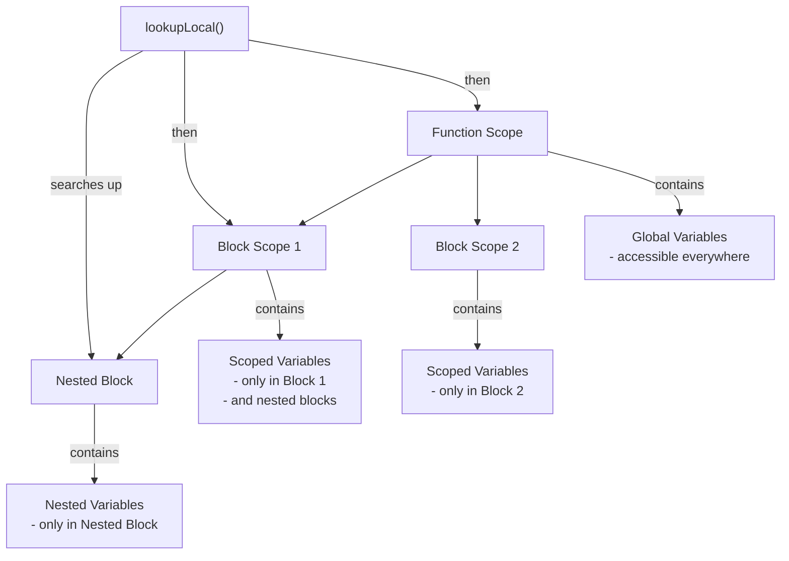
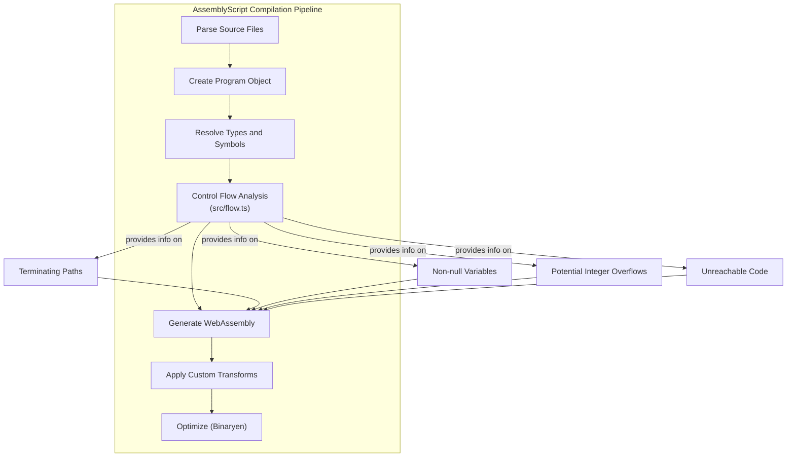

# Control Flow Analysis

Relevant source files

The following files were used as context for generating this wiki page:

- [src/flow.ts](https://github.com/AssemblyScript/assemblyscript/blob/4e7734b8/src/flow.ts)
- [src/util/collections.ts](https://github.com/AssemblyScript/assemblyscript/blob/4e7734b8/src/util/collections.ts)

## Purpose and Scope

Control Flow Analysis in AssemblyScript is responsible for tracking compilation state and analyzing code paths during the compilation process. It sits between type resolution and code generation in the compilation pipeline, providing crucial information about how code executes and the states of variables throughout program execution.

This system keeps track of conditions such as whether code paths always terminate, whether local variables are guaranteed to be non-null, and whether expressions might overflow their value ranges. This information is used for optimizations, error checking, and generating appropriate WebAssembly code.

Sources: [src/flow.ts:1-16](https://github.com/AssemblyScript/assemblyscript/blob/4e7734b8/src/flow.ts#L1-L16)

## Flow Class Overview

The core of Control Flow Analysis is the `Flow` class, which represents a branch in the program's control flow graph. Each function compilation begins with a clean flow that is populated with initial local states. As compilation progresses, statements and expressions update flow state while control structures (if/else, loops) create additional branched flows that are forked and later merged.

Sources: [src/flow.ts:17-205](https://github.com/AssemblyScript/assemblyscript/blob/4e7734b8/src/flow.ts#L17-L205), [src/flow.ts:206-217](https://github.com/AssemblyScript/assemblyscript/blob/4e7734b8/src/flow.ts#L206-L217)

## Flow Creation and Lifecycle

Each function being compiled receives a new flow instance. Control flow analysis begins with creating the default flow for a function using `Flow.createDefault()`. For optimization purposes, when inlining is performed, a special inline flow is created with `Flow.createInline()`.

As compilation progresses through the source code, the flow instance tracks program state, including:

1. Which code paths terminate (return, throw, break, continue)
2. The state of local variables (initialized, non-null, constant, etc.)
3. In constructors, which fields of `this` have been initialized
4. Whether potential integer overflows might occur

Sources: [src/flow.ts:206-242](https://github.com/AssemblyScript/assemblyscript/blob/4e7734b8/src/flow.ts#L206-L242), [src/flow.ts:329-365](https://github.com/AssemblyScript/assemblyscript/blob/4e7734b8/src/flow.ts#L329-L365)

## Flow Flags

The flow analyzer uses a set of flags to track the characteristics of each control flow branch. These flags indicate conditions such as whether a branch always returns, throws an exception, or terminates in some other way.

Key flow flags include:

| Flag | Description |
|------|-------------|
| `Returns` | This flow always returns |
| `ReturnsWrapped` | This flow always returns a properly wrapped value (relevant for small integers) |
| `ReturnsNonNull` | This flow always returns a non-null value |
| `Throws` | This flow always throws an exception |
| `Breaks` | This flow always breaks out of a loop or switch |
| `Continues` | This flow always continues to the next loop iteration |
| `Terminates` | This flow always terminates (returns, throws, etc.) |
| `ConditionallyReturns` | This flow conditionally returns in a child flow |
| `ConditionallyThrows` | This flow conditionally throws in a child flow |

These flags help the compiler determine:
- When code is unreachable
- Whether values need null checking
- If specific optimizations can be applied

Sources: [src/flow.ts:103-171](https://github.com/AssemblyScript/assemblyscript/blob/4e7734b8/src/flow.ts#L103-L171)

## Local Variable Tracking

A critical function of Control Flow Analysis is tracking the state of local variables throughout a function's execution. The `Flow` class maintains an array of `LocalFlags` that correspond to each local variable in a function.

### Local Flags

The following flags track the state of each local variable:

| Flag | Description |
|------|-------------|
| `Constant` | The local variable is a constant value |
| `Wrapped` | The local is properly wrapped (relevant for small integer types) |
| `NonNull` | The local is guaranteed to be non-null |
| `Initialized` | The local has been initialized |

### Local Tracking Example

For example, when an if-statement checks if a variable is non-null and then executes a branch only if that condition is true, the `Flow` class will automatically mark that variable as `NonNull` in the true branch:

The flow analyzer tracks this information by using methods like `inheritNonnullIfTrue()` and `inheritNonnullIfFalse()` which update local states based on conditions.

Sources: [src/flow.ts:173-186](https://github.com/AssemblyScript/assemblyscript/blob/4e7734b8/src/flow.ts#L173-L186), [src/flow.ts:547-574](https://github.com/AssemblyScript/assemblyscript/blob/4e7734b8/src/flow.ts#L547-L574), [src/flow.ts:979-1181](https://github.com/AssemblyScript/assemblyscript/blob/4e7734b8/src/flow.ts#L979-L1181)

## Branch Handling

Control flow analysis relies on creating, forking, and merging flows to handle branching code paths correctly. The `Flow` class provides sophisticated mechanisms for this purpose.

### Forking Flows

When the compiler encounters a branching statement (like an if/else), it forks the current flow into separate branches:

- `fork()`: Creates a new child flow for a generic branch
- `forkThen()`: Creates a flow where a specific condition is true
- `forkElse()`: Creates a flow where a specific condition is false

### Merging Flows

After processing different branches, the compiler needs to merge their states:

- `mergeBranch()`: Merges a branch (like a then-block without an else) with the current flow
- `inheritAlternatives()`: Merges two alternative branches (then and else) into the current flow
- `inherit()`: Inherits flags from another flow into this one

When merging, the system must carefully determine which properties are guaranteed across all paths. For example, a variable is only considered non-null after merging if it's non-null in all merged branches.

Sources: [src/flow.ts:329-411](https://github.com/AssemblyScript/assemblyscript/blob/4e7734b8/src/flow.ts#L329-L411), [src/flow.ts:651-915](https://github.com/AssemblyScript/assemblyscript/blob/4e7734b8/src/flow.ts#L651-L915)

## Integer Overflow Analysis

A unique feature of AssemblyScript's control flow analysis is its ability to track potential integer overflows for small integer types (i8, u8, i16, u16, bool). The `canOverflow()` method analyzes expressions to determine if they might overflow their value range.

The analyzer considers various factors:

1. The type of the expression (only small integer types can overflow)
2. The operations being performed
3. Whether operands are constants or wrapped values
4. The specific values of constants where applicable

This analysis helps the compiler:
- Insert appropriate value wrapping operations when needed
- Optimize out unnecessary wrapping when an operation can't overflow
- Ensure types behave as expected without unexpected overflow behavior

The system is particularly sophisticated in how it analyzes different operations. For example, it knows that:
- Comparisons never overflow (result is always 0 or 1)
- Multiplying by 0 or 1 has special overflow properties
- Bit shifts by certain amounts can eliminate overflow possibilities

Sources: [src/flow.ts:1183-1443](https://github.com/AssemblyScript/assemblyscript/blob/4e7734b8/src/flow.ts#L1183-L1443), [src/flow.ts:1472-1479](https://github.com/AssemblyScript/assemblyscript/blob/4e7734b8/src/flow.ts#L1472-L1479)

## Scoped Variables

The Control Flow Analysis system tracks scoped variables (variables defined within blocks) through dedicated mechanisms:

- `addScopedLocal()`: Adds a new scoped local variable
- `getScopedLocal()`: Gets a scoped local by name
- `lookupLocal()`: Searches up the flow hierarchy for a local variable
- `addScopedTypeAlias()`: Adds a scoped type alias

This tracking is crucial for proper variable scoping, especially in blocks like loops and if statements where variables might only exist within that scope.

Sources: [src/flow.ts:413-537](https://github.com/AssemblyScript/assemblyscript/blob/4e7734b8/src/flow.ts#L413-L537)

## Constructor Analysis

Flow Analysis has special handling for class constructors, tracking which fields of `this` have been initialized. This helps enforce initialization requirements and detect potential errors like accessing uninitialized fields.

When analyzing a constructor, the system:
1. Creates a map of field flags to track each field's state
2. Sets the `Initialized` flag for fields that have initializers or are initialized as constructor parameters
3. Updates field initialization states as the constructor executes
4. Detects accesses to `this` and calls to `super()`
5. Enforces language rules about field initialization before use

Sources: [src/flow.ts:189-192](https://github.com/AssemblyScript/assemblyscript/blob/4e7734b8/src/flow.ts#L189-L192), [src/flow.ts:577-631](https://github.com/AssemblyScript/assemblyscript/blob/4e7734b8/src/flow.ts#L577-L631)

## Integration with the Compiler

Control Flow Analysis is tightly integrated with the AssemblyScript compiler. It appears at the "Flow Analysis" step in the compilation pipeline, between type resolution and WebAssembly code generation.

The information collected during flow analysis directly influences:

1. Code generation strategy
2. Optimization opportunities
3. Error and warning generation
4. Runtime checks insertion (null checks, bounds checks)

Sources: [src/flow.ts:1-16](https://github.com/AssemblyScript/assemblyscript/blob/4e7734b8/src/flow.ts#L1-L16)

## Performance Considerations

Flow Analysis includes mechanisms to handle performance challenges:

1. **Recompilation detection**: The `resetIfNeedsRecompile()` method determines if recompilation is needed due to incompatible local flags between loops, and resets if necessary.

2. **Loop analysis**: Special handling is provided for loops, as their analysis can be more complex due to the potential for multiple iterations with changing variable states.

3. **Efficient collection operations**: Use of utility functions like `cloneMap()` ensures efficient operations when working with collections of state data.

Sources: [src/flow.ts:917-956](https://github.com/AssemblyScript/assemblyscript/blob/4e7734b8/src/flow.ts#L917-L956), [src/util/collections.ts:1-23](https://github.com/AssemblyScript/assemblyscript/blob/4e7734b8/src/util/collections.ts#L1-L23)

## Summary

Control Flow Analysis in AssemblyScript provides a sophisticated system for tracking program state throughout compilation. By analyzing how code flows and how variables change state, it enables the compiler to:

1. Generate more efficient WebAssembly code
2. Detect potential errors at compile time
3. Eliminate unnecessary runtime checks
4. Make informed optimization decisions

The system's ability to track variable states (null/non-null, wrapped/unwrapped, initialized/uninitialized) and flow termination (returns, throws, breaks) provides the foundation for AssemblyScript's ability to generate safe, efficient WebAssembly code.