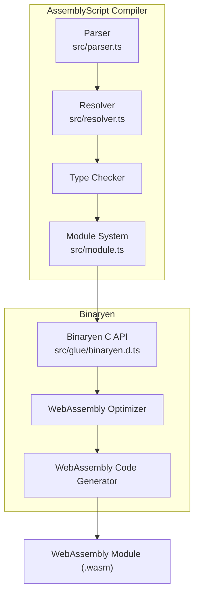
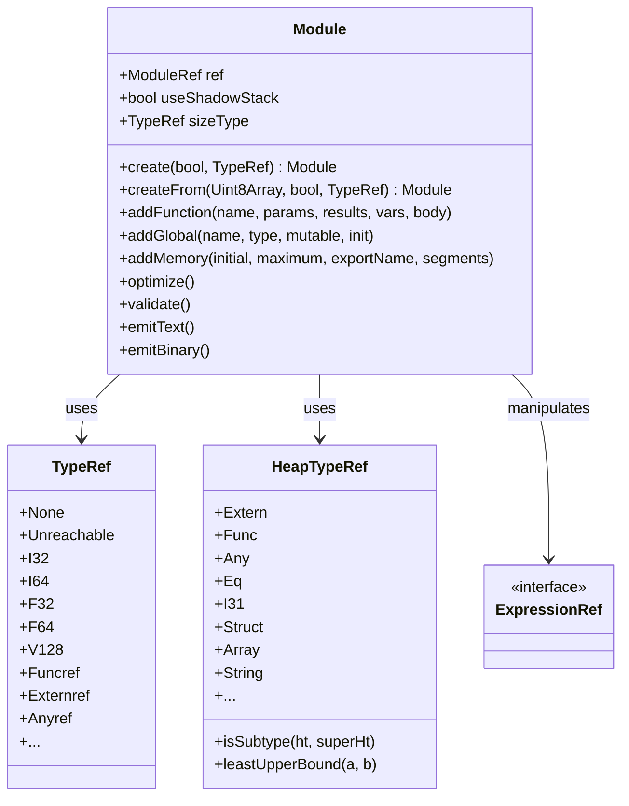
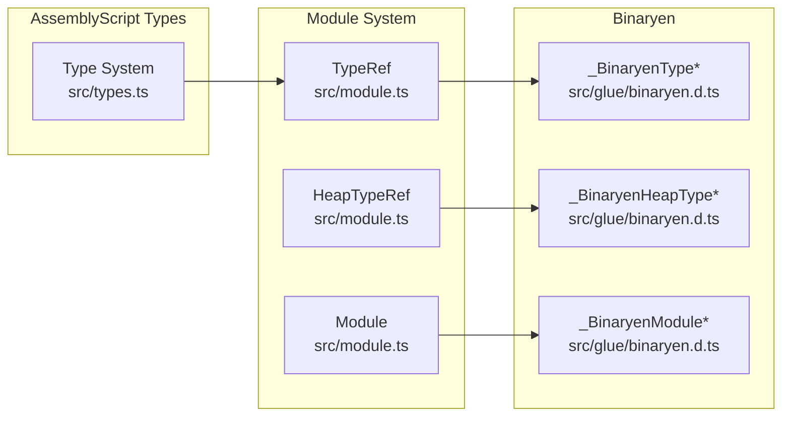
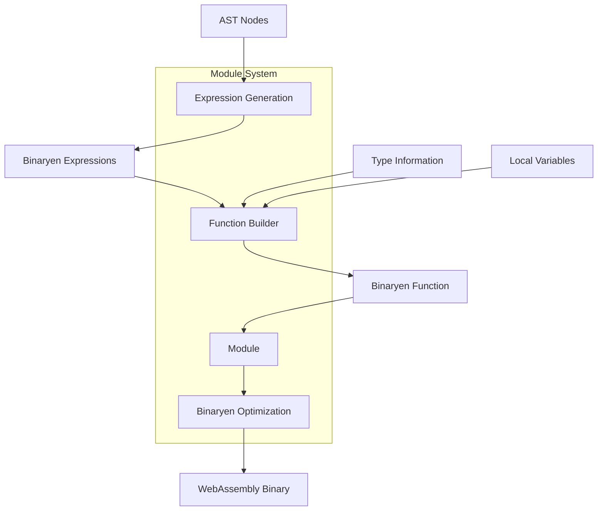

# Module System and Binaryen Integration

<details>
<summary>Relevant source files</summary>

The following files were used as context for generating this wiki page:

- [package-lock.json](https://github.com/AssemblyScript/assemblyscript/blob/4e7734b8/package-lock.json)
- [package.json](https://github.com/AssemblyScript/assemblyscript/blob/4e7734b8/package.json)
- [src/glue/binaryen.d.ts](https://github.com/AssemblyScript/assemblyscript/blob/4e7734b8/src/glue/binaryen.d.ts)
- [src/module.ts](https://github.com/AssemblyScript/assemblyscript/blob/4e7734b8/src/module.ts)

</details>


This document describes how AssemblyScript interfaces with Binaryen to generate WebAssembly code. The module system is a critical component of the compilation pipeline, responsible for transforming AssemblyScript's internal representation into optimized WebAssembly modules.

## Overview

AssemblyScript uses Binaryen as its WebAssembly backend. While Binaryen provides both a C API and JavaScript API, AssemblyScript intentionally uses the C API directly through a thin wrapper layer. This integration enables the compiler to leverage Binaryen's powerful optimization capabilities while maintaining precise control over the generated WebAssembly.



*Diagram: High-level integration between AssemblyScript and Binaryen*

Sources: [src/module.ts:1-10](https://github.com/AssemblyScript/assemblyscript/blob/4e7734b8/src/module.ts#L1-L10), [src/glue/binaryen.d.ts:1-10](https://github.com/AssemblyScript/assemblyscript/blob/4e7734b8/src/glue/binaryen.d.ts#L1-L10)

## Module System Architecture

The module system acts as a bridge between AssemblyScript's high-level representation and Binaryen's lower-level WebAssembly operations. It maintains references to Binaryen entities and provides an API to construct WebAssembly modules programmatically.



*Diagram: Core classes in the module system*

Sources: [src/module.ts:32-172](https://github.com/AssemblyScript/assemblyscript/blob/4e7734b8/src/module.ts#L32-L172), [src/module.ts:1375-1392](https://github.com/AssemblyScript/assemblyscript/blob/4e7734b8/src/module.ts#L1375-L1392)

## Binaryen Integration

AssemblyScript's module system is designed as a thin wrapper around Binaryen's C API. This approach simplifies integration while ensuring efficient operations for WebAssembly code generation.

### Key Integration Points

1. **Type Mapping**: AssemblyScript maps its types to Binaryen's type system
2. **Expression Building**: All WebAssembly instructions are created through Binaryen
3. **Module Operations**: Module-level operations (functions, globals, memory) use Binaryen APIs
4. **Optimization**: AssemblyScript leverages Binaryen's optimization passes



*Diagram: Type mapping between AssemblyScript and Binaryen*

Sources: [src/module.ts:61-87](https://github.com/AssemblyScript/assemblyscript/blob/4e7734b8/src/module.ts#L61-L87), [src/module.ts:90-172](https://github.com/AssemblyScript/assemblyscript/blob/4e7734b8/src/module.ts#L90-L172), [src/glue/binaryen.d.ts:45-98](https://github.com/AssemblyScript/assemblyscript/blob/4e7734b8/src/glue/binaryen.d.ts#L45-L98)

## Core Components

### Module Class

The `Module` class is the primary interface to Binaryen. It encapsulates a Binaryen module reference (`ModuleRef`) and provides methods to build and manipulate the WebAssembly module.

Key features of the Module class:

| Method | Purpose |
|--------|---------|
| `create` | Creates a new module instance |
| `createFrom` | Creates a module from existing WebAssembly binary data |
| `addFunction` | Adds a function declaration to the module |
| `addFunctionImport` | Adds an imported function |
| `addFunctionExport` | Exports a function to the host environment |
| `addGlobal` | Adds a global variable |
| `addMemory` | Configures the module's memory |
| `addTable` | Adds a WebAssembly table |
| `optimize` | Runs Binaryen's optimization passes |
| `validate` | Validates the WebAssembly module |
| `emitText` | Produces WebAssembly text format (.wat) |
| `emitBinary` | Produces WebAssembly binary format (.wasm) |

Sources: [src/module.ts:1375-1392](https://github.com/AssemblyScript/assemblyscript/blob/4e7734b8/src/module.ts#L1375-L1392)

### Type System

AssemblyScript's module system maps its types to Binaryen's type system through the `TypeRef` and `HeapTypeRef` namespaces:

- **TypeRef**: Represents WebAssembly value types (i32, i64, f32, f64, v128) and reference types (externref, funcref)
- **HeapTypeRef**: Represents types for GC proposals, including structs and arrays

The module system includes special handling for type operations like subtyping checks and least upper bound computations.

```typescript
// Example of type constants in TypeRef
export namespace TypeRef {
  export const None: TypeRef = 0;        // No value
  export const Unreachable: TypeRef = 1; // Unreachable
  export const I32: TypeRef = 2;         // 32-bit integer
  export const I64: TypeRef = 3;         // 64-bit integer
  export const F32: TypeRef = 4;         // 32-bit float
  export const F64: TypeRef = 5;         // 64-bit float
  export const V128: TypeRef = 6;        // 128-bit vector
  export const Funcref = binaryen._BinaryenTypeFuncref();
  export const Externref = binaryen._BinaryenTypeExternref();
  // ...
}
```

Sources: [src/module.ts:61-87](https://github.com/AssemblyScript/assemblyscript/blob/4e7734b8/src/module.ts#L61-L87), [src/module.ts:90-172](https://github.com/AssemblyScript/assemblyscript/blob/4e7734b8/src/module.ts#L90-L172)

### Expression System

The module system provides a comprehensive set of functions to create WebAssembly expressions:

- **Basic operations**: Constants, variables, memory access
- **Control flow**: Blocks, loops, if statements, branches
- **Function calls**: Direct and indirect calls
- **Memory operations**: Load, store, grow, size
- **SIMD operations**: Vector instructions
- **Reference types**: Reference manipulation operations
- **GC operations**: Struct and array operations for the GC proposal

These operations are represented through constants and enums that map directly to Binaryen's operation codes:

| Category | Examples |
|----------|----------|
| Expression IDs | `ExpressionId.Block`, `ExpressionId.Call`, `ExpressionId.LocalGet` |
| Unary Operations | `UnaryOp.ClzI32`, `UnaryOp.NegF32`, `UnaryOp.ExtendI32ToI64` |
| Binary Operations | `BinaryOp.AddI32`, `BinaryOp.MulF64`, `BinaryOp.ShlI32` |
| SIMD Operations | `SIMDExtractOp`, `SIMDReplaceOp`, `SIMDShiftOp` |

Sources: [src/module.ts:229-323](https://github.com/AssemblyScript/assemblyscript/blob/4e7734b8/src/module.ts#L229-L323), [src/module.ts:335-619](https://github.com/AssemblyScript/assemblyscript/blob/4e7734b8/src/module.ts#L335-L619), [src/module.ts:622-1090](https://github.com/AssemblyScript/assemblyscript/blob/4e7734b8/src/module.ts#L622-L1090)

## Code Generation Flow

When generating WebAssembly code, AssemblyScript follows a systematic process of building expressions and combining them into functions, which are then added to the module.



*Diagram: Code generation flow through the module system*

Sources: [src/module.ts:1375-1392](https://github.com/AssemblyScript/assemblyscript/blob/4e7734b8/src/module.ts#L1375-L1392)

### Expression Building

The module system provides a rich API for building WebAssembly expressions. Each expression type has a corresponding creation function and accessor methods:

1. **Constants**: Creation of constant values (`i32.const`, `f64.const`, etc.)
2. **Variables**: Local and global variable access
3. **Memory operations**: Load and store operations with various types
4. **Control flow**: Blocks, loops, branches, and conditionals
5. **Function calls**: Direct and indirect function invocation

Example flow for creating a simple addition:

1. Create local.get expressions for two variables
2. Create a binary.add expression with the two local.get expressions
3. Use the result in a function body or other composite expression

Sources: [src/module.ts:229-323](https://github.com/AssemblyScript/assemblyscript/blob/4e7734b8/src/module.ts#L229-L323), [src/module.ts:335-619](https://github.com/AssemblyScript/assemblyscript/blob/4e7734b8/src/module.ts#L335-L619), [src/module.ts:622-1090](https://github.com/AssemblyScript/assemblyscript/blob/4e7734b8/src/module.ts#L622-L1090)

## Feature Flags and WebAssembly Proposals

AssemblyScript supports various WebAssembly proposals through Binaryen. The module system exposes these as feature flags:

| Feature Flag | WebAssembly Proposal |
|--------------|----------------------|
| `FeatureFlags.MVP` | Minimum Viable Product (base WebAssembly) |
| `FeatureFlags.Atomics` | Atomic operations |
| `FeatureFlags.MutableGlobals` | Mutable global variables |
| `FeatureFlags.SIMD` | 128-bit SIMD operations |
| `FeatureFlags.BulkMemory` | Bulk memory operations |
| `FeatureFlags.ReferenceTypes` | Reference types |
| `FeatureFlags.GC` | Garbage collection |
| `FeatureFlags.Stringref` | String references |

These flags can be combined to enable multiple features:

```typescript
// Enable GC, reference types and string references
module.setFeatures(
  FeatureFlags.GC | 
  FeatureFlags.ReferenceTypes | 
  FeatureFlags.Stringref
);
```

Sources: [src/module.ts:207-226](https://github.com/AssemblyScript/assemblyscript/blob/4e7734b8/src/module.ts#L207-L226)

## Shadow Stack Support

AssemblyScript's module system can optionally use a shadow stack for function calls, which is important for supporting certain advanced features like exception handling. This is controlled through the `useShadowStack` parameter when creating a module:

```typescript
// Create a module with shadow stack enabled
const module = Module.create(true, TypeRef.I32);
```

The shadow stack affects how function calls are generated and how certain operations like exceptions are handled.

Sources: [src/module.ts:1380](https://github.com/AssemblyScript/assemblyscript/blob/4e7734b8/src/module.ts#L1380)

## Conclusion

The module system is a critical component of AssemblyScript's compiler, serving as the bridge between AssemblyScript's high-level representation and Binaryen's WebAssembly generation capabilities. By wrapping Binaryen's C API directly, AssemblyScript achieves efficient and flexible WebAssembly code generation with precise control over the output.