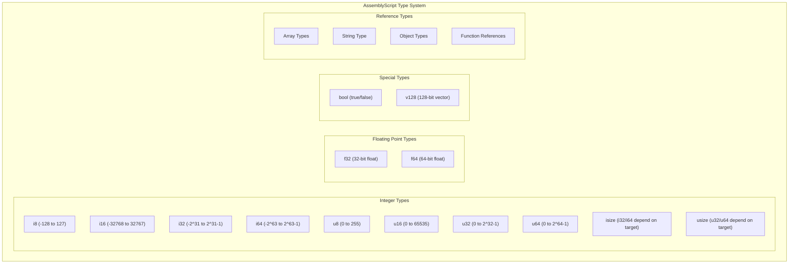
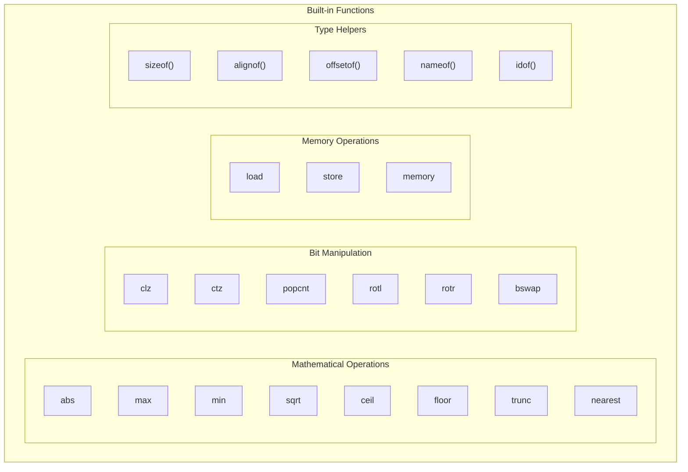
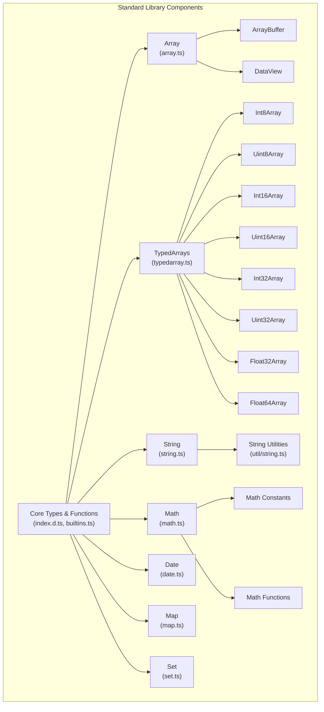
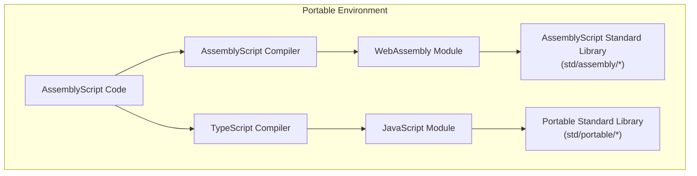

# Standard Library

Relevant source files

The following files were used as context for generating this wiki page:

- [NOTICE](https://github.com/AssemblyScript/assemblyscript/blob/4e7734b8/NOTICE)
- [std/assembly/builtins.ts](https://github.com/AssemblyScript/assemblyscript/blob/4e7734b8/std/assembly/builtins.ts)
- [std/assembly/index.d.ts](https://github.com/AssemblyScript/assemblyscript/blob/4e7734b8/std/assembly/index.d.ts)
- [std/portable/index.d.ts](https://github.com/AssemblyScript/assemblyscript/blob/4e7734b8/std/portable/index.d.ts)
- [std/portable/index.js](https://github.com/AssemblyScript/assemblyscript/blob/4e7734b8/std/portable/index.js)
- [tests/compiler/builtins.ts](https://github.com/AssemblyScript/assemblyscript/blob/4e7734b8/tests/compiler/builtins.ts)

The AssemblyScript Standard Library provides fundamental types, data structures, and utility functions necessary for writing WebAssembly applications. It serves as the foundation for AssemblyScript programs, offering functionality comparable to standard libraries in other languages while being specifically optimized for WebAssembly's needs.

This document provides a comprehensive overview of the AssemblyScript standard library's core types, built-in functions, and components. For information about specific library components such as Array and String, see [Array and String](#3.1), and for memory management details, see [Memory Management](#6).

## Core Types and Type System

AssemblyScript's type system is designed to provide static type safety while targeting WebAssembly's limited set of primitive types. The type system is defined in `index.d.ts` under the standard library.

Sources: [std/assembly/index.d.ts:10-81](https://github.com/AssemblyScript/assemblyscript/blob/4e7734b8/std/assembly/index.d.ts#L10-L81)

### Integer Types

AssemblyScript provides a comprehensive set of integer types with explicit bit widths:

| Type    | Description                       | Size    | Range                                   |
|---------|-----------------------------------|---------|----------------------------------------|
| `i8`    | 8-bit signed integer             | 1 byte  | -128 to 127                            |
| `i16`   | 16-bit signed integer            | 2 bytes | -32,768 to 32,767                      |
| `i32`   | 32-bit signed integer            | 4 bytes | -2,147,483,648 to 2,147,483,647        |
| `i64`   | 64-bit signed integer            | 8 bytes | -9,223,372,036,854,775,808 to 9,223,372,036,854,775,807 |
| `u8`    | 8-bit unsigned integer           | 1 byte  | 0 to 255                               |
| `u16`   | 16-bit unsigned integer          | 2 bytes | 0 to 65,535                            |
| `u32`   | 32-bit unsigned integer          | 4 bytes | 0 to 4,294,967,295                     |
| `u64`   | 64-bit unsigned integer          | 8 bytes | 0 to 18,446,744,073,709,551,615        |
| `isize` | Pointer-sized signed integer     | 4/8 bytes | Depends on target (32-bit or 64-bit)   |
| `usize` | Pointer-sized unsigned integer   | 4/8 bytes | Depends on target (32-bit or 64-bit)   |

Each integer type has associated `MIN_VALUE` and `MAX_VALUE` constants defining their ranges, as well as helpful utility functions like `parse()` for string conversion.

Sources: [std/assembly/index.d.ts:10-29](https://github.com/AssemblyScript/assemblyscript/blob/4e7734b8/std/assembly/index.d.ts#L10-L29), [std/assembly/builtins.ts:277-295](https://github.com/AssemblyScript/assemblyscript/blob/4e7734b8/std/assembly/builtins.ts#L277-L295), [std/assembly/builtins.ts:303-317](https://github.com/AssemblyScript/assemblyscript/blob/4e7734b8/std/assembly/builtins.ts#L303-L317), [std/assembly/builtins.ts:323-337](https://github.com/AssemblyScript/assemblyscript/blob/4e7734b8/std/assembly/builtins.ts#L323-L337), [std/assembly/builtins.ts:841-858](https://github.com/AssemblyScript/assemblyscript/blob/4e7734b8/std/assembly/builtins.ts#L841-L858), [std/assembly/builtins.ts:864-880](https://github.com/AssemblyScript/assemblyscript/blob/4e7734b8/std/assembly/builtins.ts#L864-L880), [std/assembly/builtins.ts:886-921](https://github.com/AssemblyScript/assemblyscript/blob/4e7734b8/std/assembly/builtins.ts#L886-L921), [std/assembly/builtins.ts:927-942](https://github.com/AssemblyScript/assemblyscript/blob/4e7734b8/std/assembly/builtins.ts#L927-L942), [std/assembly/builtins.ts:948-965](https://github.com/AssemblyScript/assemblyscript/blob/4e7734b8/std/assembly/builtins.ts#L948-L965)

### Floating-Point Types

AssemblyScript provides two floating-point types:

| Type    | Description                     | Size    | Precision               |
|---------|---------------------------------|---------|-------------------------|
| `f32`   | 32-bit IEEE 754 floating point  | 4 bytes | ~7 decimal digits       |
| `f64`   | 64-bit IEEE 754 floating point  | 8 bytes | ~15-16 decimal digits   |

Floating-point types include useful constants such as:
- `MIN_VALUE`: Smallest representable value
- `MAX_VALUE`: Largest representable value
- `EPSILON`: Difference between 1 and the smallest value greater than 1
- `NaN`: Not a Number value
- `POSITIVE_INFINITY` and `NEGATIVE_INFINITY`
- `MIN_SAFE_INTEGER` and `MAX_SAFE_INTEGER`: Integer values that can be represented exactly

Sources: [std/assembly/index.d.ts:31-35](https://github.com/AssemblyScript/assemblyscript/blob/4e7734b8/std/assembly/index.d.ts#L31-L35), [std/assembly/builtins.ts:993-1035](https://github.com/AssemblyScript/assemblyscript/blob/4e7734b8/std/assembly/builtins.ts#L993-L1035), [std/assembly/builtins.ts:1111-1156](https://github.com/AssemblyScript/assemblyscript/blob/4e7734b8/std/assembly/builtins.ts#L1111-L1156)

### Boolean Type

The `bool` type represents a boolean value (true or false), but unlike in JavaScript, it's not directly interchangeable with numbers. When necessary, AssemblyScript does implicit conversions following WebAssembly's conventions.

Sources: [std/assembly/index.d.ts:30](https://github.com/AssemblyScript/assemblyscript/blob/4e7734b8/std/assembly/index.d.ts#L30), [std/assembly/builtins.ts:969-986](https://github.com/AssemblyScript/assemblyscript/blob/4e7734b8/std/assembly/builtins.ts#L969-L986)

### Special Types

AssemblyScript also provides special types for specific use cases:

| Type         | Description                                               |
|--------------|-----------------------------------------------------------|
| `v128`       | 128-bit vector type for SIMD operations                   |
| `funcref`    | Nullable function reference                               |
| `externref`  | Nullable external reference                               |
| `anyref`     | Nullable any reference                                    |
| `stringref`  | Nullable string reference                                 |

Sources: [std/assembly/index.d.ts:36-81](https://github.com/AssemblyScript/assemblyscript/blob/4e7734b8/std/assembly/index.d.ts#L36-L81)

## Built-in Functions and Constants

AssemblyScript provides a rich set of built-in functions and constants. Many of these map directly to WebAssembly instructions, offering efficient operations with a familiar syntax.

Sources: [std/assembly/index.d.ts:142-170](https://github.com/AssemblyScript/assemblyscript/blob/4e7734b8/std/assembly/index.d.ts#L142-L170), [std/assembly/index.d.ts:197-282](https://github.com/AssemblyScript/assemblyscript/blob/4e7734b8/std/assembly/index.d.ts#L197-L282), [std/assembly/builtins.ts:4-217](https://github.com/AssemblyScript/assemblyscript/blob/4e7734b8/std/assembly/builtins.ts#L4-L217)

### Math Functions

The standard library includes a comprehensive set of mathematical functions:

| Function          | Description                                                   |
|-------------------|---------------------------------------------------------------|
| `abs<T>`          | Computes the absolute value of an integer or float            |
| `max<T>`          | Determines the maximum of two integers or floats              |
| `min<T>`          | Determines the minimum of two integers or floats              |
| `ceil<T>`         | Performs the ceiling operation (round up to nearest integer)   |
| `floor<T>`        | Performs the floor operation (round down to nearest integer)   |
| `nearest<T>`      | Rounds to the nearest integer tied to even                    |
| `sqrt<T>`         | Calculates the square root                                    |
| `trunc<T>`        | Rounds to the nearest integer towards zero                    |
| `copysign<T>`     | Composes a float from the magnitude of x and the sign of y    |

Sources: [std/assembly/index.d.ts:154-175](https://github.com/AssemblyScript/assemblyscript/blob/4e7734b8/std/assembly/index.d.ts#L154-L175), [std/assembly/builtins.ts:91-127](https://github.com/AssemblyScript/assemblyscript/blob/4e7734b8/std/assembly/builtins.ts#L91-L127)

### Bit Manipulation Functions

Efficient bit-level operations are crucial for many algorithms:

| Function          | Description                                                   |
|-------------------|---------------------------------------------------------------|
| `clz<T>`          | Counts leading zero bits                                      |
| `ctz<T>`          | Counts trailing zero bits                                     |
| `popcnt<T>`       | Counts the number of 1 bits                                   |
| `rotl<T>`         | Rotates bits left                                             |
| `rotr<T>`         | Rotates bits right                                            |
| `bswap<T>`        | Reverses the byte order (endianness swap)                     |

Sources: [std/assembly/index.d.ts:143-153](https://github.com/AssemblyScript/assemblyscript/blob/4e7734b8/std/assembly/index.d.ts#L143-L153), [std/assembly/builtins.ts:71-87](https://github.com/AssemblyScript/assemblyscript/blob/4e7734b8/std/assembly/builtins.ts#L71-L87)

### Memory Operations

Direct memory manipulation functions:

| Function        | Description                                                    |
|-----------------|----------------------------------------------------------------|
| `load<T>`       | Loads a value of the specified type from memory                |
| `store<T>`      | Stores a value of the specified type to memory                 |

These low-level operations allow direct access to the linear memory. They're generally considered unsafe and should be used carefully.

Sources: [std/assembly/index.d.ts:190-193](https://github.com/AssemblyScript/assemblyscript/blob/4e7734b8/std/assembly/index.d.ts#L190-L193), [std/assembly/builtins.ts:158-163](https://github.com/AssemblyScript/assemblyscript/blob/4e7734b8/std/assembly/builtins.ts#L158-L163)

### Atomic Operations

For applications using threads, the standard library provides atomic operations through the `atomic` namespace:

| Function               | Description                                              |
|------------------------|----------------------------------------------------------|
| `atomic.load<T>`       | Atomically loads a value from memory                     |
| `atomic.store<T>`      | Atomically stores a value to memory                      |
| `atomic.add<T>`        | Atomically adds a value in memory                        |
| `atomic.sub<T>`        | Atomically subtracts a value in memory                   |
| `atomic.and<T>`        | Atomically performs a bitwise AND operation              |
| `atomic.or<T>`         | Atomically performs a bitwise OR operation               |
| `atomic.xor<T>`        | Atomically performs a bitwise XOR operation              |
| `atomic.xchg<T>`       | Atomically exchanges a value in memory                   |
| `atomic.cmpxchg<T>`    | Atomically compares and exchanges a value in memory      |
| `atomic.wait<T>`       | Waits on a memory address                                |
| `atomic.notify`        | Notifies waiting agents                                  |
| `atomic.fence`         | Ensures ordering of operations                           |

Sources: [std/assembly/index.d.ts:284-310](https://github.com/AssemblyScript/assemblyscript/blob/4e7734b8/std/assembly/index.d.ts#L284-L310), [std/assembly/builtins.ts:219-267](https://github.com/AssemblyScript/assemblyscript/blob/4e7734b8/std/assembly/builtins.ts#L219-L267)

### Type Information Functions

AssemblyScript provides useful functions for type introspection:

| Function          | Description                                                   |
|-------------------|---------------------------------------------------------------|
| `sizeof<T>()`     | Determines the byte size of the specified type                |
| `alignof<T>()`    | Determines the alignment (log2) of the specified type         |
| `offsetof<T>()`   | Determines the offset of fields within a class type           |
| `nameof<T>()`     | Determines the name of a given type                           |
| `idof<T>()`       | Determines the unique runtime id of a class type              |

Sources: [std/assembly/index.d.ts:208-220](https://github.com/AssemblyScript/assemblyscript/blob/4e7734b8/std/assembly/index.d.ts#L208-L220), [std/assembly/builtins.ts:167-183](https://github.com/AssemblyScript/assemblyscript/blob/4e7734b8/std/assembly/builtins.ts#L167-L183)

### Type Testing Functions

The library provides a rich set of type checking functions:

| Function              | Description                                               |
|-----------------------|-----------------------------------------------------------|
| `isBoolean<T>()`      | Tests if the type is a boolean                            |
| `isInteger<T>()`      | Tests if the type is an integer                           |
| `isSigned<T>()`       | Tests if the type can represent negative numbers          |
| `isFloat<T>()`        | Tests if the type is a float                              |
| `isReference<T>()`    | Tests if the type is a reference type                     |
| `isString<T>()`       | Tests if the type can be used as a string                 |
| `isArray<T>()`        | Tests if the type can be used as an array                 |
| `isFunction<T>()`     | Tests if the type is a function                           |
| `isNullable<T>()`     | Tests if the type is nullable                             |

Sources: [std/assembly/index.d.ts:234-263](https://github.com/AssemblyScript/assemblyscript/blob/4e7734b8/std/assembly/index.d.ts#L234-L263), [std/assembly/builtins.ts:7-59](https://github.com/AssemblyScript/assemblyscript/blob/4e7734b8/std/assembly/builtins.ts#L7-L59)

### Compiler Constants

The standard library also exposes various compiler constants, which provide information about the compilation environment:

| Constant                     | Description                                           |
|------------------------------|-------------------------------------------------------|
| `ASC_TARGET`                | Compiler target (0=JS, 1=WASM32, 2=WASM64)            |
| `ASC_RUNTIME`               | Runtime type (0=Stub, 1=Minimal, 2=Incremental)       |
| `ASC_MEMORY_BASE`           | Provided memoryBase option                            |
| `ASC_TABLE_BASE`            | Provided tableBase option                             |
| `ASC_OPTIMIZE_LEVEL`        | Provided optimizeLevel option                         |
| `ASC_SHRINK_LEVEL`          | Provided shrinkLevel option                           |
| `ASC_FEATURE_*`             | Various feature flags (e.g., SIMD, threads, etc.)     |

These constants are particularly useful for conditional compilation or optimizing code based on target environment and available features.

Sources: [std/assembly/index.d.ts:85-138](https://github.com/AssemblyScript/assemblyscript/blob/4e7734b8/std/assembly/index.d.ts#L85-L138)

## Standard Library Structure

The AssemblyScript standard library is organized in a modular fashion, with core types and functions defined in the root namespace and additional functionality organized into specific components.

Sources: [std/assembly/index.d.ts:1-283](https://github.com/AssemblyScript/assemblyscript/blob/4e7734b8/std/assembly/index.d.ts#L1-L283)

## Portable Environment

The AssemblyScript standard library includes a portable environment that enables code to be compiled to both WebAssembly and JavaScript. This is provided through two main files:

1. `std/portable/index.d.ts` - TypeScript definitions for the portable environment
2. `std/portable/index.js` - JavaScript implementations of the AssemblyScript standard library

The portable environment defines the same types and functions as the WebAssembly environment but implements them in JavaScript, allowing code to be shared between WebAssembly and JavaScript execution contexts.

Sources: [std/portable/index.d.ts:1-462](https://github.com/AssemblyScript/assemblyscript/blob/4e7734b8/std/portable/index.d.ts#L1-L462), [std/portable/index.js:1-415](https://github.com/AssemblyScript/assemblyscript/blob/4e7734b8/std/portable/index.js#L1-L415)

The portable environment is particularly useful for:
- Testing AssemblyScript code in JavaScript environments
- Developing libraries that can be used in both WebAssembly and JavaScript
- Creating fallback implementations for browsers without WebAssembly support

Key differences in the portable environment:
- 64-bit integers are emulated using JavaScript numbers or BigInt (with limitations)
- Some WebAssembly-specific optimizations are not available
- Memory model differs (JavaScript garbage collection vs. AssemblyScript's memory management)

Sources: [std/portable/index.d.ts:15-28](https://github.com/AssemblyScript/assemblyscript/blob/4e7734b8/std/portable/index.d.ts#L15-L28), [std/portable/index.js:4-17](https://github.com/AssemblyScript/assemblyscript/blob/4e7734b8/std/portable/index.js#L4-L17)

## Conclusion

The AssemblyScript standard library provides a rich set of types, functions, and utilities that form the foundation for AssemblyScript applications. With its familiar TypeScript-like syntax and WebAssembly-specific optimizations, it strikes a balance between developer ergonomics and performance.