# Array and String

Relevant source files

The following files were used as context for generating this wiki page:

- [std/assembly/array.ts](https://github.com/AssemblyScript/assemblyscript/blob/4e7734b8/std/assembly/array.ts)
- [std/assembly/string.ts](https://github.com/AssemblyScript/assemblyscript/blob/4e7734b8/std/assembly/string.ts)
- [tests/compiler/std/array.ts](https://github.com/AssemblyScript/assemblyscript/blob/4e7734b8/tests/compiler/std/array.ts)
- [tests/compiler/std/string.ts](https://github.com/AssemblyScript/assemblyscript/blob/4e7734b8/tests/compiler/std/string.ts)

This page documents the Array and String implementations in the AssemblyScript standard library, which provide fundamental data structures for collections and text manipulation. These classes are core building blocks for most AssemblyScript applications and are implemented with careful attention to memory efficiency and runtime safety.

## Memory Structure

Both Array and String have carefully designed memory layouts to optimize performance while ensuring type safety.

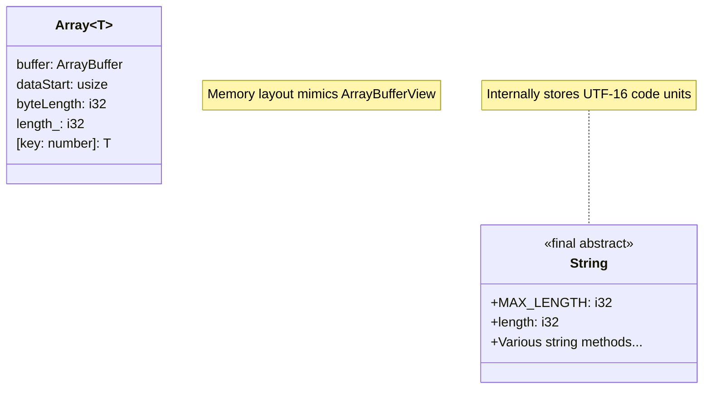

### Array Memory Layout

The Array class has a specific memory structure that intentionally mimics the ArrayBufferView interface:

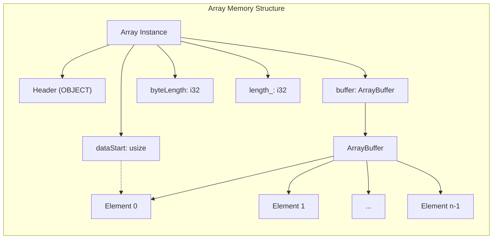

Sources: [std/assembly/array.ts:41-56](https://github.com/AssemblyScript/assemblyscript/blob/4e7734b8/std/assembly/array.ts:41-56#L41-L56)

Key characteristics:
- `buffer`: Points to an ArrayBuffer containing the actual data
- `dataStart`: Provides direct memory access to the start of the array data
- `byteLength`: Tracks the capacity of the array in bytes
- `length_`: Stores the actual number of elements

Arrays have a minimum capacity (8 elements) and grow by doubling their capacity when needed to amortize allocation costs.

### String Memory Layout

Strings in AssemblyScript are final abstract classes that store UTF-16 encoded text:

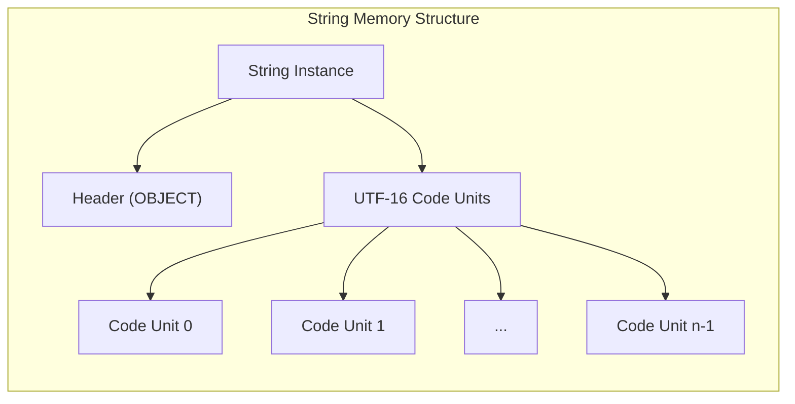

Sources: [std/assembly/string.ts:10-86](https://github.com/AssemblyScript/assemblyscript/blob/4e7734b8/std/assembly/string.ts:10-86#L10-L86)

Key characteristics:
- Implemented as a final abstract class
- Internally stores a sequence of 16-bit code units (UTF-16)
- Provides the `length` property that returns the number of code units
- Defines a maximum length based on block size constraints
- All string operations create new instances (immutable design)

## Array Implementation

### Creation and Capacity Management

Arrays dynamically manage their capacity as elements are added:

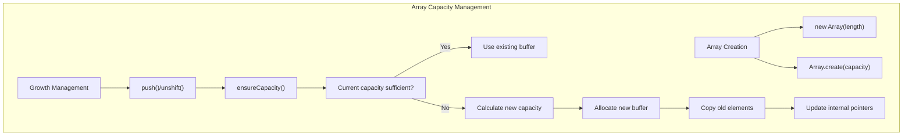

Sources: [std/assembly/array.ts:15-38](https://github.com/AssemblyScript/assemblyscript/blob/4e7734b8/std/assembly/array.ts:15-38#L15-L38), [std/assembly/array.ts:69-86](https://github.com/AssemblyScript/assemblyscript/blob/4e7734b8/std/assembly/array.ts:69-86#L69-L86)

Key implementation details:
- Arrays start with a minimum capacity of 8 elements
- The `ensureCapacity` function handles dynamic resizing:
  - Checks if current capacity is sufficient
  - Typically doubles capacity when growing
  - Allocates new memory with `__new`/`__renew`
  - Copies existing elements to the new buffer
  - Updates internal pointers
- Capacity is constrained by `BLOCK_MAXSIZE`

### Element Access and Mutation

Array provides methods for accessing and manipulating elements:

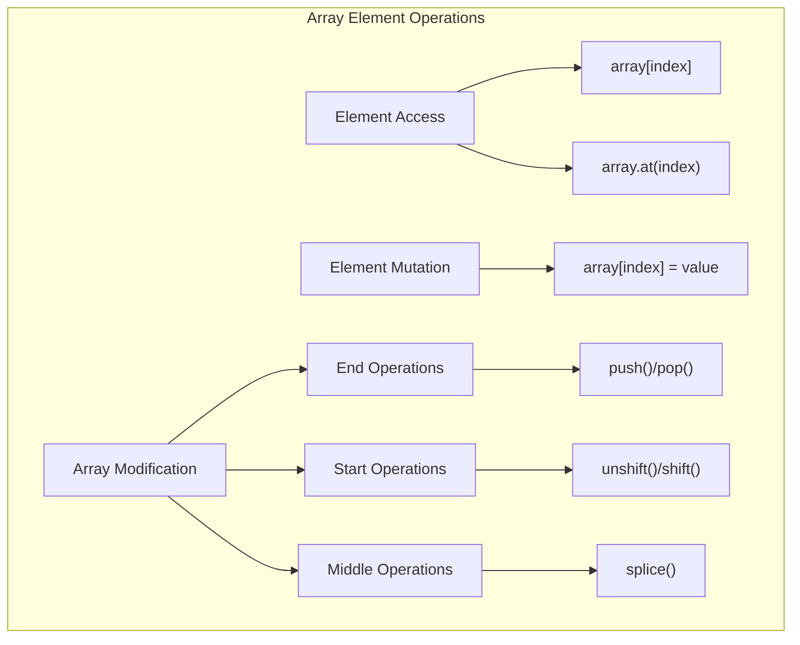

Sources: [std/assembly/array.ts:113-151](https://github.com/AssemblyScript/assemblyscript/blob/4e7734b8/std/assembly/array.ts:113-151#L113-L151), [std/assembly/array.ts:206-371](https://github.com/AssemblyScript/assemblyscript/blob/4e7734b8/std/assembly/array.ts:206-371#L206-L371)

Implementation characteristics:
- Direct indexing (`array[index]`) includes bounds checking and throws a RangeError when out of bounds
- `at` method supports negative indices (counting from the end)
- For non-nullable reference types, accessing an uninitialized (null) element throws an error
- `push` ensures capacity before adding elements
- `shift`/`unshift` use `memory.copy` to move elements
- `splice` extracts elements and adjusts the array

### Iteration and Higher-Order Functions

Array implements numerous higher-order functions:

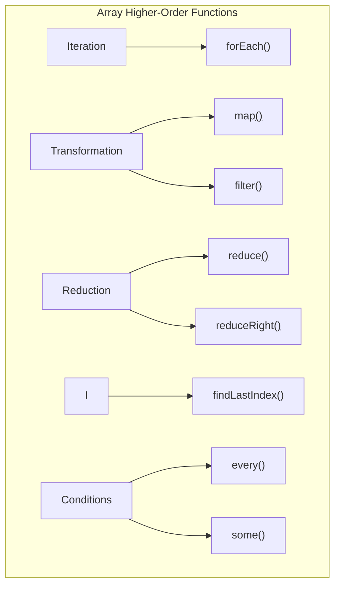

Sources: [std/assembly/array.ts:92-352](https://github.com/AssemblyScript/assemblyscript/blob/4e7734b8/std/assembly/array.ts:92-352#L92-L352)

Key implementation patterns:
- Iterations are based on the initial length to prevent infinite loops if the array is modified during iteration
- Safe handling of reference types with proper runtime linking
- Optimization for common operation patterns
- Support for early termination in functions like `some` and `every`

### Transformation and Utilities

Arrays include methods for data transformation:

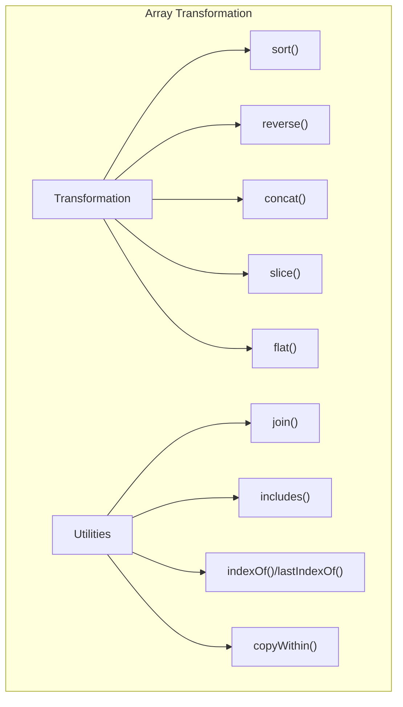

Sources: [std/assembly/array.ts:153-511](https://github.com/AssemblyScript/assemblyscript/blob/4e7734b8/std/assembly/array.ts:153-511#L153-L511)

Implementation highlights:
- `sort` implements a stable sorting algorithm that handles various edge cases
- `reverse` modifies the array in place using efficient memory operations
- `concat` creates a new array with combined elements
- `slice` extracts a portion of the array into a new instance
- `flat` flattens nested arrays
- Special handling for floating-point types (e.g., `includes` treats NaN as equal to itself)

## String Implementation

### Creation and Character Access

Strings can be created and accessed through various methods:

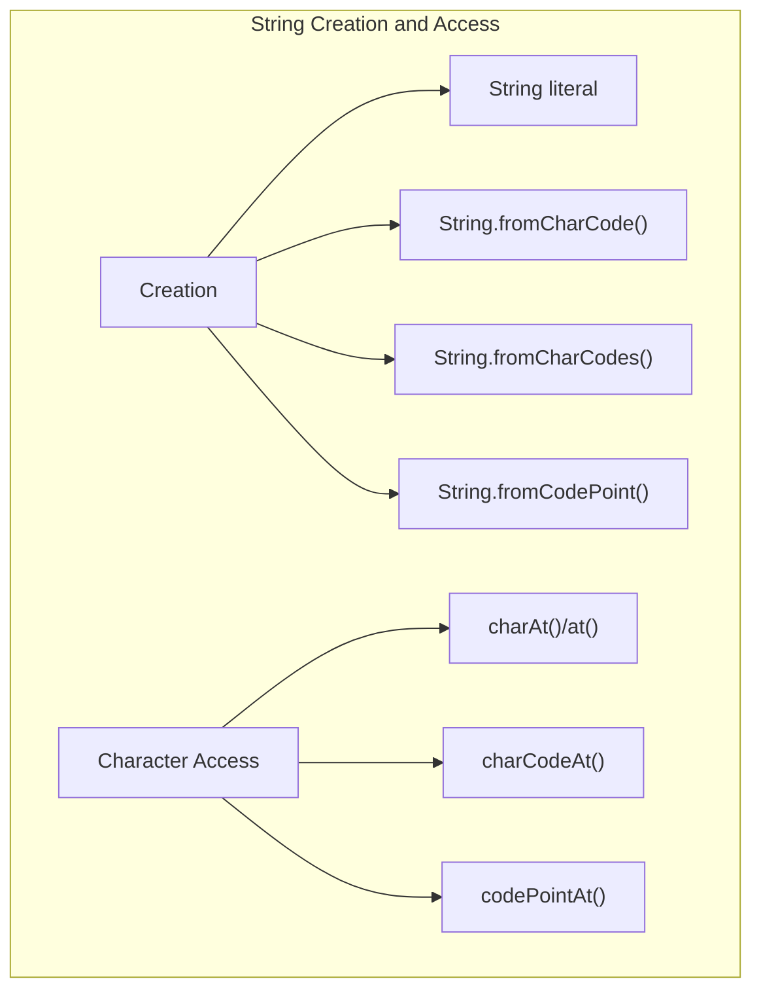

Sources: [std/assembly/string.ts:14-83](https://github.com/AssemblyScript/assemblyscript/blob/4e7734b8/std/assembly/string.ts:14-83#L14-L83)

Implementation details:
- `fromCharCode` creates a string from UTF-16 code units
- `fromCharCodes` converts an array of code units to a string
- `fromCodePoint` handles surrogate pairs for Unicode code points above 0xFFFF
- Character access methods handle bounds checking appropriately
- `codePointAt` properly combines surrogate pairs

### String Operations

Strings provide comprehensive functionality for text manipulation:

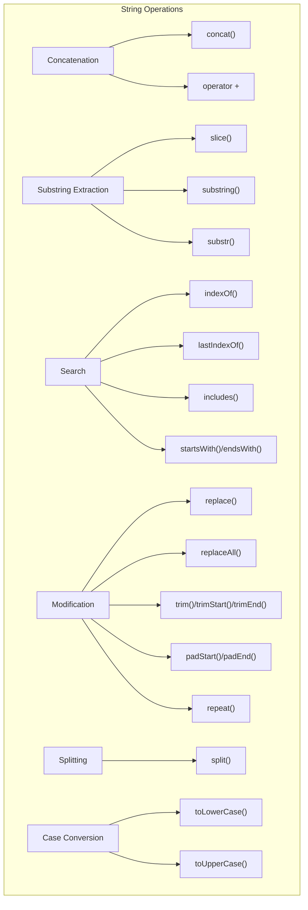

Sources: [std/assembly/string.ts:89-646](https://github.com/AssemblyScript/assemblyscript/blob/4e7734b8/std/assembly/string.ts:89-646#L89-L646)

Implementation characteristics:
- String operations create new string instances (immutability)
- Memory is explicitly managed using `__new` and `__renew`
- Operations optimize for common cases (e.g., empty strings)
- Case conversion handles:
  - ASCII as a fast path
  - Full Unicode case mapping
  - Special cases like Greek sigma at the end of words
  - Surrogate pairs and character expansion

### String Encoding and Decoding

The String class provides specialized namespaces for encoding/decoding:

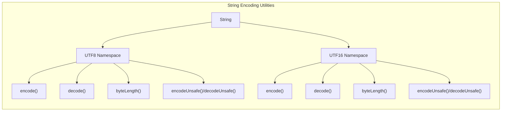

Sources: [std/assembly/string.ts:661-843](https://github.com/AssemblyScript/assemblyscript/blob/4e7734b8/std/assembly/string.ts:661-843#L661-L843)

Key functionality:
- UTF-8 encoding handles proper code point conversion to 1-4 bytes
- Surrogate pair detection and handling
- Error modes for invalid sequences (WTF8, REPLACE, ERROR)
- Optimized encoding/decoding paths for common patterns
- Support for null termination

## Integration with Runtime

Both Array and String interact with AssemblyScript's runtime system:

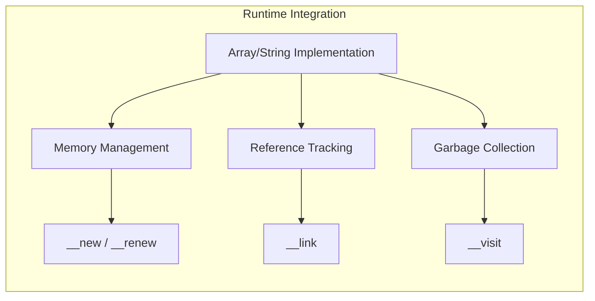

Sources: [std/assembly/array.ts:514-525](https://github.com/AssemblyScript/assemblyscript/blob/4e7734b8/std/assembly/array.ts:514-525#L514-L525)

Integration points:
- Memory allocation via `__new` and `__renew`
- Arrays use `__link` to establish ownership of references they contain
- The `__visit` method supports garbage collection
- Efficient memory operations with `memory.copy` and `memory.fill`

## Performance Considerations

### Array Performance

- Arrays start with a minimum capacity of 8 elements
- Capacity doubles on reallocation to amortize costs
- Operations at the end of the array (`push`/`pop`) are more efficient than operations at the beginning (`unshift`/`shift`)
- Arrays with non-nullable reference types include null checking for type safety
- Methods that mutate the array in place are generally more efficient than those creating new arrays

### String Performance

- Strings are immutable, so all operations create new instances
- Comparison operations optimize common cases (same instance, different lengths)
- Case transformations use ASCII fast paths when possible
- String methods balance correctness (Unicode handling) with performance
- For extensive string building, concatenating multiple strings at once is more efficient than sequential concatenation

## Common Usage Patterns

Arrays and strings are fundamental data structures used throughout most applications:

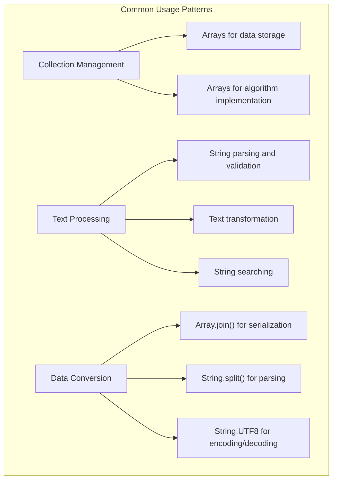

Sources: [tests/compiler/std/array.ts](https://github.com/AssemblyScript/assemblyscript/blob/4e7734b8/tests/compiler/std/array.ts), [tests/compiler/std/string.ts](https://github.com/AssemblyScript/assemblyscript/blob/4e7734b8/tests/compiler/std/string.ts)

## Summary

The Array and String implementations in AssemblyScript provide essential functionality while maintaining memory efficiency and type safety. They are designed with careful attention to memory management, offering comprehensive APIs for data manipulation and transformation.