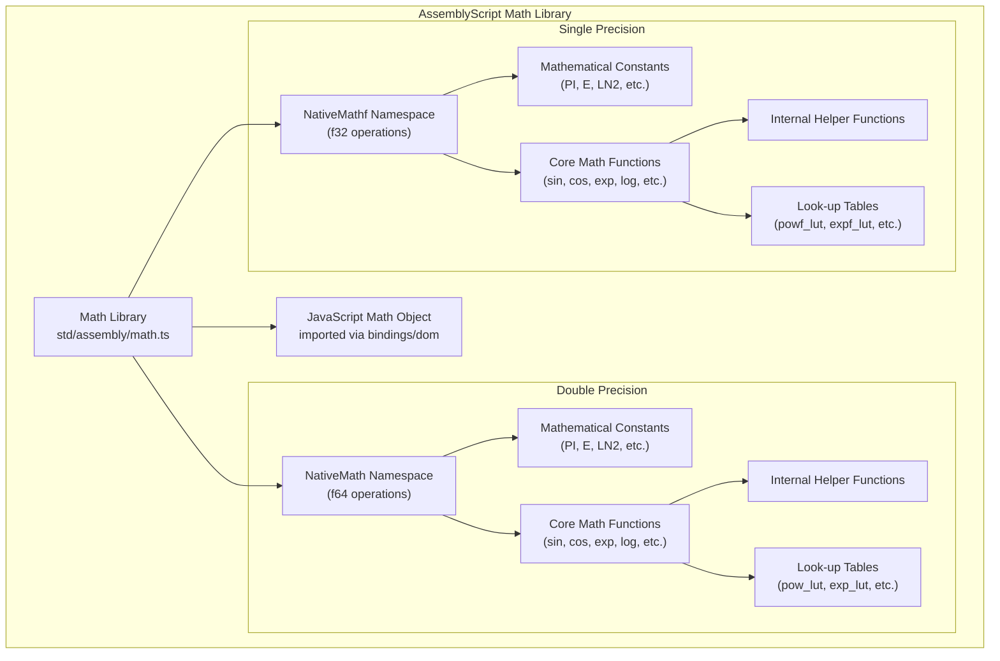
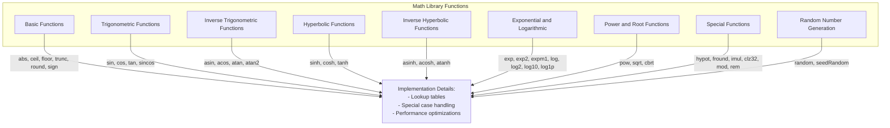
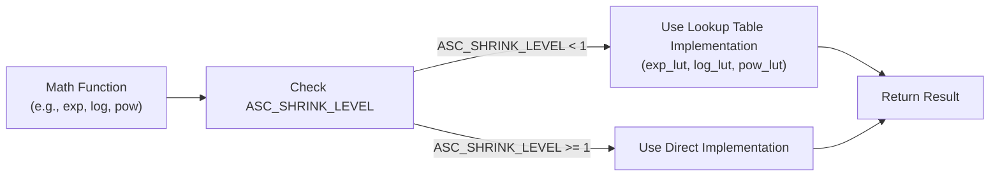
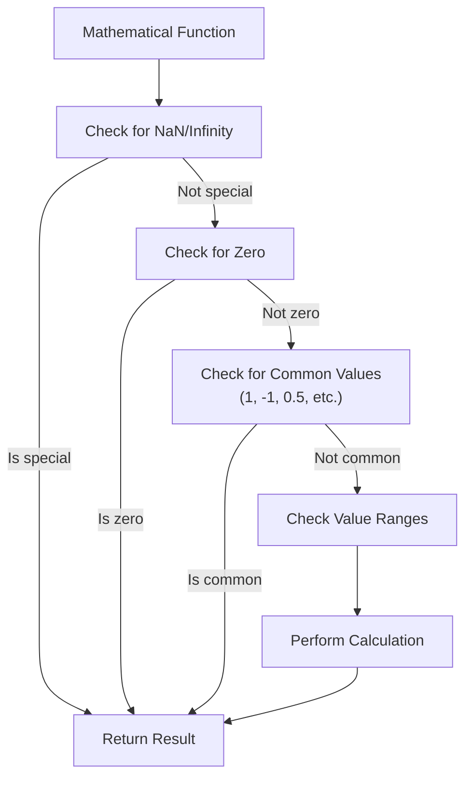
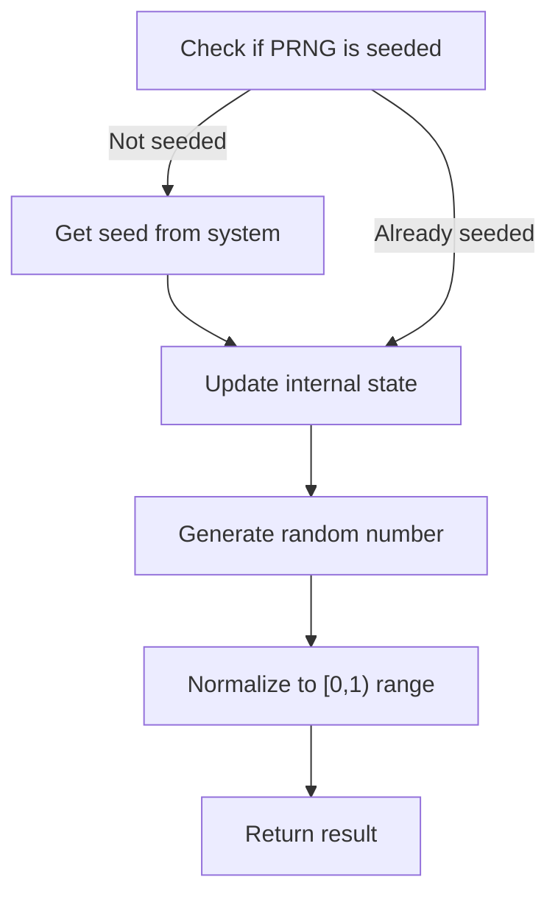

# Math Library

<details>
<summary>Relevant source files</summary>

The following files were used as context for generating this wiki page:

- [std/assembly/math.ts](https://github.com/AssemblyScript/assemblyscript/blob/4e7734b8/std/assembly/math.ts)
- [tests/compiler/std/math.ts](https://github.com/AssemblyScript/assemblyscript/blob/4e7734b8/tests/compiler/std/math.ts)

</details>


The AssemblyScript Math Library provides mathematical operations and constants for both single-precision (f32) and double-precision (f64) floating-point arithmetic. It implements standard mathematical functions similar to JavaScript's Math object, but with native WebAssembly performance and precision characteristics. The library is part of the AssemblyScript standard library.

## Overview

The Math Library is implemented in [std/assembly/math.ts](). It consists of two main namespaces:

1. `NativeMath` - Double-precision (f64) mathematical functions
2. `NativeMathf` - Single-precision (f32) mathematical functions

Many implementations are based on the musl C library, with adaptations for WebAssembly, as noted in the source code comments. The library also includes specialized look-up tables for improved performance of certain functions.

Sources: [std/assembly/math.ts:1-2764](https://github.com/AssemblyScript/assemblyscript/blob/4e7734b8/std/assembly/math.ts#L1-L2764)

## Library Architecture

The Math Library is organized into namespaces with parallel implementations for different precision levels:



Sources: [std/assembly/math.ts:1-7](https://github.com/AssemblyScript/assemblyscript/blob/4e7734b8/std/assembly/math.ts#L1-L7), [std/assembly/math.ts:415-1765](https://github.com/AssemblyScript/assemblyscript/blob/4e7734b8/std/assembly/math.ts#L415-L1765), [std/assembly/math.ts:1946-2764](https://github.com/AssemblyScript/assemblyscript/blob/4e7734b8/std/assembly/math.ts#L1946-L2764)

## Mathematical Constants

Both `NativeMath` and `NativeMathf` provide the following constants:

| Constant  | Description                                       | Value (approx.)     |
|-----------|---------------------------------------------------|---------------------|
| E         | Euler's number (base of natural logarithm)        | 2.718281828459045   |
| LN2       | Natural logarithm of 2                            | 0.6931471805599453  |
| LN10      | Natural logarithm of 10                           | 2.302585092994046   |
| LOG2E     | Base-2 logarithm of E                             | 1.4426950408889634  |
| LOG10E    | Base-10 logarithm of E                            | 0.4342944819032518  |
| PI        | Ratio of the circumference to the diameter of a circle | 3.141592653589793 |
| SQRT1_2   | Square root of 1/2                                | 0.7071067811865476  |
| SQRT2     | Square root of 2                                  | 1.4142135623730951  |

The constants are implemented using the `@lazy` decorator and precise bit representations to ensure accuracy:

```
@lazy
export const PI = reinterpret<f64>(0x400921FB54442D18); // 3.14159265358979323846
```

Sources: [std/assembly/math.ts:417-447](https://github.com/AssemblyScript/assemblyscript/blob/4e7734b8/std/assembly/math.ts#L417-L447), [std/assembly/math.ts:1949-1978](https://github.com/AssemblyScript/assemblyscript/blob/4e7734b8/std/assembly/math.ts#L1949-L1978)

## Function Categories

The Math Library implements the following categories of functions for both f32 and f64:



Sources: [std/assembly/math.ts:415-1765](https://github.com/AssemblyScript/assemblyscript/blob/4e7734b8/std/assembly/math.ts#L415-L1765), [std/assembly/math.ts:1946-2764](https://github.com/AssemblyScript/assemblyscript/blob/4e7734b8/std/assembly/math.ts#L1946-L2764)

## Implementation Techniques

The Math Library uses several techniques to balance precision, performance, and code size:

### 1. Lookup Tables

For computationally expensive functions like `exp`, `log`, and `pow`, lookup tables are used to improve performance:



The lookup tables are imported from `./util/math`:

```
import {
  pow_lut, exp_lut, exp2_lut, log_lut, log2_lut,
  powf_lut, expf_lut, exp2f_lut, logf_lut, log2f_lut
} from "./util/math";
```

Sources: [std/assembly/math.ts:4-7](https://github.com/AssemblyScript/assemblyscript/blob/4e7734b8/std/assembly/math.ts#L4-L7), [std/assembly/math.ts:781-826](https://github.com/AssemblyScript/assemblyscript/blob/4e7734b8/std/assembly/math.ts#L781-L826), [std/assembly/math.ts:1128-1185](https://github.com/AssemblyScript/assemblyscript/blob/4e7734b8/std/assembly/math.ts#L1128-L1185), [std/assembly/math.ts:1199-1416](https://github.com/AssemblyScript/assemblyscript/blob/4e7734b8/std/assembly/math.ts#L1199-L1416)

### 2. Special Case Handling

Mathematical functions handle special cases like NaN, Infinity, zero, and specific input ranges for correctness and performance:



Sources: [std/assembly/math.ts:462-1764](https://github.com/AssemblyScript/assemblyscript/blob/4e7734b8/std/assembly/math.ts#L462-L1764)

### 3. Optimization Levels

The library uses the `ASC_SHRINK_LEVEL` constant to provide different implementations based on code size requirements:

```typescript
if (ASC_SHRINK_LEVEL < 1) {
  return exp_lut(x);  // Optimized with lookup tables
} else {
  // Direct calculation implementation
  // ...
}
```

Sources: [std/assembly/math.ts:781-826](https://github.com/AssemblyScript/assemblyscript/blob/4e7734b8/std/assembly/math.ts#L781-L826), [std/assembly/math.ts:967-1014](https://github.com/AssemblyScript/assemblyscript/blob/4e7734b8/std/assembly/math.ts#L967-L1014), [std/assembly/math.ts:1128-1185](https://github.com/AssemblyScript/assemblyscript/blob/4e7734b8/std/assembly/math.ts#L1128-L1185), [std/assembly/math.ts:1199-1416](https://github.com/AssemblyScript/assemblyscript/blob/4e7734b8/std/assembly/math.ts#L1199-L1416)

## Random Number Generation

The Math Library includes a pseudo-random number generator:

1. `random()` - Returns a random number between 0 (inclusive) and 1 (exclusive)
2. `seedRandom(value: i64)` - Seeds the random number generator

The implementation uses a xorshift algorithm for f64 and xoroshiro64starstar for f32:



Sources: [std/assembly/math.ts:390-398](https://github.com/AssemblyScript/assemblyscript/blob/4e7734b8/std/assembly/math.ts#L390-L398), [std/assembly/math.ts:1418-1442](https://github.com/AssemblyScript/assemblyscript/blob/4e7734b8/std/assembly/math.ts#L1418-L1442), [std/assembly/math.ts:2727-2740](https://github.com/AssemblyScript/assemblyscript/blob/4e7734b8/std/assembly/math.ts#L2727-L2740)

## Usage Examples

The Math Library can be used in AssemblyScript code like this:

```typescript
// Using double precision (f64) functions
import { NativeMath } from "./math";

function calculateDistance(x1: f64, y1: f64, x2: f64, y2: f64): f64 {
  const dx = x2 - x1;
  const dy = y2 - y1;
  return NativeMath.sqrt(dx * dx + dy * dy);
}

// Using single precision (f32) functions
import { NativeMathf } from "./math";

function normalizeVector(x: f32, y: f32): void {
  const length = NativeMathf.sqrt(x * x + y * y);
  return { x: x / length, y: y / length };
}
```

## Performance Considerations

1. **Precision vs. Size Trade-offs**: Use the appropriate precision (f32 or f64) based on your needs. Single-precision operations are generally faster but less precise.

2. **Optimization Levels**: The `ASC_SHRINK_LEVEL` compiler option affects which implementations are used:
   - Lower levels use lookup tables for better performance
   - Higher levels use direct calculations for smaller code size

3. **Special Cases**: Functions include optimizations for common cases (like `x = 0`, `x = 1`, etc.) that bypass expensive calculations.

4. **Implementation Details**: Many functions are based on the musl C library, with adaptations for WebAssembly to ensure efficiency.

Sources: [std/assembly/math.ts:371-388](https://github.com/AssemblyScript/assemblyscript/blob/4e7734b8/std/assembly/math.ts#L371-L388), [std/assembly/math.ts:781-826](https://github.com/AssemblyScript/assemblyscript/blob/4e7734b8/std/assembly/math.ts#L781-L826), [std/assembly/math.ts:967-1014](https://github.com/AssemblyScript/assemblyscript/blob/4e7734b8/std/assembly/math.ts#L967-L1014), [std/assembly/math.ts:1128-1185](https://github.com/AssemblyScript/assemblyscript/blob/4e7734b8/std/assembly/math.ts#L1128-L1185), [std/assembly/math.ts:1199-1416](https://github.com/AssemblyScript/assemblyscript/blob/4e7734b8/std/assembly/math.ts#L1199-L1416)

## Relationship with JavaScript Math

The AssemblyScript Math Library imports the JavaScript Math object for compatibility:

```typescript
import { Math as JSMath } from "./bindings/dom";
export { JSMath };
```

This allows existing JavaScript code to be more easily ported to AssemblyScript, while the `NativeMath` and `NativeMathf` namespaces provide native WebAssembly implementations for better performance.