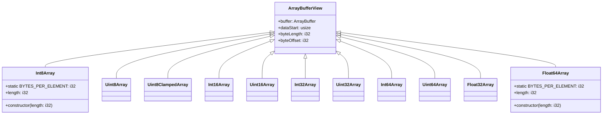
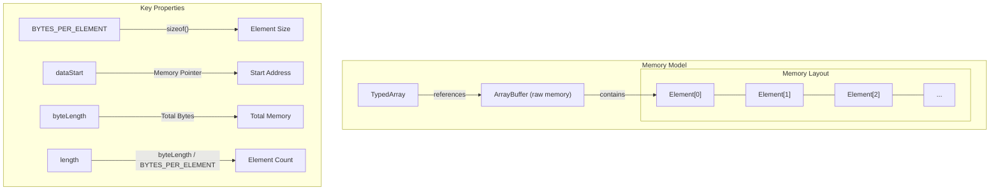

# TypedArrays

<details>
<summary>Relevant source files</summary>

The following files were used as context for generating this wiki page:

- [std/assembly/typedarray.ts](https://github.com/AssemblyScript/assemblyscript/blob/4e7734b8/std/assembly/typedarray.ts)
- [tests/compiler/std/typedarray.ts](https://github.com/AssemblyScript/assemblyscript/blob/4e7734b8/tests/compiler/std/typedarray.ts)

</details>


TypedArrays in AssemblyScript provide fixed-length array-like objects that store numeric values of specific types in WebAssembly memory. These typed arrays offer memory-efficient storage and operations compared to regular arrays and are essential for binary data manipulation, interfacing with external systems, and optimizing memory usage in AssemblyScript applications.

## TypedArray Hierarchy and Structure

TypedArrays in AssemblyScript extend the `ArrayBufferView` class, which provides a view into an underlying `ArrayBuffer` that holds the actual data.



Sources: [std/assembly/typedarray.ts:8-1569](https://github.com/AssemblyScript/assemblyscript/blob/4e7734b8/std/assembly/typedarray.ts#L8-L1569)

## Available TypedArray Types

AssemblyScript provides several TypedArray implementations for different numeric types:

| TypedArray | Element Type | Bytes Per Element | Value Range |
|------------|--------------|-------------------|-------------|
| Int8Array | i8 | 1 | -128 to 127 |
| Uint8Array | u8 | 1 | 0 to 255 |
| Uint8ClampedArray | u8 | 1 | 0 to 255 (with clamping) |
| Int16Array | i16 | 2 | -32,768 to 32,767 |
| Uint16Array | u16 | 2 | 0 to 65,535 |
| Int32Array | i32 | 4 | -2,147,483,648 to 2,147,483,647 |
| Uint32Array | u32 | 4 | 0 to 4,294,967,295 |
| Int64Array | i64 | 8 | -2^63 to 2^63-1 |
| Uint64Array | u64 | 8 | 0 to 2^64-1 |
| Float32Array | f32 | 4 | 32-bit IEEE floating point |
| Float64Array | f64 | 8 | 64-bit IEEE floating point |

Sources: [std/assembly/typedarray.ts:8-1569](https://github.com/AssemblyScript/assemblyscript/blob/4e7734b8/std/assembly/typedarray.ts#L8-L1569), [tests/compiler/std/typedarray.ts:1-11](https://github.com/AssemblyScript/assemblyscript/blob/4e7734b8/tests/compiler/std/typedarray.ts#L1-L11)

## Memory Layout

TypedArrays provide structured access to binary data in memory. Each TypedArray maintains a reference to its underlying `ArrayBuffer` and uses low-level memory operations to access and modify elements efficiently.



Sources: [std/assembly/typedarray.ts:8-147](https://github.com/AssemblyScript/assemblyscript/blob/4e7734b8/std/assembly/typedarray.ts#L8-L147), [std/assembly/typedarray.ts:287-432](https://github.com/AssemblyScript/assemblyscript/blob/4e7734b8/std/assembly/typedarray.ts#L287-L432)

## Creating TypedArrays

There are multiple ways to create TypedArrays in AssemblyScript:

1. Creating a new TypedArray with a specified length:
   ```typescript
   let array = new Int32Array(5); // 5 elements, each initialized to 0
   ```

2. Using the `wrap` static method to create a view over an existing `ArrayBuffer`:
   ```typescript
   let buffer = new ArrayBuffer(20);
   let array = Int32Array.wrap(buffer); // View into buffer with 5 Int32 elements
   ```

3. Creating a slice (copy) or subarray (view) from an existing TypedArray:
   ```typescript
   let original = new Int32Array(10);
   let slice = original.slice(2, 5);    // New copy with elements 2, 3, 4
   let subarray = original.subarray(2, 5); // View into original with elements 2, 3, 4
   ```

Sources: [std/assembly/typedarray.ts:15-147](https://github.com/AssemblyScript/assemblyscript/blob/4e7734b8/std/assembly/typedarray.ts#L15-L147), [std/assembly/typedarray.ts:1571-1883](https://github.com/AssemblyScript/assemblyscript/blob/4e7734b8/std/assembly/typedarray.ts#L1571-L1883), [tests/compiler/std/typedarray.ts:29-85](https://github.com/AssemblyScript/assemblyscript/blob/4e7734b8/tests/compiler/std/typedarray.ts#L29-L85)

## Key Operations

### Element Access

Each TypedArray provides methods for accessing and modifying elements:

```typescript
// Element access
let value = array[2];      // Get element at index 2
array[2] = 42;             // Set element at index 2
let lastValue = array.at(-1); // Get last element using negative index
```

The `at()` method supports negative indices, where `-1` refers to the last element.

Sources: [std/assembly/typedarray.ts:23-50](https://github.com/AssemblyScript/assemblyscript/blob/4e7734b8/std/assembly/typedarray.ts#L23-L50), [std/assembly/typedarray.ts:319-334](https://github.com/AssemblyScript/assemblyscript/blob/4e7734b8/std/assembly/typedarray.ts#L319-L334)

### Searching

TypedArrays include methods for searching elements:

```typescript
let hasElement = array.includes(42);               // Check if array contains a value
let indexOfElement = array.indexOf(42);            // Find index of first occurrence
let lastIndexOfElement = array.lastIndexOf(42);    // Find index of last occurrence
let evenNumberIndex = array.findIndex(x => x % 2 === 0); // Find first element satisfying a condition
let lastEvenNumberIndex = array.findLastIndex(x => x % 2 === 0); // Find last element satisfying a condition
```

Sources: [std/assembly/typedarray.ts:52-62](https://github.com/AssemblyScript/assemblyscript/blob/4e7734b8/std/assembly/typedarray.ts#L52-L62), [std/assembly/typedarray.ts:1746-1808](https://github.com/AssemblyScript/assemblyscript/blob/4e7734b8/std/assembly/typedarray.ts#L1746-L1808)

### Transformation

TypedArrays offer methods to transform data:

```typescript
// Map, filter, reduce
let doubled = array.map(x => x * 2);                   // Create new array with transformed values
let evenNumbers = array.filter(x => x % 2 === 0);      // Create new array with filtered values
let sum = array.reduce((acc, val) => acc + val, 0);    // Reduce to a single value
let reverseSum = array.reduceRight((acc, val) => acc + val, 0); // Reduce from right to left
```

Sources: [std/assembly/typedarray.ts:100-121](https://github.com/AssemblyScript/assemblyscript/blob/4e7734b8/std/assembly/typedarray.ts#L100-L121), [std/assembly/typedarray.ts:1664-1717](https://github.com/AssemblyScript/assemblyscript/blob/4e7734b8/std/assembly/typedarray.ts#L1664-L1717)

### Array Manipulation

TypedArrays provide methods for manipulating array elements:

```typescript
array.fill(0);                 // Fill entire array with 0
array.fill(1, 2, 4);           // Fill indices 2-3 with 1
array.sort();                  // Sort numerically
array.sort((a, b) => b - a);   // Sort with custom comparator
array.reverse();               // Reverse the array in-place
array.copyWithin(0, 2, 4);     // Copy elements from indices 2-3 to index 0
```

Sources: [std/assembly/typedarray.ts:64-84](https://github.com/AssemblyScript/assemblyscript/blob/4e7734b8/std/assembly/typedarray.ts#L64-L84), [std/assembly/typedarray.ts:128-131](https://github.com/AssemblyScript/assemblyscript/blob/4e7734b8/std/assembly/typedarray.ts#L128-L131), [tests/compiler/std/typedarray.ts:140-202](https://github.com/AssemblyScript/assemblyscript/blob/4e7734b8/tests/compiler/std/typedarray.ts#L140-L202)

### Iteration and Aggregation

TypedArrays support methods for iterating through elements and testing conditions:

```typescript
let allPositive = array.every(x => x > 0);    // Test if all elements pass predicate
let someEven = array.some(x => x % 2 === 0);  // Test if any element passes predicate
array.forEach(x => console.log(x));           // Execute function for each element
```

Sources: [std/assembly/typedarray.ts:116-126](https://github.com/AssemblyScript/assemblyscript/blob/4e7734b8/std/assembly/typedarray.ts#L116-L126), [std/assembly/typedarray.ts:1809-1847](https://github.com/AssemblyScript/assemblyscript/blob/4e7734b8/std/assembly/typedarray.ts#L1809-L1847)

### Interoperation

TypedArrays allow copying values between arrays and converting to strings:

```typescript
// Copy values from another array
array.set(sourceArray, offsetIndex);

// Convert to string
let arrayString = array.join(',');    // Join with separator
let arrayToString = array.toString(); // Default toString uses comma separator
```

Sources: [std/assembly/typedarray.ts:141-143](https://github.com/AssemblyScript/assemblyscript/blob/4e7734b8/std/assembly/typedarray.ts#L141-L143), [std/assembly/typedarray.ts:133-139](https://github.com/AssemblyScript/assemblyscript/blob/4e7734b8/std/assembly/typedarray.ts#L133-L139), [std/assembly/typedarray.ts:1886-1945](https://github.com/AssemblyScript/assemblyscript/blob/4e7734b8/std/assembly/typedarray.ts#L1886-L1945)

## Special TypedArray Features

### Uint8ClampedArray

The `Uint8ClampedArray` has a unique behavior when assigning values:

- Values less than 0 are clamped to 0
- Values greater than 255 are clamped to 255
- Non-finite values like `NaN` and `Infinity` become 0

This is useful for image processing where pixel values must be in the 0-255 range.

```typescript
let clampedArray = new Uint8ClampedArray(3);
clampedArray[0] = -32;   // Clamped to 0
clampedArray[1] = 2;     // Remains 2
clampedArray[2] = 256;   // Clamped to 255
```

Sources: [std/assembly/typedarray.ts:318-327](https://github.com/AssemblyScript/assemblyscript/blob/4e7734b8/std/assembly/typedarray.ts#L318-L327), [tests/compiler/std/typedarray.ts:130-138](https://github.com/AssemblyScript/assemblyscript/blob/4e7734b8/tests/compiler/std/typedarray.ts#L130-L138)

### Memory Efficiency

TypedArrays provide memory-efficient storage by using the exact amount of memory needed for each element type:

```typescript
let array = new Int32Array(1000);
// Exactly 4000 bytes (4 bytes × 1000 elements)
// Plus minimal overhead for the view object
```

This is more efficient than using regular arrays for numeric data.

Sources: [tests/compiler/std/typedarray.ts:1-11](https://github.com/AssemblyScript/assemblyscript/blob/4e7734b8/tests/compiler/std/typedarray.ts#L1-L11)

## Implementation Details

TypedArrays use low-level memory operations for efficient data access through the WebAssembly memory:

```typescript
// Simplified example of element access in Int32Array
@operator("[]")
private __get(index: i32): i32 {
  // Bounds check
  if (<u32>index >= <u32>this.byteLength >>> alignof<i32>()) 
    throw new RangeError(E_INDEXOUTOFRANGE);
  // Direct memory access
  return load<i32>(this.dataStart + (<usize>index << alignof<i32>()));
}
```

Key implementation details:
- Use of `load<T>` and `store<T>` for direct memory access
- Alignment-aware calculations with `alignof<T>()` 
- Shared helper functions like `SLICE`, `SUBARRAY`, and `COPY_WITHIN` that implement common operations generically

Sources: [std/assembly/typedarray.ts:734-754](https://github.com/AssemblyScript/assemblyscript/blob/4e7734b8/std/assembly/typedarray.ts#L734-L754), [std/assembly/typedarray.ts:1571-1589](https://github.com/AssemblyScript/assemblyscript/blob/4e7734b8/std/assembly/typedarray.ts#L1571-L1589)

## Common Usage Patterns

### Creating and Manipulating Pixel Data

```typescript
// Create a pixel buffer with RGBA values
let pixels = new Uint8ClampedArray(width * height * 4);

// Set RGBA values for a pixel at (x,y)
function setPixel(x: i32, y: i32, r: u8, g: u8, b: u8, a: u8): void {
  const index = (y * width + x) * 4;
  pixels[index + 0] = r;
  pixels[index + 1] = g;
  pixels[index + 2] = b;
  pixels[index + 3] = a;
}
```

### Working with Binary Data

```typescript
// Create a view into binary data
let buffer = new ArrayBuffer(16);
let int32View = Int32Array.wrap(buffer);
let uint8View = Uint8Array.wrap(buffer);

// Modify data through one view affects the other
int32View[0] = 0x01020304;
// uint8View now contains [4, 3, 2, 1] or [1, 2, 3, 4] depending on endianness
```

### Data Processing

```typescript
// Process array of sensor readings
let readings = new Float32Array(100);
// ... fill with data ...

// Process the data
let average = readings.reduce((sum, val) => sum + val, 0) / readings.length;
let normalizedReadings = readings.map(val => val - average);
let peaks = normalizedReadings.filter(val => val > threshold);
```

Sources: [tests/compiler/std/typedarray.ts:317-436](https://github.com/AssemblyScript/assemblyscript/blob/4e7734b8/tests/compiler/std/typedarray.ts#L317-L436), [tests/compiler/std/typedarray.ts:593-661](https://github.com/AssemblyScript/assemblyscript/blob/4e7734b8/tests/compiler/std/typedarray.ts#L593-L661)

## Performance Considerations

1. **Direct Memory Access**: TypedArrays provide direct access to WebAssembly memory, making them much more efficient than regular arrays for numeric data.

2. **Alignment and Padding**: Each TypedArray element is properly aligned in memory based on its type, which ensures optimal access patterns.

3. **View vs. Copy**: Using `subarray()` creates a view into the existing memory (no copy), while `slice()` creates a new copy of the data. Choose wisely based on whether you need to modify the original data.

4. **Memory Management**: TypedArrays are managed by the AssemblyScript garbage collector, but their tight memory representation reduces pressure on the GC.

Sources: [std/assembly/typedarray.ts:1571-1610](https://github.com/AssemblyScript/assemblyscript/blob/4e7734b8/std/assembly/typedarray.ts#L1571-L1610)

## Compatibility with JavaScript

The AssemblyScript TypedArray implementation follows the same API as JavaScript TypedArrays, making it easier to port code between the two environments and interact with JavaScript through WebAssembly exports and imports.