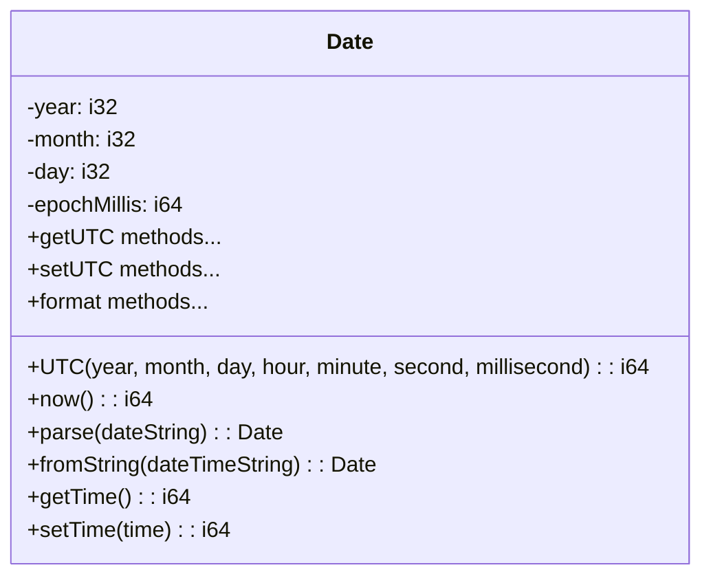
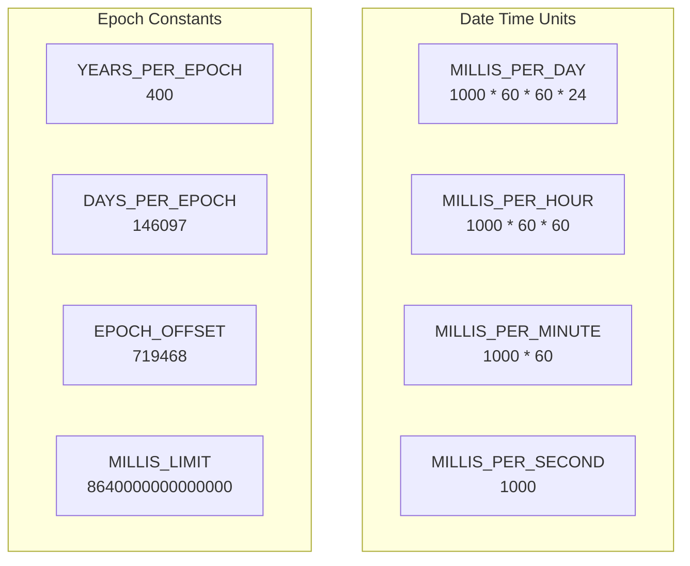
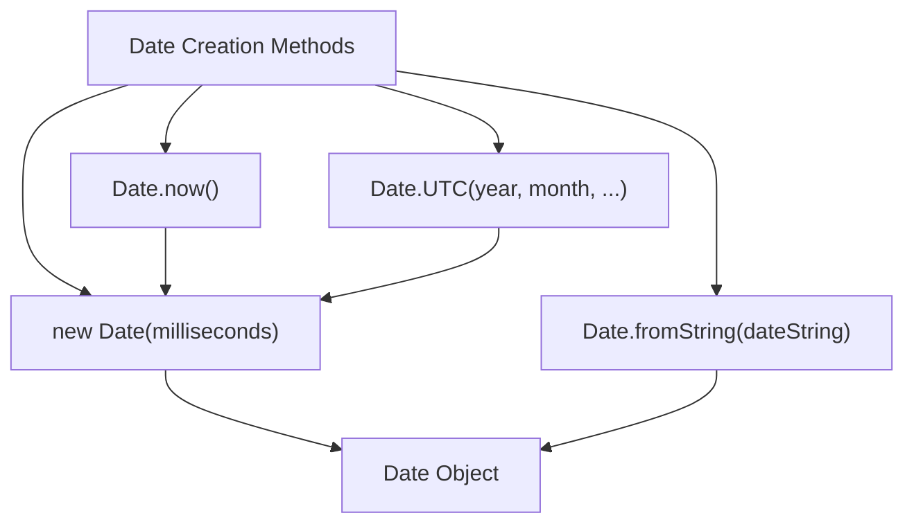
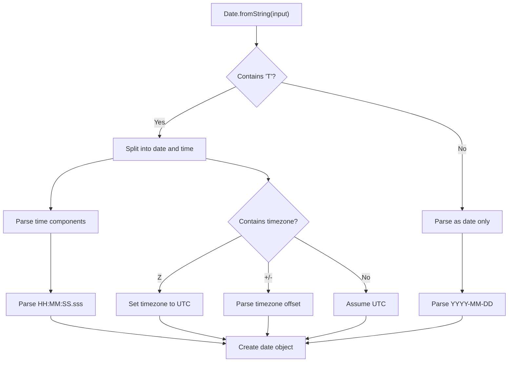

# Date

<details>
<summary>Relevant source files</summary>

The following files were used as context for generating this wiki page:

- [std/assembly/date.ts](https://github.com/AssemblyScript/assemblyscript/blob/4e7734b8/std/assembly/date.ts)
- [std/assembly/util/error.ts](https://github.com/AssemblyScript/assemblyscript/blob/4e7734b8/std/assembly/util/error.ts)
- [tests/compiler/std/date.debug.wat](https://github.com/AssemblyScript/assemblyscript/blob/4e7734b8/tests/compiler/std/date.debug.wat)
- [tests/compiler/std/date.json](https://github.com/AssemblyScript/assemblyscript/blob/4e7734b8/tests/compiler/std/date.json)
- [tests/compiler/std/date.release.wat](https://github.com/AssemblyScript/assemblyscript/blob/4e7734b8/tests/compiler/std/date.release.wat)
- [tests/compiler/std/date.ts](https://github.com/AssemblyScript/assemblyscript/blob/4e7734b8/tests/compiler/std/date.ts)
- [tests/compiler/std/date.untouched.wat](https://github.com/AssemblyScript/assemblyscript/blob/4e7734b8/tests/compiler/std/date.untouched.wat)

</details>


This document describes the `Date` class in AssemblyScript, which provides functionality for working with dates and times. The Date class represents moments in time as milliseconds since the Unix epoch (January 1, 1970, 00:00:00 UTC) and provides methods for creating, manipulating, and formatting dates.

## Overview

The `Date` class in AssemblyScript's standard library supports UTC-based date and time operations. It provides functionality similar to JavaScript's Date object but with implementation details specific to AssemblyScript.



Sources: [std/assembly/date.ts:20-296](https://github.com/AssemblyScript/assemblyscript/blob/4e7734b8/std/assembly/date.ts#L20-L296)

## Data Model and Constants

The `Date` class uses key constants for time calculations:



Sources: [std/assembly/date.ts:5-14](https://github.com/AssemblyScript/assemblyscript/blob/4e7734b8/std/assembly/date.ts#L5-L14)

Internally, the Date object stores:
- Milliseconds since epoch (`epochMillis`)
- Cached year, month, and day components to avoid recalculation

## Creating Date Objects

The Date class provides several methods for creating date objects:

### Constructor

The basic constructor accepts milliseconds since epoch:

```typescript
constructor(private epochMillis: i64)
```

Example:
```typescript
// January 1, 2020 00:00:00 UTC
let date = new Date(1577836800000);
```

If the provided value is invalid (outside the valid range), the constructor throws a `RangeError` with "Invalid Date" message.

Sources: [std/assembly/date.ts:128-136](https://github.com/AssemblyScript/assemblyscript/blob/4e7734b8/std/assembly/date.ts#L128-L136)

### Static Methods

The Date class provides several static methods for date creation:

1. **Date.UTC**:
   ```typescript
   static UTC(year: i32, month: i32 = 0, day: i32 = 1, 
             hour: i32 = 0, minute: i32 = 0, second: i32 = 0, 
             millisecond: i32 = 0): i64
   ```
   
   Creates a timestamp in milliseconds for the specified UTC date/time. Month is 0-based (0 = January).

2. **Date.now**:
   ```typescript
   static now(): i64
   ```
   
   Returns the current time in milliseconds since epoch.

3. **Date.parse/fromString**:
   ```typescript
   static parse(dateString: string): Date
   static fromString(dateTimeString: string): Date
   ```
   
   Parses ISO 8601 date strings (e.g., "YYYY-MM-DDTHH:MM:SS.sssZ").

Sources: [std/assembly/date.ts:25-126](https://github.com/AssemblyScript/assemblyscript/blob/4e7734b8/std/assembly/date.ts#L25-L126)



## Accessing Date Components

The Date class provides methods to access various date components:

```typescript
getTime(): i64                 // Milliseconds since epoch
getUTCFullYear(): i32          // Year (e.g., 2020)
getUTCMonth(): i32             // Month (0-11)
getUTCDate(): i32              // Day of month (1-31)
getUTCDay(): i32               // Day of week (0-6, 0=Sunday)
getUTCHours(): i32             // Hour (0-23)
getUTCMinutes(): i32           // Minute (0-59)
getUTCSeconds(): i32           // Second (0-59)
getUTCMilliseconds(): i32      // Millisecond (0-999)
```

Sources: [std/assembly/date.ts:138-183](https://github.com/AssemblyScript/assemblyscript/blob/4e7734b8/std/assembly/date.ts#L138-L183)

## Modifying Date Components

The Date class provides methods to modify date components:

```typescript
setTime(time: i64): i64               // Set milliseconds since epoch
setUTCMilliseconds(millis: i32): void // Set milliseconds (0-999)
setUTCSeconds(seconds: i32): void     // Set seconds (0-59)
setUTCMinutes(minutes: i32): void     // Set minutes (0-59)
setUTCHours(hours: i32): void         // Set hour (0-23)
setUTCDate(day: i32): void            // Set day of month (1-31)
setUTCMonth(month: i32, day?: i32): void // Set month (0-11) and optionally day
setUTCFullYear(year: i32): void       // Set year
```

When changing date components:
- Values outside the valid range (like month=12) will overflow properly (becomes next year, month=0)
- The internal year/month/day cache is automatically updated

Sources: [std/assembly/date.ts:142-214](https://github.com/AssemblyScript/assemblyscript/blob/4e7734b8/std/assembly/date.ts#L142-L214)

## Date Formatting Methods

The Date class offers several formatting methods:

```typescript
toISOString(): string    // "YYYY-MM-DDTHH:MM:SS.sssZ"
toUTCString(): string    // "Ddd, DD Mmm YYYY HH:MM:SS GMT"
toDateString(): string   // "Ddd Mmm DD YYYY"
toTimeString(): string   // "HH:MM:SS"
toString(): string       // "Ddd Mmm DD YYYY HH:MM:SS"
```

Sources: [std/assembly/date.ts:216-295](https://github.com/AssemblyScript/assemblyscript/blob/4e7734b8/std/assembly/date.ts#L216-L295)

Example:
```typescript
let date = new Date(Date.UTC(2020, 0, 1));
date.toISOString();  // "2020-01-01T00:00:00.000Z"
date.toUTCString();  // "Wed, 01 Jan 2020 00:00:00 GMT"
date.toDateString(); // "Wed Jan 01 2020"
```

## Parsing ISO 8601 Date Strings

The `fromString` method parses ISO 8601 date strings with extensive support for various formats:



The parser supports:
- Basic date: `YYYY`, `YYYY-MM`, `YYYY-MM-DD`
- Time components: `THH:MM`, `THH:MM:SS`, `THH:MM:SS.sss`
- UTC indicator: `Z`
- Timezone offsets: `+HH:MM`, `-HH:MM`

Sources: [std/assembly/date.ts:49-126](https://github.com/AssemblyScript/assemblyscript/blob/4e7734b8/std/assembly/date.ts#L49-L126)

## Date Calculations

The Date implementation uses efficient algorithms for date calculations:

### Key Helper Functions

```typescript
// Convert date components to milliseconds
epochMillis(year, month, day, hour, minute, second, milliseconds): i64

// Convert milliseconds to date components (populates _month, _day globals)
dateFromEpoch(ms: i64): i32  // Returns year

// Calculate days since epoch for date
daysSinceEpoch(y: i32, m: i32, d: i32): i64

// Calculate day of week (0=Sunday)
dayOfWeek(year: i32, month: i32, day: i32): i32
```

Sources: [std/assembly/date.ts:298-375](https://github.com/AssemblyScript/assemblyscript/blob/4e7734b8/std/assembly/date.ts#L298-L375)

The implementation uses the Euclidean Affine Functions algorithm for date calculations, as noted in the source code comments:

> Based on "Euclidean Affine Functions and Applications to Calendar Algorithms"
> Paper: https://arxiv.org/pdf/2102.06959.pdf

Sources: [std/assembly/date.ts:332-334](https://github.com/AssemblyScript/assemblyscript/blob/4e7734b8/std/assembly/date.ts#L332-L334)

## Date Limitations

The Date class has the following limitations:

- Valid date range: -8,640,000,000,000,000 to 8,640,000,000,000,000 milliseconds from epoch
- This corresponds approximately to years -271821 to 275760
- Attempting to create a Date with values outside this range will throw a RangeError

The validation occurs in the `invalidDate` function:

```typescript
function invalidDate(millis: i64): bool {
  return (millis < -MILLIS_LIMIT) | (millis > MILLIS_LIMIT);
}
```

Sources: [std/assembly/date.ts:327-330](https://github.com/AssemblyScript/assemblyscript/blob/4e7734b8/std/assembly/date.ts#L327-L330)

## Examples

### Basic Date Creation and Formatting

```typescript
// Create date from timestamp
let date1 = new Date(1577836800000);  // 2020-01-01T00:00:00.000Z

// Create date from components (month is 0-based)
let date2 = new Date(Date.UTC(2020, 0, 1));

// Get current time
let now = new Date(Date.now());

// Format date
let isoString = date1.toISOString();  // "2020-01-01T00:00:00.000Z"
```

### Date Component Manipulation

```typescript
let date = new Date(Date.UTC(2020, 0, 1));

// Get components
let year = date.getUTCFullYear();    // 2020
let month = date.getUTCMonth();      // 0 (January)
let day = date.getUTCDate();         // 1

// Set components
date.setUTCFullYear(2021);           // Change year to 2021
date.setUTCMonth(11);                // Change to December
date.setUTCDate(31);                 // Change to the 31st
```

### Date Parsing

```typescript
// Parse ISO date strings
let date1 = Date.fromString("2020-01-01");              // Date only
let date2 = Date.fromString("2020-01-01T12:30:45");     // Date and time
let date3 = Date.fromString("2020-01-01T12:30:45Z");    // With UTC indicator
let date4 = Date.fromString("2020-01-01T12:30:45-08:00"); // With timezone offset
```

Sources: [tests/compiler/std/date.ts:288-340](https://github.com/AssemblyScript/assemblyscript/blob/4e7734b8/tests/compiler/std/date.ts#L288-L340)

## Implementation Notes

The Date implementation in AssemblyScript:

1. Emphasizes efficiency with cached date components
2. Uses optimized algorithms for date calculations
3. Provides UTC-based methods only (no local timezone support)
4. Handles the full range of date scenarios including leap years, different month lengths, etc.
5. Throws appropriate errors for invalid dates instead of returning special values