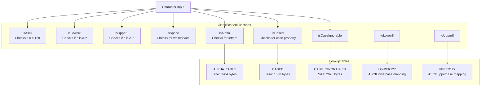
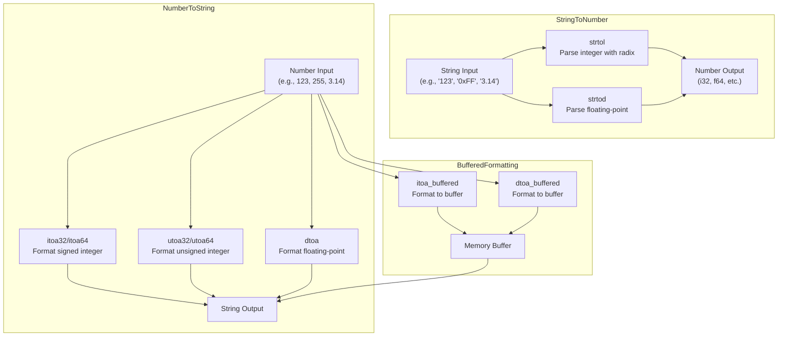
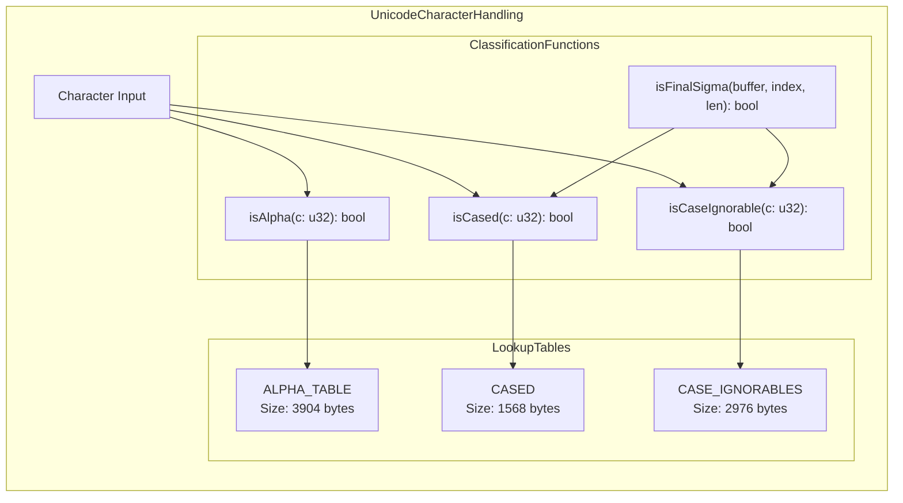

# String and Number Utilities

<details>
<summary>Relevant source files</summary>

The following files were used as context for generating this wiki page:

- [std/assembly/util/number.ts](https://github.com/AssemblyScript/assemblyscript/blob/4e7734b8/std/assembly/util/number.ts)
- [std/assembly/util/string.ts](https://github.com/AssemblyScript/assemblyscript/blob/4e7734b8/std/assembly/util/string.ts)
- [tests/compiler/resolve-binary.debug.wat](https://github.com/AssemblyScript/assemblyscript/blob/4e7734b8/tests/compiler/resolve-binary.debug.wat)
- [tests/compiler/resolve-elementaccess.debug.wat](https://github.com/AssemblyScript/assemblyscript/blob/4e7734b8/tests/compiler/resolve-elementaccess.debug.wat)
- [tests/compiler/resolve-elementaccess.release.wat](https://github.com/AssemblyScript/assemblyscript/blob/4e7734b8/tests/compiler/resolve-elementaccess.release.wat)
- [tests/compiler/resolve-ternary.debug.wat](https://github.com/AssemblyScript/assemblyscript/blob/4e7734b8/tests/compiler/resolve-ternary.debug.wat)
- [tests/compiler/std/array.debug.wat](https://github.com/AssemblyScript/assemblyscript/blob/4e7734b8/tests/compiler/std/array.debug.wat)
- [tests/compiler/std/array.release.wat](https://github.com/AssemblyScript/assemblyscript/blob/4e7734b8/tests/compiler/std/array.release.wat)
- [tests/compiler/std/string.debug.wat](https://github.com/AssemblyScript/assemblyscript/blob/4e7734b8/tests/compiler/std/string.debug.wat)
- [tests/compiler/std/string.release.wat](https://github.com/AssemblyScript/assemblyscript/blob/4e7734b8/tests/compiler/std/string.release.wat)
- [tests/compiler/std/typedarray.debug.wat](https://github.com/AssemblyScript/assemblyscript/blob/4e7734b8/tests/compiler/std/typedarray.debug.wat)
- [tests/compiler/std/typedarray.release.wat](https://github.com/AssemblyScript/assemblyscript/blob/4e7734b8/tests/compiler/std/typedarray.release.wat)
- [tests/compiler/templateliteral.debug.wat](https://github.com/AssemblyScript/assemblyscript/blob/4e7734b8/tests/compiler/templateliteral.debug.wat)
- [tests/compiler/templateliteral.release.wat](https://github.com/AssemblyScript/assemblyscript/blob/4e7734b8/tests/compiler/templateliteral.release.wat)

</details>


## Purpose and Scope

The String and Number Utilities in AssemblyScript provide essential functionality for string manipulation and number conversion. This document covers the character classification and manipulation functions, string comparison utilities, string-to-number parsing, and number-to-string formatting capabilities found in the standard library. For information about the core String type implementation, see [Array and String](#3.1).

## Character Classification and Manipulation

AssemblyScript provides several utility functions for classifying and manipulating characters:

| Function | Purpose |
|----------|---------|
| `isAscii(c: u32): bool` | Determines if a character is an ASCII character (code point < 128) |
| `isLower8(c: u32): bool` | Checks if a character is a lowercase ASCII letter (a-z) |
| `isUpper8(c: u32): bool` | Checks if a character is an uppercase ASCII letter (A-Z) |
| `isSpace(c: u32): bool` | Identifies whitespace characters |
| `isAlpha(c: u32): bool` | Detects alphabetic characters (both ASCII and Unicode) |
| `isCased(c: u32): bool` | Determines if a character has case (uppercase, lowercase, or titlecase) |
| `isCaseIgnorable(c: u32): bool` | Identifies characters that should be ignored when determining case |
| `toLower8(c: u32): u32` | Converts an ASCII character to lowercase |
| `toUpper8(c: u32): u32` | Converts an ASCII character to uppercase |

These functions are implemented using efficient lookup tables and bitwise operations.

Sources: [std/assembly/util/string.ts:506-662](https://github.com/AssemblyScript/assemblyscript/blob/4e7734b8/std/assembly/util/string.ts#L506-L662)

## Character Classification System



Sources: [std/assembly/util/string.ts:26-462](https://github.com/AssemblyScript/assemblyscript/blob/4e7734b8/std/assembly/util/string.ts#L26-L462)

## String Comparison

The `compareImpl` function compares two strings character by character:

```typescript
export function compareImpl(str1: string, index1: usize, str2: string, index2: usize, len: usize): i32
```

This function returns:
- A negative value if the first string is lexicographically less than the second
- A positive value if the first string is lexicographically greater than the second
- Zero if the strings are equal for the specified length

The implementation includes an optimization for aligned pointers to improve performance on sequences of 4 or more characters.

Sources: [std/assembly/util/string.ts:621-642](https://github.com/AssemblyScript/assemblyscript/blob/4e7734b8/std/assembly/util/string.ts#L621-L642)

## String to Number Conversion

### Integer Parsing

The `strtol` function parses a string to an integer:

```typescript
export function strtol<T>(str: string, radix: i32 = 0): T
```

This generic function handles various integer formats:
- Optional leading whitespace
- Optional sign (+ or -)
- Automatic detection of number prefixes when `radix` is 0:
  - `0x` or `0X` for hexadecimal (base 16)
  - `0o` or `0O` for octal (base 8)
  - `0b` or `0B` for binary (base 2)
- Conversion of characters to numeric values based on the specified radix

Sources: [std/assembly/util/string.ts:665-781](https://github.com/AssemblyScript/assemblyscript/blob/4e7734b8/std/assembly/util/string.ts#L665-L781)

### Floating-Point Parsing

The `strtod` function parses a string to a floating-point number:

```typescript
export function strtod(str: string): f64
```

This function handles:
- Optional leading whitespace
- Optional sign (+ or -)
- Special values like "Infinity"
- Decimal points and fractional parts
- Scientific notation with exponents (e.g., "1.23e-45")

Sources: [std/assembly/util/string.ts:783-856](https://github.com/AssemblyScript/assemblyscript/blob/4e7734b8/std/assembly/util/string.ts#L783-L856)

## String-Number Conversion Flow



Sources: [std/assembly/util/string.ts:665-856](https://github.com/AssemblyScript/assemblyscript/blob/4e7734b8/std/assembly/util/string.ts#L665-L856), [std/assembly/util/number.ts:1-700](https://github.com/AssemblyScript/assemblyscript/blob/4e7734b8/std/assembly/util/number.ts#L1-L700)

## Number to String Conversion

AssemblyScript provides several functions for converting numbers to strings:

| Function | Purpose |
|----------|---------|
| `itoa32(value: i32, radix: i32 = 10): string` | Converts a 32-bit signed integer to a string |
| `utoa32(value: u32, radix: i32 = 10): string` | Converts a 32-bit unsigned integer to a string |
| `itoa64(value: i64, radix: i32 = 10): string` | Converts a 64-bit signed integer to a string |
| `utoa64(value: u64, radix: i32 = 10): string` | Converts a 64-bit unsigned integer to a string |
| `dtoa(value: f64): string` | Converts a double-precision floating-point number to a string |

These functions support different radixes (bases) for integer formatting, including decimal, hexadecimal, octal, and binary.

Sources: [std/assembly/util/number.ts:300-700](https://github.com/AssemblyScript/assemblyscript/blob/4e7734b8/std/assembly/util/number.ts#L300-L700)

## Buffered Formatting

For efficient string building, the library provides buffered formatting functions that write directly to a memory buffer:

```typescript
export function itoa_buffered(buffer: usize, offset: usize, value: i32, radix: i32 = 10): usize
export function dtoa_buffered(buffer: usize, offset: usize, value: f64, precision: i32 = 0): usize
```

These functions are useful when building complex strings as they:
- Avoid creating intermediate string objects
- Allow fine control over the formatting process
- Return the new offset in the buffer after writing

The maximum length needed for double-precision floating-point formatting is defined as:

```typescript
export const MAX_DOUBLE_LENGTH = 28;
```

Sources: [std/assembly/util/number.ts:8-250](https://github.com/AssemblyScript/assemblyscript/blob/4e7734b8/std/assembly/util/number.ts#L8-L250)

## Unicode and Character Set Handling

AssemblyScript uses space-efficient lookup tables for character handling:



These tables use a space-efficient "two-staged lookup table" structure that allows for efficient storage and lookup:

```typescript
function stagedBinaryLookup(table: usize, c: u32): bool {
  return <bool>((load<u8>(table + (<u32>load<u8>(table + (c >>> 8)) << 5) + ((c & 255) >> 3)) >>> (c & 7)) & 1);
}
```

For ASCII characters, simpler tables are provided for case conversion:
- `LOWER127`: Maps ASCII characters to their lowercase equivalents
- `UPPER127`: Maps ASCII characters to their uppercase equivalents

Additionally, the `POWERS10` table in the number utilities stores powers of 10 for efficient number formatting.

Sources: [std/assembly/util/string.ts:26-619](https://github.com/AssemblyScript/assemblyscript/blob/4e7734b8/std/assembly/util/string.ts#L26-L619), [std/assembly/util/number.ts:10-22](https://github.com/AssemblyScript/assemblyscript/blob/4e7734b8/std/assembly/util/number.ts#L10-L22)

## Special Case Handling

The library includes specialized functions for handling Unicode case transformations:

- `isFinalSigma`: Determines if a Greek sigma is in final position (requiring special case transformations)
- `codePointBefore`: Gets the code point before a given position in a string buffer

These functions support correct handling of Unicode characters in various contexts.

For number formatting, special handling is provided for:
- NaN and Infinity
- Zero values (positive and negative)
- Very large or small numbers requiring scientific notation
- Precision control for floating-point numbers

Sources: [std/assembly/util/string.ts:565-614](https://github.com/AssemblyScript/assemblyscript/blob/4e7734b8/std/assembly/util/string.ts#L565-L614), [std/assembly/util/number.ts:300-700](https://github.com/AssemblyScript/assemblyscript/blob/4e7734b8/std/assembly/util/number.ts#L300-L700)

## Performance Optimizations

The string and number utilities include several performance optimizations:

1. Two-staged lookup tables for space-efficient character classification
2. Fast path for ASCII characters in case conversion
3. Optimized comparison for aligned memory in `compareImpl`
4. Buffered formatting to avoid intermediate string allocations
5. Pre-computed lookup tables for commonly used values:

```typescript
@lazy @inline const POWERS10 = memory.data<u32>([
  1, 10, 100, 1000, 10000, 100000, 1000000, 10000000, 100000000, 1000000000
]);
```

6. Lookup tables for efficiently formatting pairs of digits:

```typescript
@lazy @inline const DIGITS = memory.data<u32>([
  0x00300030, 0x00310030, 0x00320030, ... // "00", "01", "02", etc.
]);
```

Sources: [std/assembly/util/string.ts:26-642](https://github.com/AssemblyScript/assemblyscript/blob/4e7734b8/std/assembly/util/string.ts#L26-L642), [std/assembly/util/number.ts:10-50](https://github.com/AssemblyScript/assemblyscript/blob/4e7734b8/std/assembly/util/number.ts#L10-L50)

## Character Codes Constants

The library defines common character codes as an enum for improved code readability:

```typescript
@inline
export const enum CharCode {
  PERCENT = 0x25,
  PLUS = 0x2B,
  MINUS = 0x2D,
  DOT = 0x2E,
  _0 = 0x30,
  // Additional character codes...
  z = 0x7A
}
```

This enum allows for clearer code when working with specific character codes in the string and number utilities.

Sources: [std/assembly/util/string.ts:472-503](https://github.com/AssemblyScript/assemblyscript/blob/4e7734b8/std/assembly/util/string.ts#L472-L503)

## Usage Examples

The string and number utility functions are used extensively throughout the AssemblyScript standard library and in user code for tasks such as:

- Parsing user input
- Formatting values for display
- Serializing data to string formats
- Processing text
- Implementing higher-level string operations