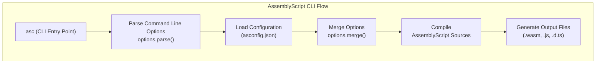
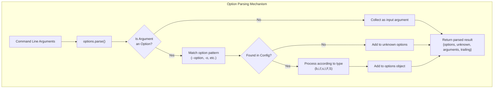
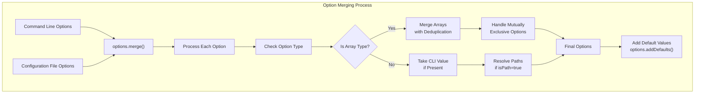

# Command Line Interface (CLI)

<details>
<summary>Relevant source files</summary>

The following files were used as context for generating this wiki page:

- [src/index.ts](https://github.com/AssemblyScript/assemblyscript/blob/4e7734b8/src/index.ts)
- [tests/cli/options.js](https://github.com/AssemblyScript/assemblyscript/blob/4e7734b8/tests/cli/options.js)
- [tests/compiler/import.ts](https://github.com/AssemblyScript/assemblyscript/blob/4e7734b8/tests/compiler/import.ts)
- [tests/compiler/issues/1699.ts](https://github.com/AssemblyScript/assemblyscript/blob/4e7734b8/tests/compiler/issues/1699.ts)
- [util/options.js](https://github.com/AssemblyScript/assemblyscript/blob/4e7734b8/util/options.js)

</details>


This document provides a comprehensive guide to using the AssemblyScript command line interface (CLI), which serves as the primary entry point for compiling AssemblyScript code to WebAssembly. For information about programmatic compilation using the Compiler API, see [Compiler API](#4.1).

## Overview

The AssemblyScript CLI provides a command-line tool for compiling `.ts` files to WebAssembly modules (`.wasm`), along with optional JavaScript bindings and TypeScript definitions. The CLI offers extensive configuration options for controlling the compilation process, optimizations, and output formats.



Sources: [util/options.js:22-96](https://github.com/AssemblyScript/assemblyscript/blob/4e7734b8/util/options.js#L22-L96)

## Basic Usage

The basic syntax for using the AssemblyScript CLI is:

```
asc [options] [entry files]
```

For example, to compile a simple AssemblyScript file:

```
asc assembly/index.ts -o build/output.wasm
```

This compiles `assembly/index.ts` to WebAssembly and writes the output to `build/output.wasm`.

## CLI Options

The AssemblyScript CLI supports various types of options for configuring the compilation process. Options can be specified in the command line or in a configuration file.

### Option Types

The CLI supports the following option types:

| Type | Description | Example |
|------|-------------|---------|
| `b` | Boolean flag | `--optimize` |
| `i` | Integer value | `--optimizeLevel 3` |
| `f` | Float value | `--converge 0.01` |
| `s` | String value | `--outFile output.wasm` |
| `I` | Integer array | `--target 99` (multiple times) |
| `F` | Float array | `--rates 0.1,0.2` |
| `S` | String array | `--importMemory external,mutable` |

Sources: [util/options.js:12-19](https://github.com/AssemblyScript/assemblyscript/blob/4e7734b8/util/options.js#L12-L19)

### Option Parsing

When you run the CLI, it processes command line arguments according to the following flow:



Sources: [util/options.js:22-96](https://github.com/AssemblyScript/assemblyscript/blob/4e7734b8/util/options.js#L22-L96)

## Configuration File

The AssemblyScript CLI supports a configuration file named `asconfig.json` that can be used to specify compiler options. This is particularly useful for projects with many compiler options or for maintaining consistent configurations across builds.

Example `asconfig.json`:

```json
{
  "targets": {
    "debug": {
      "outFile": "build/debug.wasm",
      "textFile": "build/debug.wat",
      "sourceMap": true,
      "debug": true
    },
    "release": {
      "outFile": "build/release.wasm",
      "textFile": "build/release.wat",
      "sourceMap": true,
      "optimize": true
    }
  },
  "options": {
    "bindings": "esm",
    "importMemory": true
  }
}
```

### Option Merging

When both command line arguments and a configuration file are present, the CLI merges these options with command line options taking precedence. This process handles array types, mutually exclusive options, and path resolution.



Sources: [util/options.js:174-235](https://github.com/AssemblyScript/assemblyscript/blob/4e7734b8/util/options.js#L174-L235), [util/options.js:256-262](https://github.com/AssemblyScript/assemblyscript/blob/4e7734b8/util/options.js#L256-L262)

## Path Resolution

The CLI handles paths in options specially, resolving relative paths against the base directory of the configuration file or the current working directory.

### Node Resolution

For certain options, the CLI can use Node.js module resolution to resolve non-relative imports. This is controlled by the `useNodeResolution` property of the option configuration.

Sources: [util/options.js:247-253](https://github.com/AssemblyScript/assemblyscript/blob/4e7734b8/util/options.js#L247-L253)

## Common CLI Options

While the specific options available in the CLI are not directly visible in the provided code, here are some common options:

| Option | Description |
|--------|-------------|
| `--outFile, -o` | Specifies the WebAssembly output file |
| `--textFile, -t` | Specifies the WebAssembly text format output |
| `--bindings` | Generates JavaScript bindings (raw, esm, js) |
| `--optimize, -O` | Enables optimizations |
| `--optimizeLevel` | Sets the optimization level (0-3) |
| `--shrinkLevel` | Sets the shrink level (0-2) |
| `--importMemory` | Imports the memory from the environment |
| `--exportMemory` | Exports the memory to the environment |
| `--debug` | Enables debug information |
| `--sourceMap` | Enables source maps |
| `--target` | Sets the WebAssembly target version |

## Examples

### Basic Compilation

```
asc assembly/index.ts -o build/output.wasm --optimize
```

### Using a Configuration File

```
asc --config asconfig.json
```

### Compiling with a Specific Target

```
asc assembly/index.ts --target release
```

### Generating JavaScript Bindings

```
asc assembly/index.ts -o build/output.wasm --bindings esm
```

## Help Text

The CLI provides detailed help text that can be accessed using:

```
asc --help
```

This displays all available options with their descriptions, grouped by categories if the option has a `category` property.

Sources: [util/options.js:98-141](https://github.com/AssemblyScript/assemblyscript/blob/4e7734b8/util/options.js#L98-L141)

## Summary