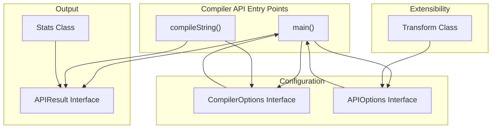
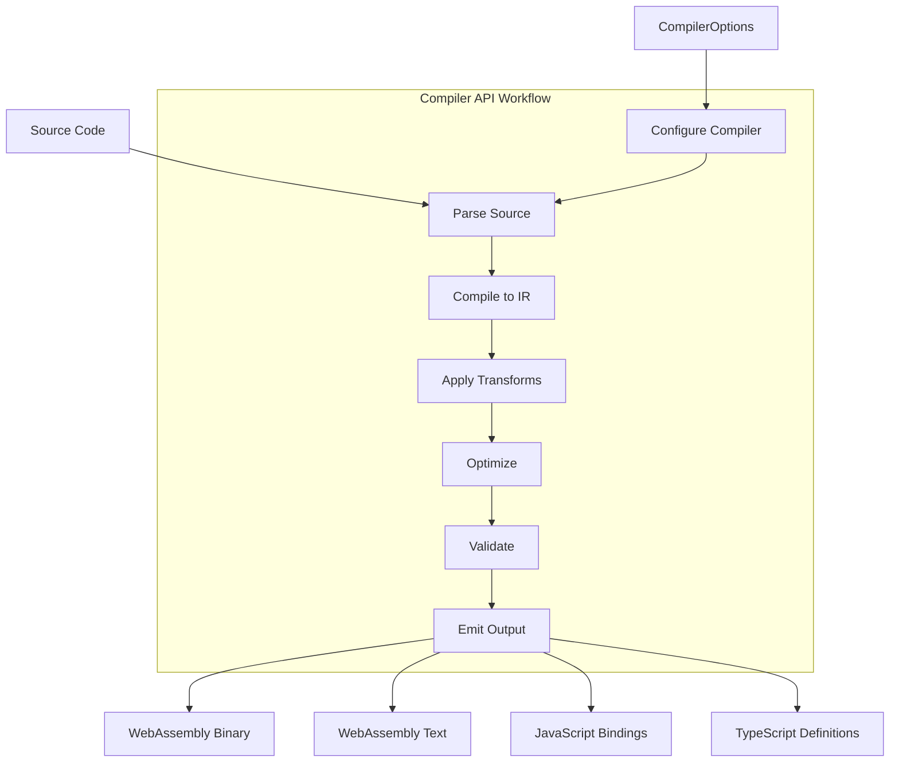
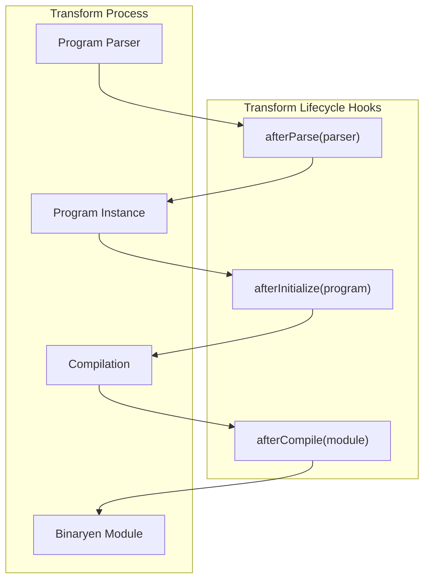

# Compiler API

<details>
<summary>Relevant source files</summary>

The following files were used as context for generating this wiki page:

- [.gitignore](https://github.com/AssemblyScript/assemblyscript/blob/4e7734b8/.gitignore)
- [cli/index.d.ts](https://github.com/AssemblyScript/assemblyscript/blob/4e7734b8/cli/index.d.ts)
- [cli/index.js](https://github.com/AssemblyScript/assemblyscript/blob/4e7734b8/cli/index.js)
- [dist/asc.d.ts](https://github.com/AssemblyScript/assemblyscript/blob/4e7734b8/dist/asc.d.ts)
- [dist/assemblyscript.d.ts](https://github.com/AssemblyScript/assemblyscript/blob/4e7734b8/dist/assemblyscript.d.ts)
- [dist/transform.cjs](https://github.com/AssemblyScript/assemblyscript/blob/4e7734b8/dist/transform.cjs)
- [dist/transform.d.ts](https://github.com/AssemblyScript/assemblyscript/blob/4e7734b8/dist/transform.d.ts)
- [dist/transform.js](https://github.com/AssemblyScript/assemblyscript/blob/4e7734b8/dist/transform.js)
- [scripts/build-dts.js](https://github.com/AssemblyScript/assemblyscript/blob/4e7734b8/scripts/build-dts.js)
- [src/index-wasm.ts](https://github.com/AssemblyScript/assemblyscript/blob/4e7734b8/src/index-wasm.ts)

</details>


The AssemblyScript Compiler API provides programmatic access to the AssemblyScript compiler, allowing developers to integrate the compilation process into their own applications or tools. This page documents the main interfaces and functions that make up the Compiler API.

For information about using the command line interface (CLI) instead, see [Command Line Interface (CLI)](#4).

## Overview

The AssemblyScript Compiler API enables you to compile AssemblyScript code to WebAssembly programmatically from JavaScript applications. The API is exposed through the AssemblyScript package and provides functions to parse AssemblyScript source code, compile it to WebAssembly, and generate JavaScript bindings.



Sources: [cli/index.js:178-139](https://github.com/AssemblyScript/assemblyscript/blob/4e7734b8/cli/index.js#L178-L139), [cli/index.d.ts:79-156](https://github.com/AssemblyScript/assemblyscript/blob/4e7734b8/cli/index.d.ts#L79-L156), [cli/index.d.ts:159-175](https://github.com/AssemblyScript/assemblyscript/blob/4e7734b8/cli/index.d.ts#L159-L175), [cli/index.d.ts:177-187](https://github.com/AssemblyScript/assemblyscript/blob/4e7734b8/cli/index.d.ts#L177-L187)

## Key Functions

### Main Compilation Functions

The API provides two primary functions for compiling AssemblyScript code:

1. **main** - Runs the compiler with specified arguments and options
2. **compileString** - Compiles source strings directly (convenience function)

#### main

The `main` function is the primary entry point for the API. It accepts an array of arguments (similar to command line arguments) or a configuration object, along with additional API options.

```typescript
function main(
  argv: string[] | CompilerOptions, 
  options?: APIOptions
): Promise<APIResult>
```

#### compileString

The `compileString` function provides a simplified interface for compiling AssemblyScript source code directly from strings.

```typescript
function compileString(
  sources: { [key: string]: string } | string, 
  options?: CompilerOptions
): Promise<APIResult & {
  binary: Uint8Array | null,
  text: string | null
}>
```

Sources: [cli/index.js:133-1019](https://github.com/AssemblyScript/assemblyscript/blob/4e7734b8/cli/index.js#L133-L1019), [cli/index.js:116-130](https://github.com/AssemblyScript/assemblyscript/blob/4e7734b8/cli/index.js#L116-L130), [cli/index.d.ts:190-191](https://github.com/AssemblyScript/assemblyscript/blob/4e7734b8/cli/index.d.ts#L190-L191), [cli/index.d.ts:192-198](https://github.com/AssemblyScript/assemblyscript/blob/4e7734b8/cli/index.d.ts#L192-L198)

## Compilation Process

The following diagram illustrates the compilation process when using the Compiler API:



Sources: [cli/index.js:400-1008](https://github.com/AssemblyScript/assemblyscript/blob/4e7734b8/cli/index.js#L400-L1008)

## Configuration Options

The Compiler API provides extensive configuration options through the `CompilerOptions` interface.

### Core Compiler Options

| Option | Type | Description |
|--------|------|-------------|
| `optimize` | boolean | Optimizes the module |
| `optimizeLevel` | number | How much to focus on optimizing code (0-3) |
| `shrinkLevel` | number | How much to focus on shrinking code size (0-2) |
| `noAssert` | boolean | Replaces assertions with just their value without trapping |
| `debug` | boolean | Enables debug information in emitted binaries |
| `noEmit` | boolean | Performs compilation without emitting code |
| `runtime` | string | Specifies the runtime variant to include |
| `noUnsafe` | boolean | Disallows unsafe features in user code |

### Output Options

| Option | Type | Description |
|--------|------|-------------|
| `outFile` | string | WebAssembly output file (.wasm) |
| `textFile` | string | WebAssembly text output file (.wat) |
| `sourceMap` | boolean \| string | Enables source map generation |
| `bindings` | string[] | Specifies the bindings to generate |

### Memory Options

| Option | Type | Description |
|--------|------|-------------|
| `importMemory` | boolean | Imports memory provided as 'env.memory' |
| `noExportMemory` | boolean | Does not export memory as 'memory' |
| `initialMemory` | number | Sets initial memory size in pages |
| `maximumMemory` | number | Sets maximum memory size in pages |
| `sharedMemory` | boolean | Declares memory as shared |
| `memoryBase` | number | Sets start offset of compiler-generated static memory |

Sources: [cli/index.d.ts:79-156](https://github.com/AssemblyScript/assemblyscript/blob/4e7734b8/cli/index.d.ts#L79-L156), [cli/index.js:282-339](https://github.com/AssemblyScript/assemblyscript/blob/4e7734b8/cli/index.js#L282-L339)

## API Options

The `APIOptions` interface provides additional options for the API, allowing customization of I/O operations and other aspects of the compilation process.

```typescript
interface APIOptions {
  stdout?: OutputStream;
  stderr?: OutputStream;
  readFile?: (filename: string, baseDir: string) => (string | null) | Promise<string | null>;
  writeFile?: (filename: string, contents: Uint8Array | string, baseDir: string) => void | Promise<void>;
  listFiles?: (dirname: string, baseDir: string) => (string[] | null) | Promise<string[] | null>;
  reportDiagnostic?: DiagnosticReporter;
  transforms?: Transform[];
}
```

Sources: [cli/index.d.ts:159-175](https://github.com/AssemblyScript/assemblyscript/blob/4e7734b8/cli/index.d.ts#L159-L175), [cli/index.js:137-165](https://github.com/AssemblyScript/assemblyscript/blob/4e7734b8/cli/index.js#L137-L165)

## Transform API

The Transform API allows extending the compilation process with custom transforms. Transforms can be applied at various stages of the compilation process.



### Transform Class

The `Transform` abstract class provides the base for implementing custom transforms:

```typescript
abstract class Transform {
  readonly program: Program;
  readonly binaryen: typeof binaryen;
  readonly baseDir: string;
  readonly stdout: OutputStream;
  readonly stderr: OutputStream;
  readonly log: typeof console.log;
  
  readFile(filename: string, baseDir: string): (string | null) | Promise<string | null>;
  writeFile(filename: string, contents: string | Uint8Array, baseDir: string): void | Promise<void>;
  listFiles(dirname: string, baseDir: string): (string[] | null) | Promise<string[] | null>;
  
  afterParse?(parser: Parser): void | Promise<void>;
  afterInitialize?(program: Program): void | Promise<void>;
  afterCompile?(module: binaryen.Module): void | Promise<void>;
}
```

Sources: [cli/index.d.ts:246-284](https://github.com/AssemblyScript/assemblyscript/blob/4e7734b8/cli/index.d.ts#L246-L284), [cli/index.js:405-468](https://github.com/AssemblyScript/assemblyscript/blob/4e7734b8/cli/index.js#L405-L468), [cli/index.js:470-484](https://github.com/AssemblyScript/assemblyscript/blob/4e7734b8/cli/index.js#L470-L484)

## Diagnostics and Error Handling

The API provides interfaces for diagnostic messages and functions for checking diagnostics:

```typescript
interface DiagnosticMessage {
  code: number;
  category: number;
  message: string;
  range: Range | null;
  relatedRange: Range | null;
}

function checkDiagnostics(
  emitter: Record<string,unknown>, 
  stderr?: OutputStream, 
  reportDiagnostic?: DiagnosticReporter, 
  useColors?: boolean
): boolean;
```

Sources: [cli/index.d.ts:62-74](https://github.com/AssemblyScript/assemblyscript/blob/4e7734b8/cli/index.d.ts#L62-L74), [cli/index.d.ts:201](https://github.com/AssemblyScript/assemblyscript/blob/4e7734b8/cli/index.d.ts#L201)

## Statistics

The `Stats` class provides statistics about the compilation process:

```typescript
class Stats {
  readCount: number;
  writeCount: number;
  parseTime: number;
  parseCount: number;
  compileTime: number;
  compileCount: number;
  emitTime: number;
  emitCount: number;
  validateTime: number;
  validateCount: number;
  optimizeTime: number;
  optimizeCount: number;
  
  begin(): number;
  end(begin: number): number;
  toString(): string;
}
```

Sources: [cli/index.d.ts:204-235](https://github.com/AssemblyScript/assemblyscript/blob/4e7734b8/cli/index.d.ts#L204-L235)

## Usage Examples

### Basic Compilation

This example shows how to compile a simple AssemblyScript program using the `compileString` function:

```javascript
import { compileString } from "assemblyscript/cli";

async function compile() {
  const result = await compileString(`
    export function add(a: i32, b: i32): i32 {
      return a + b;
    }
  `);
  
  if (result.error) {
    console.error(result.error);
  } else {
    console.log("Compilation successful!");
    // Access WebAssembly binary
    const binary = result.binary;
    // Access WebAssembly text format
    const text = result.text;
  }
}
```

### Advanced Compilation

This example demonstrates using the `main` function with custom options and transforms:

```javascript
import { main, Transform } from "assemblyscript/cli";
import * as fs from "fs";
import * as path from "path";

// Custom transform
class MyTransform extends Transform {
  afterParse(parser) {
    console.log("Parsing complete!");
  }
  
  afterCompile(module) {
    console.log("Compilation complete!");
  }
}

async function compile() {
  const options = {
    optimize: true,
    optimizeLevel: 3,
    shrinkLevel: 1,
    outFile: "output.wasm",
    textFile: "output.wat",
    bindings: ["esm"],
    sourceMap: true
  };
  
  const apiOptions = {
    transforms: [new MyTransform()],
    readFile: (filename, baseDir) => {
      try {
        return fs.readFileSync(path.join(baseDir, filename), "utf8");
      } catch (e) {
        return null;
      }
    },
    writeFile: (filename, contents, baseDir) => {
      const dir = path.dirname(path.join(baseDir, filename));
      if (!fs.existsSync(dir)) {
        fs.mkdirSync(dir, { recursive: true });
      }
      if (typeof contents === "string") {
        fs.writeFileSync(path.join(baseDir, filename), contents);
      } else {
        fs.writeFileSync(path.join(baseDir, filename), Buffer.from(contents));
      }
    }
  };
  
  const result = await main(["input.ts", ...Object.entries(options).flat()], apiOptions);
  
  if (result.error) {
    console.error(result.error);
  } else {
    console.log("Compilation successful!");
    console.log(result.stats.toString());
  }
}
```

Sources: [cli/index.js:116-130](https://github.com/AssemblyScript/assemblyscript/blob/4e7734b8/cli/index.js#L116-L130), [cli/index.js:133-139](https://github.com/AssemblyScript/assemblyscript/blob/4e7734b8/cli/index.js#L133-L139)

## Integration with Other Systems

The Compiler API is designed to integrate with various development tools and build systems. Common integration scenarios include:

1. **Build tools** (webpack, rollup, etc.) - Create plugins that use the Compiler API to compile AssemblyScript files during the build process
2. **IDEs and editors** - Provide in-editor compilation and error checking
3. **Online playgrounds** - Enable browser-based compilation and execution
4. **Custom tooling** - Develop specialized tools for AssemblyScript development

The API's promise-based interface and customizable I/O operations make it well-suited for these integration scenarios.

Sources: [cli/index.js:133-1019](https://github.com/AssemblyScript/assemblyscript/blob/4e7734b8/cli/index.js#L133-L1019)

## Underlying CompilerOptions Implementation

The AssemblyScript compiler itself uses a more low-level API for setting compiler options as seen in the internal implementation. The Compiler API provides a high-level wrapper around these functions:

```typescript
// Low-level API example (internal use)
function setTarget(options: Options, target: Target): void
function setRuntime(options: Options, runtime: Runtime): void
function setNoAssert(options: Options, noAssert: bool): void
// ...and many more option setters
```

Sources: [src/index-wasm.ts:54-238](https://github.com/AssemblyScript/assemblyscript/blob/4e7734b8/src/index-wasm.ts#L54-L238)

## Conclusion

The AssemblyScript Compiler API provides a flexible and powerful way to integrate AssemblyScript compilation into JavaScript applications. With its extensive configuration options, transform capabilities, and customizable I/O operations, it enables developers to build sophisticated tooling around AssemblyScript.