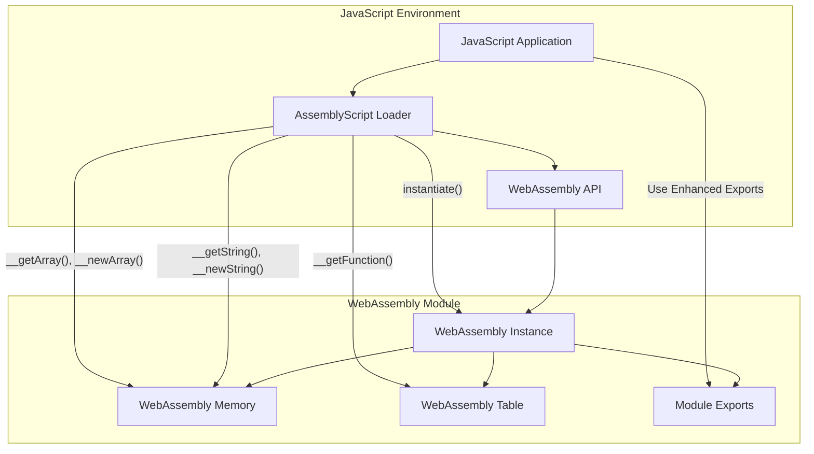
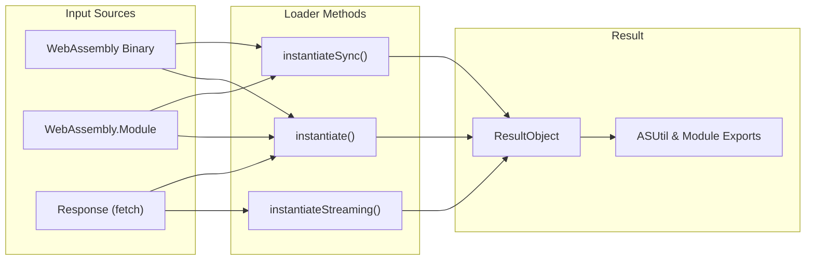
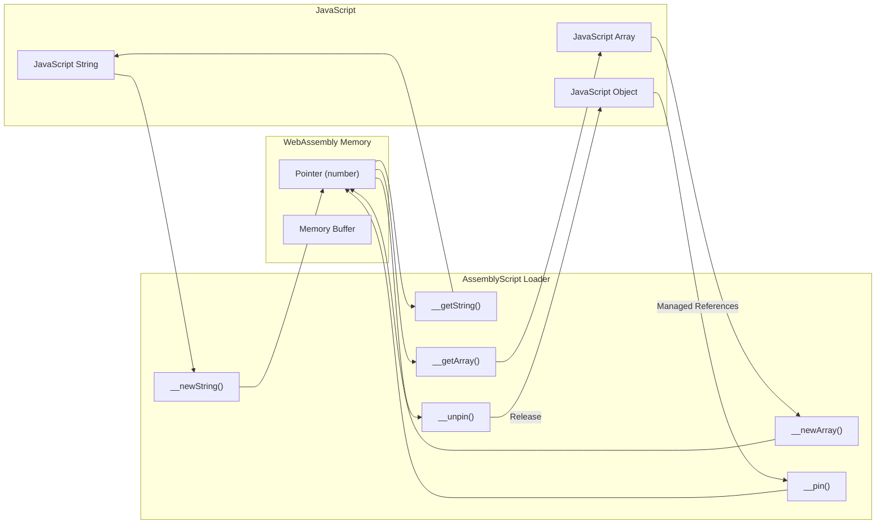
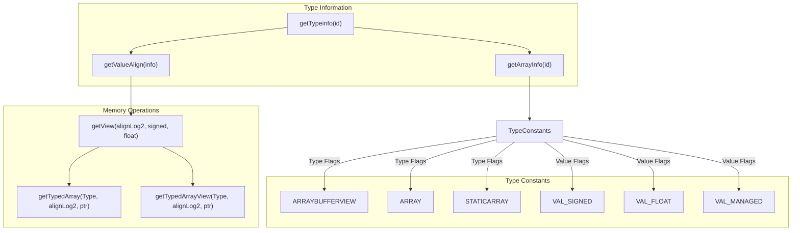
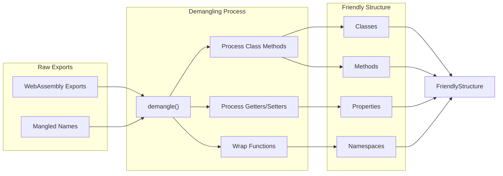

# JavaScript Integration

<details>
<summary>Relevant source files</summary>

The following files were used as context for generating this wiki page:

- [lib/loader/README.md](https://github.com/AssemblyScript/assemblyscript/blob/4e7734b8/lib/loader/README.md)
- [lib/loader/index.d.ts](https://github.com/AssemblyScript/assemblyscript/blob/4e7734b8/lib/loader/index.d.ts)
- [lib/loader/index.js](https://github.com/AssemblyScript/assemblyscript/blob/4e7734b8/lib/loader/index.js)
- [lib/loader/package.json](https://github.com/AssemblyScript/assemblyscript/blob/4e7734b8/lib/loader/package.json)
- [lib/loader/tests/assembly/index.ts](https://github.com/AssemblyScript/assemblyscript/blob/4e7734b8/lib/loader/tests/assembly/index.ts)
- [lib/loader/tests/build/default.wasm](https://github.com/AssemblyScript/assemblyscript/blob/4e7734b8/lib/loader/tests/build/default.wasm)
- [lib/loader/tests/build/legacy.wasm](https://github.com/AssemblyScript/assemblyscript/blob/4e7734b8/lib/loader/tests/build/legacy.wasm)
- [lib/loader/tests/index.html](https://github.com/AssemblyScript/assemblyscript/blob/4e7734b8/lib/loader/tests/index.html)
- [lib/loader/tests/index.js](https://github.com/AssemblyScript/assemblyscript/blob/4e7734b8/lib/loader/tests/index.js)

</details>


This page documents how AssemblyScript modules can be integrated with JavaScript environments, focusing on the mechanisms for instantiating WebAssembly modules and managing data transfer between JavaScript and WebAssembly. For information about JavaScript bindings generation, see [JavaScript Bindings Generator](#5.1).

## Overview

AssemblyScript's JavaScript integration layer provides a bridge between WebAssembly modules compiled from AssemblyScript and JavaScript host environments. This integration is primarily facilitated through the AssemblyScript loader, which handles module instantiation, memory management, and data conversions.

**Note:** The AssemblyScript loader has been deprecated as of AssemblyScript 0.20. It will continue to work for a while, but it's recommended to switch to the new static bindings generation.

The JavaScript integration system solves several key challenges:

1. **Module Instantiation**: Simplifying the process of loading WebAssembly modules
2. **Memory Management**: Facilitating access to the WebAssembly module's memory
3. **Type Conversion**: Converting between JavaScript and AssemblyScript data types
4. **Object Lifetime**: Managing the lifetime of complex objects across the boundary

Sources: [lib/loader/README.md:1-5](https://github.com/AssemblyScript/assemblyscript/blob/4e7734b8/lib/loader/README.md#L1-L5)

## AssemblyScript Loader Architecture

The AssemblyScript loader provides a convenient API for working with AssemblyScript modules. It wraps the WebAssembly API and adds utilities for working with AssemblyScript types.



Sources: [lib/loader/index.js:332-365](https://github.com/AssemblyScript/assemblyscript/blob/4e7734b8/lib/loader/index.js#L332-L365), [lib/loader/index.d.ts:102-118](https://github.com/AssemblyScript/assemblyscript/blob/4e7734b8/lib/loader/index.d.ts#L102-L118)

### Key Components

The loader consists of the following key components:

1. **Instantiation Methods**: Functions for instantiating WebAssembly modules
2. **Memory Access Utilities**: Functions for working with the module's memory
3. **Type Conversion Utilities**: Functions for converting between JavaScript and AssemblyScript types
4. **Export Demangling**: Logic for creating a friendly object structure from module exports

Sources: [lib/loader/index.js:70-446](https://github.com/AssemblyScript/assemblyscript/blob/4e7734b8/lib/loader/index.js#L70-L446)

## Module Instantiation

The loader provides several methods for instantiating AssemblyScript modules:



The loader provides three primary methods for instantiating AssemblyScript modules:

| Method | Description | Usage |
|--------|-------------|-------|
| `instantiate()` | Asynchronously instantiates a module from any source | `await loader.instantiate(fetch("module.wasm"))` |
| `instantiateSync()` | Synchronously instantiates a module from a binary or module | `loader.instantiateSync(wasmBinary)` |
| `instantiateStreaming()` | Asynchronously instantiates a module from a Response | `await loader.instantiateStreaming(fetch("module.wasm"))` |

The instantiation process involves:

1. Pre-instantiation setup (preparing imports)
2. WebAssembly instantiation
3. Post-instantiation processing (enhancing exports)
4. Export demangling (creating a friendly object structure)

Sources: [lib/loader/index.js:332-365](https://github.com/AssemblyScript/assemblyscript/blob/4e7734b8/lib/loader/index.js#L332-L365), [lib/loader/index.d.ts:102-118](https://github.com/AssemblyScript/assemblyscript/blob/4e7734b8/lib/loader/index.d.ts#L102-L118)

### Example Usage

```javascript
import loader from "@assemblyscript/loader";

// Asynchronous instantiation
loader.instantiate(
  fetch("mymodule.wasm"), // WebAssembly binary source
  { /* imports */ }       // Optional imports
).then(({ exports }) => {
  // Use the module's exports with enhanced functionality
  const result = exports.myFunction();
});
```

Sources: [lib/loader/README.md:9-21](https://github.com/AssemblyScript/assemblyscript/blob/4e7734b8/lib/loader/README.md#L9-L21)

## Memory Management and Data Transfer

One of the most important aspects of JavaScript integration is managing memory and transferring data between JavaScript and WebAssembly.



### Memory Utilities

The loader provides a set of utility functions for working with memory:

| Function | Description |
|----------|-------------|
| `__new(size, id)` | Allocates a new instance of given size and id in the module's memory |
| `__pin(ptr)` | Prevents a managed object from being collected by the GC |
| `__unpin(ptr)` | Allows a managed object to be collected by the GC |
| `__collect()` | Performs a full garbage collection cycle |

Sources: [lib/loader/index.js:95-103](https://github.com/AssemblyScript/assemblyscript/blob/4e7734b8/lib/loader/index.js#L95-L103), [lib/loader/index.d.ts:92-99](https://github.com/AssemblyScript/assemblyscript/blob/4e7734b8/lib/loader/index.d.ts#L92-L99)

## Working with Types

### Strings

Converting strings between JavaScript and AssemblyScript requires explicit allocation and retrieval:

| Function | Description |
|----------|-------------|
| `__newString(str)` | Allocates a new string in module memory and returns its pointer |
| `__getString(ptr)` | Gets a string from a pointer in module memory |

The string implementation handles different string sizes efficiently, using optimized approaches for small strings and a more general approach for larger strings:

Sources: [lib/loader/index.js:54-67](https://github.com/AssemblyScript/assemblyscript/blob/4e7734b8/lib/loader/index.js#L54-L67), [lib/loader/index.js:137-147](https://github.com/AssemblyScript/assemblyscript/blob/4e7734b8/lib/loader/index.js#L137-L147), [lib/loader/index.js:161-167](https://github.com/AssemblyScript/assemblyscript/blob/4e7734b8/lib/loader/index.js#L161-L167)

### Arrays

Working with arrays requires knowing the array's type ID to properly interpret the memory:

| Function | Description |
|----------|-------------|
| `__newArray(id, values)` | Allocates a new array with the given type ID and values |
| `__getArray(ptr)` | Copies an array's values from module memory |
| `__getArrayView(ptr)` | Gets a live view on an array's values in module memory |

For typed arrays, specialized functions are available for each array type:

```javascript
// For example, for Int32Array:
__getInt32Array(ptr)      // Copies values
__getInt32ArrayView(ptr)  // Gets a live view
```

Sources: [lib/loader/index.js:191-226](https://github.com/AssemblyScript/assemblyscript/blob/4e7734b8/lib/loader/index.js#L191-L226), [lib/loader/index.js:228-294](https://github.com/AssemblyScript/assemblyscript/blob/4e7734b8/lib/loader/index.js#L228-L294)

### ArrayBuffers

For working with raw binary data:

| Function | Description |
|----------|-------------|
| `__newArrayBuffer(buf)` | Allocates a new ArrayBuffer in module memory |
| `__getArrayBuffer(ptr)` | Copies an ArrayBuffer from module memory |

Sources: [lib/loader/index.js:149-158](https://github.com/AssemblyScript/assemblyscript/blob/4e7734b8/lib/loader/index.js#L149-L158), [lib/loader/index.js:256-261](https://github.com/AssemblyScript/assemblyscript/blob/4e7734b8/lib/loader/index.js#L256-L261)

### Runtime Type Information (RTTI)

The loader uses runtime type information stored in the module to properly interpret and convert between types:



Sources: [lib/loader/index.js:11-28](https://github.com/AssemblyScript/assemblyscript/blob/4e7734b8/lib/loader/index.js#L11-L28), [lib/loader/index.js:113-129](https://github.com/AssemblyScript/assemblyscript/blob/4e7734b8/lib/loader/index.js#L113-L129), [lib/loader/index.js:172-188](https://github.com/AssemblyScript/assemblyscript/blob/4e7734b8/lib/loader/index.js#L172-L188)

## Working with Functions and Classes

### Functions

To work with functions exported from AssemblyScript:

| Function | Description |
|----------|-------------|
| `__getFunction(ptr)` | Gets a function from a pointer containing the table index |

Sources: [lib/loader/index.js:265-272](https://github.com/AssemblyScript/assemblyscript/blob/4e7734b8/lib/loader/index.js#L265-L272)

### Classes and Objects

The loader also handles class instantiation and method calls through a sophisticated export demangling process. This allows JavaScript code to interact with AssemblyScript classes in a more natural way.

For instance, with a class in AssemblyScript:

```typescript
// AssemblyScript
export class Example {
  constructor(public value: i32) {}
  getValue(): i32 { return this.value; }
}
```

The JavaScript code after demangling would be able to:

```javascript
// JavaScript
const example = new exports.Example(42);
console.log(example.getValue()); // 42
```

The demangling process handles:
- Constructor invocation
- Method calls
- Getters and setters
- Static methods

Sources: [lib/loader/index.js:367-446](https://github.com/AssemblyScript/assemblyscript/blob/4e7734b8/lib/loader/index.js#L367-L446)

## Export Demangling

The loader's `demangle` function transforms the raw WebAssembly exports into a more user-friendly structure:



The demangling process:

1. Processes the mangled export names (e.g., `Example#getValue`)
2. Creates class constructors and prototype methods
3. Sets up getters and setters
4. Wraps functions to handle argument length
5. Organizes everything into a hierarchical object structure

Sources: [lib/loader/index.js:367-446](https://github.com/AssemblyScript/assemblyscript/blob/4e7734b8/lib/loader/index.js#L367-L446), [lib/loader/index.d.ts:120-124](https://github.com/AssemblyScript/assemblyscript/blob/4e7734b8/lib/loader/index.d.ts#L120-L124)

## Advanced Usage and Best Practices

### Managing Object Lifetimes

When working with complex objects, it's important to manage their lifetimes to prevent memory leaks:

```javascript
// Pin an object to prevent garbage collection
const ptr = exports.__pin(exports.createObject());

try {
  // Work with the object...
  const result = exports.processObject(ptr);
} finally {
  // Always unpin when done to allow garbage collection
  exports.__unpin(ptr);
}
```

Sources: [lib/loader/README.md:137-147](https://github.com/AssemblyScript/assemblyscript/blob/4e7734b8/lib/loader/README.md#L137-L147)

### Live Views vs. Copying

When working with arrays, there are two approaches:

1. **Copying**: Using `__getArray()` to create a JavaScript copy of the data
2. **Live Views**: Using `__getArrayView()` to get a direct view of the memory

Live views are more efficient but also more dangerous:
- They may become detached if memory grows
- They may reference invalid memory if the array is resized

Sources: [lib/loader/README.md:114-149](https://github.com/AssemblyScript/assemblyscript/blob/4e7734b8/lib/loader/README.md#L114-L149)

### TypeScript Integration

For better type safety, the loader can be used with TypeScript definitions:

```typescript
import type * as MyModule from "myModule"; // points to generated .d.ts
import loader from "@assemblyscript/loader";

loader.instantiate<typeof MyModule>(
  fetch("myModule.wasm")
).then(({ exports }) => {
  // exports is now properly typed
});
```

Sources: [lib/loader/README.md:304-318](https://github.com/AssemblyScript/assemblyscript/blob/4e7734b8/lib/loader/README.md#L304-L318)

## Conclusion

The AssemblyScript loader provides a powerful bridge between JavaScript and WebAssembly modules compiled from AssemblyScript. While deprecated in favor of static bindings, it remains a useful tool for understanding how to integrate AssemblyScript with JavaScript environments.

Key takeaways:
- Use the loader's instantiation methods to load AssemblyScript modules
- Use the provided utility functions to convert between JavaScript and AssemblyScript types
- Manage object lifetimes to prevent memory leaks
- Consider the tradeoffs between convenience and efficiency

For more advanced integration needs, consider using static bindings generation or specialized tools like as-bind.