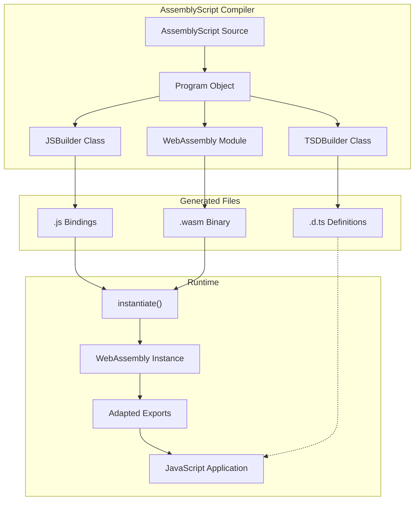
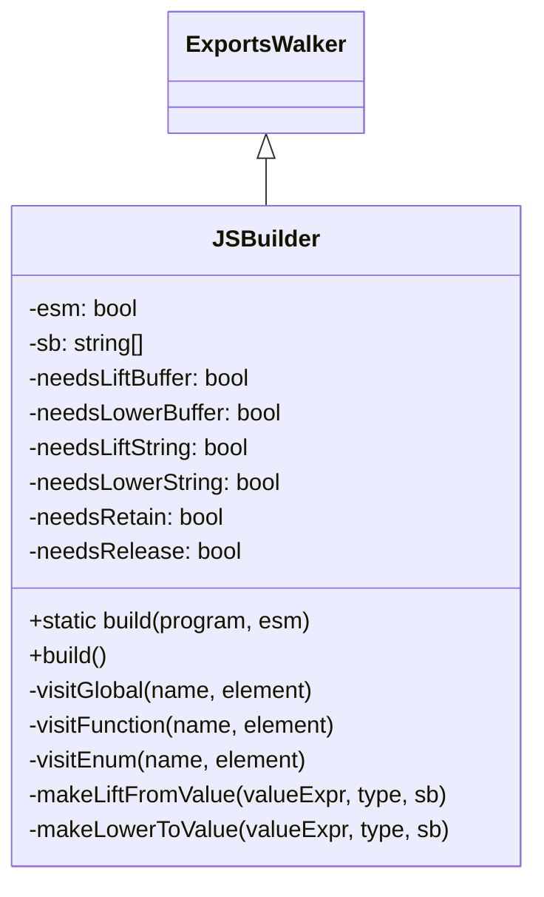
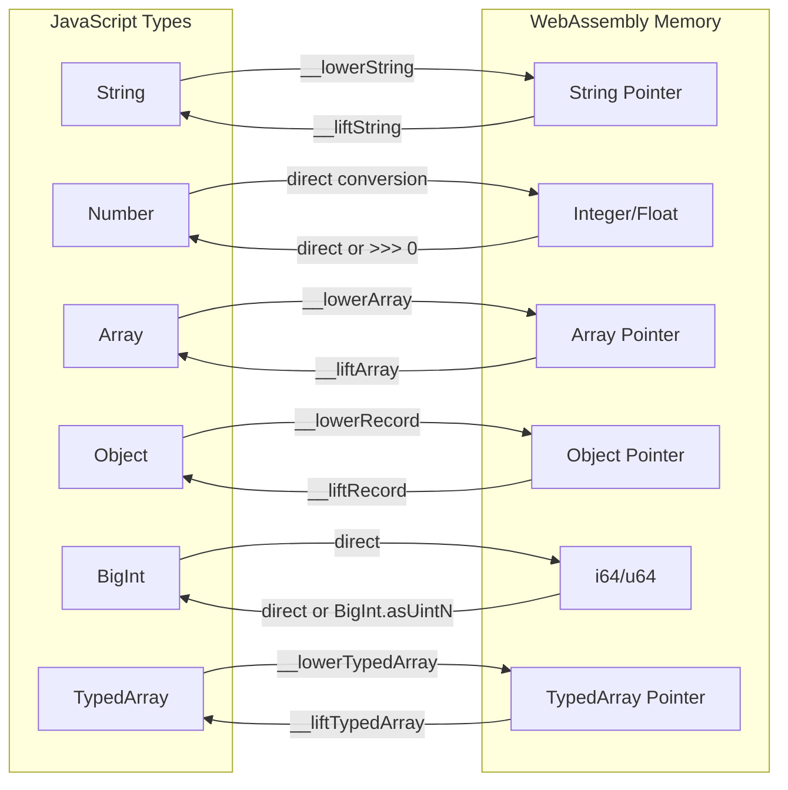
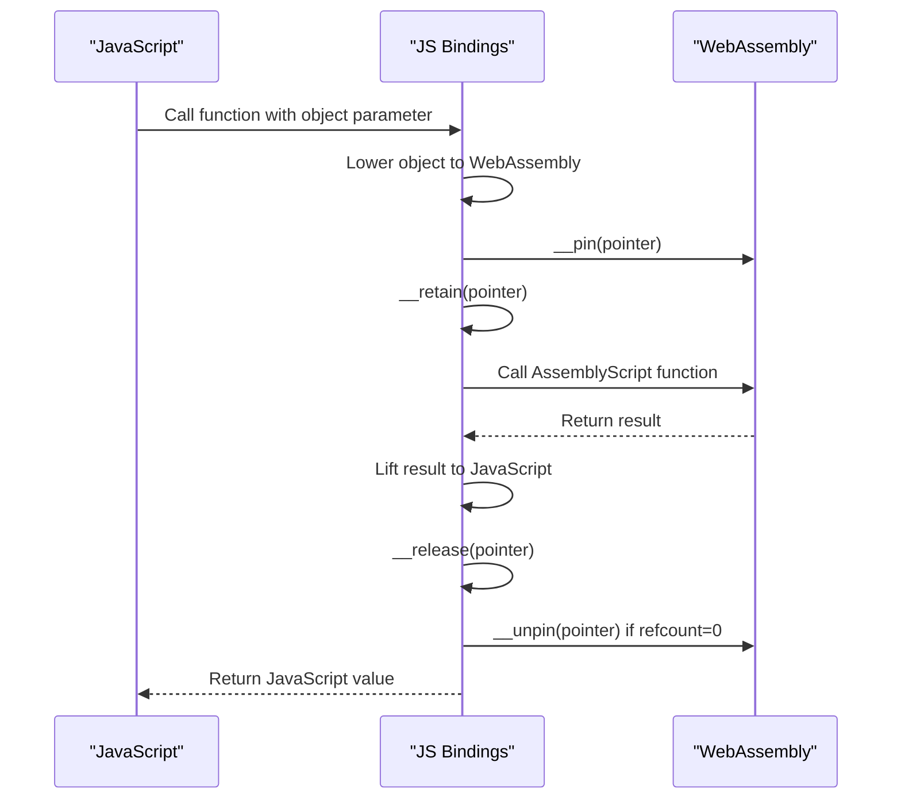
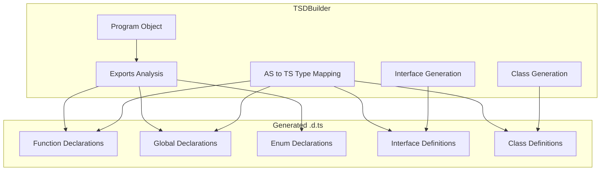

# JavaScript Bindings Generator

<details>
<summary>Relevant source files</summary>

The following files were used as context for generating this wiki page:

- [src/bindings/js.ts](https://github.com/AssemblyScript/assemblyscript/blob/4e7734b8/src/bindings/js.ts)
- [src/bindings/tsd.ts](https://github.com/AssemblyScript/assemblyscript/blob/4e7734b8/src/bindings/tsd.ts)
- [tests/compiler/bindings/esm.debug.d.ts](https://github.com/AssemblyScript/assemblyscript/blob/4e7734b8/tests/compiler/bindings/esm.debug.d.ts)
- [tests/compiler/bindings/esm.debug.js](https://github.com/AssemblyScript/assemblyscript/blob/4e7734b8/tests/compiler/bindings/esm.debug.js)
- [tests/compiler/bindings/esm.release.d.ts](https://github.com/AssemblyScript/assemblyscript/blob/4e7734b8/tests/compiler/bindings/esm.release.d.ts)
- [tests/compiler/bindings/esm.release.js](https://github.com/AssemblyScript/assemblyscript/blob/4e7734b8/tests/compiler/bindings/esm.release.js)
- [tests/compiler/bindings/esm.ts](https://github.com/AssemblyScript/assemblyscript/blob/4e7734b8/tests/compiler/bindings/esm.ts)
- [tests/compiler/bindings/noExportRuntime.debug.js](https://github.com/AssemblyScript/assemblyscript/blob/4e7734b8/tests/compiler/bindings/noExportRuntime.debug.js)
- [tests/compiler/bindings/noExportRuntime.release.js](https://github.com/AssemblyScript/assemblyscript/blob/4e7734b8/tests/compiler/bindings/noExportRuntime.release.js)
- [tests/compiler/bindings/raw.debug.d.ts](https://github.com/AssemblyScript/assemblyscript/blob/4e7734b8/tests/compiler/bindings/raw.debug.d.ts)
- [tests/compiler/bindings/raw.debug.js](https://github.com/AssemblyScript/assemblyscript/blob/4e7734b8/tests/compiler/bindings/raw.debug.js)
- [tests/compiler/bindings/raw.release.d.ts](https://github.com/AssemblyScript/assemblyscript/blob/4e7734b8/tests/compiler/bindings/raw.release.d.ts)
- [tests/compiler/bindings/raw.release.js](https://github.com/AssemblyScript/assemblyscript/blob/4e7734b8/tests/compiler/bindings/raw.release.js)

</details>


## Purpose and Scope

The JavaScript Bindings Generator is a core component of AssemblyScript that automatically generates JavaScript code to interface between WebAssembly modules compiled from AssemblyScript and JavaScript applications. It handles type conversions, memory management, and provides a natural JavaScript API for interacting with AssemblyScript-compiled code. This page documents the structure, functionality, and use of the bindings generator.

For information about integrating AssemblyScript modules with JavaScript applications in general, see [JavaScript Integration](#5).

## Architecture Overview

The JavaScript Bindings Generator consists of two main components:

1. **JSBuilder** - Generates JavaScript code for binding to WebAssembly modules
2. **TSDBuilder** - Generates TypeScript definition files for type safety

### Binding Generation System



Sources: [src/bindings/js.ts:113-1025](https://github.com/AssemblyScript/assemblyscript/blob/4e7734b8/src/bindings/js.ts#L113-L1025), [src/bindings/tsd.ts:37-408](https://github.com/AssemblyScript/assemblyscript/blob/4e7734b8/src/bindings/tsd.ts#L37-L408)

## JSBuilder Class

The `JSBuilder` class is the primary implementation of the JavaScript bindings generator. It extends the `ExportsWalker` class to traverse the AssemblyScript program's exports and generate appropriate JavaScript code.



Sources: [src/bindings/js.ts:113-168](https://github.com/AssemblyScript/assemblyscript/blob/4e7734b8/src/bindings/js.ts#L113-L168)

## Binding Generation Process

The binding generation process follows these key steps:

1. Instantiate the `JSBuilder` with the AssemblyScript program and ESM option
2. Walk through all exports in the program
3. Generate code for each export based on its type (function, global, enum)
4. Generate helper functions for type conversions and memory management
5. Assemble all generated code into a JavaScript file

### Generated Structure

The generated JavaScript file follows this basic structure:

```javascript
async function instantiate(module, imports = {}) {
  // 1. Set up adapted imports with instrumentation
  const adaptedImports = { /* ... */ };
  
  // 2. Instantiate the WebAssembly module
  const { exports } = await WebAssembly.instantiate(module, adaptedImports);
  
  // 3. Create an object wrapping the raw exports
  const adaptedExports = Object.setPrototypeOf({
    // Exported functions, globals, etc. with proper JavaScript bindings
  }, exports);
  
  // 4. Helper functions for type conversions
  function __liftString(pointer) { /* ... */ }
  function __lowerString(value) { /* ... */ }
  // ...more helper functions
  
  // 5. Return the adapted exports
  return adaptedExports;
}

// For ESM modules: export the bindings
export const {
  // Named exports
} = await instantiate(/* ... */);
```

Sources: [src/bindings/js.ts:520-1025](https://github.com/AssemblyScript/assemblyscript/blob/4e7734b8/src/bindings/js.ts#L520-L1025), [tests/compiler/bindings/esm.debug.js:1-562](https://github.com/AssemblyScript/assemblyscript/blob/4e7734b8/tests/compiler/bindings/esm.debug.js#L1-L562)

## Type Conversions

A crucial aspect of the bindings is converting between WebAssembly and JavaScript value representations. This is handled through two primary operations:

1. **Lifting** - Converting WebAssembly values to JavaScript values
2. **Lowering** - Converting JavaScript values to WebAssembly values



### Supported Type Conversions

| AssemblyScript Type | JavaScript Type | Lifting Function | Lowering Function |
|--------------------|-----------------|------------------|-------------------|
| `i8`, `i16`, `i32`, `f32`, `f64` | `number` | Direct | Direct |
| `u32` | `number` | `value >>> 0` | Direct |
| `i64`, `u64` | `bigint` | `BigInt.asIntN/asUintN` | Direct |
| `bool` | `boolean` | `!!value` | `value ? 1 : 0` |
| `string` | `string` | `__liftString` | `__lowerString` |
| `ArrayBuffer` | `ArrayBuffer` | `__liftBuffer` | `__lowerBuffer` |
| `Array<T>` | `Array<T>` | `__liftArray` | `__lowerArray` |
| `TypedArray` | `TypedArray` | `__liftTypedArray` | `__lowerTypedArray` |
| `StaticArray<T>` | `ArrayLike<T>` | `__liftStaticArray` | `__lowerStaticArray` |
| Plain objects | Plain objects | `__liftRecord` | `__lowerRecord` |
| Other objects | `Internref` | `__liftInternref` | `__lowerInternref` |

Sources: [src/bindings/js.ts:692-846](https://github.com/AssemblyScript/assemblyscript/blob/4e7734b8/src/bindings/js.ts#L692-L846), [tests/compiler/bindings/esm.debug.js:262-367](https://github.com/AssemblyScript/assemblyscript/blob/4e7734b8/tests/compiler/bindings/esm.debug.js#L262-L367)

## Memory Management

The JavaScript bindings include a reference counting mechanism to manage object lifetimes across the JavaScript/WebAssembly boundary:



### Memory Management Helpers

The bindings generator includes these key memory management functions:

- `__retain(pointer)` - Increments reference count for a pointer
- `__release(pointer)` - Decrements reference count and unpins if zero
- `__pin(pointer)` - Pins an object in memory to prevent garbage collection
- `__unpin(pointer)` - Unpins an object, allowing garbage collection

For JavaScript objects that reference AssemblyScript objects, the bindings use `FinalizationRegistry` to automatically release the reference when the JavaScript object is garbage collected.

Sources: [src/bindings/js.ts:853-894](https://github.com/AssemblyScript/assemblyscript/blob/4e7734b8/src/bindings/js.ts#L853-L894), [tests/compiler/bindings/esm.debug.js:371-387](https://github.com/AssemblyScript/assemblyscript/blob/4e7734b8/tests/compiler/bindings/esm.debug.js#L371-L387)

## TypeScript Definition Generation

The `TSDBuilder` class generates TypeScript definition files (.d.ts) that provide type information for the JavaScript bindings:



### Type Mapping

The `toTypeScriptType` method maps AssemblyScript types to TypeScript types:

| AssemblyScript Type | TypeScript Type |
|---------------------|-----------------|
| `bool` | `boolean` |
| `i8`, `i16`, `i32`, `u8`, `u16`, `u32`, `f32`, `f64` | `number` |
| `i64`, `u64` | `bigint` |
| `string` | `string` |
| `ArrayBuffer` | `ArrayBuffer` |
| `Array<T>` | `Array<T>` |
| `StaticArray<T>` | `ArrayLike<T>` |
| TypedArrays | Corresponding TypeScript TypedArrays |
| Plain classes | Interfaces (`__RecordN<T>`) |
| Other classes | Class declarations (`__InternrefN`) |

Sources: [src/bindings/tsd.ts:262-350](https://github.com/AssemblyScript/assemblyscript/blob/4e7734b8/src/bindings/tsd.ts#L262-L350), [tests/compiler/bindings/esm.debug.d.ts:1-209](https://github.com/AssemblyScript/assemblyscript/blob/4e7734b8/tests/compiler/bindings/esm.debug.d.ts#L1-L209)

## Examples

### Basic Example

```javascript
// AssemblyScript code
export function add(a: i32, b: i32): i32 {
  return a + b;
}

// Generated JavaScript binding
export function add(a, b) {
  // Direct conversion for numeric types
  return exports.add(a, b);
}
```

### String Handling Example

```javascript
// AssemblyScript code
export function concat(a: string, b: string): string {
  return a + b;
}

// Generated JavaScript binding
export function concat(a, b) {
  // Convert JS strings to WebAssembly strings
  a = __retain(__lowerString(a) || __notnull());
  b = __lowerString(b) || __notnull();
  try {
    // Call the WebAssembly function and convert result back to JS string
    return __liftString(exports.concat(a, b) >>> 0);
  } finally {
    // Release the retained reference
    __release(a);
  }
}
```

### Object Example

```javascript
// AssemblyScript code
export class Point {
  x: i32;
  y: i32;
}

export function createPoint(x: i32, y: i32): Point {
  const pt = new Point();
  pt.x = x;
  pt.y = y;
  return pt;
}

// Generated TypeScript definition
declare interface __Record1<TOmittable> {
  /** @type `i32` */
  x: number | TOmittable;
  /** @type `i32` */
  y: number | TOmittable;
}

// Generated JavaScript binding function
export function createPoint(x, y) {
  return __liftRecord1(exports.createPoint(x, y) >>> 0);
}
```

Sources: [tests/compiler/bindings/esm.debug.js:83-213](https://github.com/AssemblyScript/assemblyscript/blob/4e7734b8/tests/compiler/bindings/esm.debug.js#L83-L213), [tests/compiler/bindings/esm.debug.d.ts:55-198](https://github.com/AssemblyScript/assemblyscript/blob/4e7734b8/tests/compiler/bindings/esm.debug.d.ts#L55-L198)

## Limitations and Considerations

1. **Class Support**: Complex class hierarchies with inheritance are not fully supported. Plain classes are represented as interfaces, while classes with constructors or private members are represented as opaque reference types.

2. **Memory Management**: Care must be taken when working with object references. The reference counting system helps manage memory, but circular references between JavaScript and WebAssembly can cause leaks.

3. **Internref Handling**: Objects that can't be directly represented as plain JavaScript objects are exposed as opaque references through a custom `Internref` class.

4. **Performance**: Type conversions add overhead compared to direct WebAssembly calls. For performance-critical code, consider using simpler types or raw WebAssembly exports.

5. **Module Linking**: Linking two instrumented modules produces intermediate garbage. A native mechanism for direct communication between modules would improve efficiency.

Sources: [src/bindings/js.ts:52-99](https://github.com/AssemblyScript/assemblyscript/blob/4e7734b8/src/bindings/js.ts#L52-L99)

## Integration with AssemblyScript Compiler

The binding generator is integrated into the AssemblyScript compiler pipeline and can be configured through compiler options:

- `--bindings esm` - Generate ECMAScript module bindings (default)
- `--bindings raw` - Generate CommonJS bindings
- `--exportStart` - Specify a function to call upon module instantiation
- `--exportRuntime` - Export runtime functions like `__new`, `__pin`, etc.

The binding generator will automatically detect which helper functions are needed based on the types used in exports and generate only the necessary code.