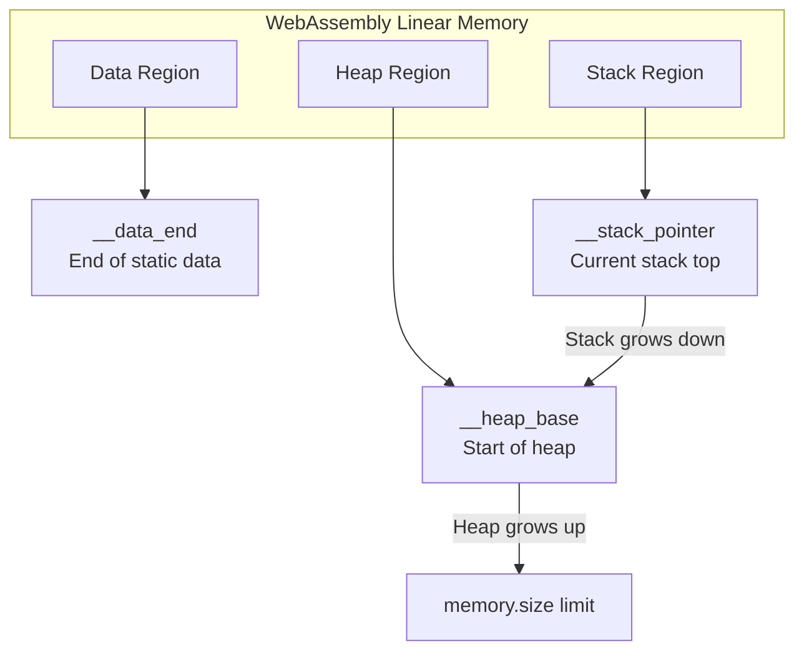
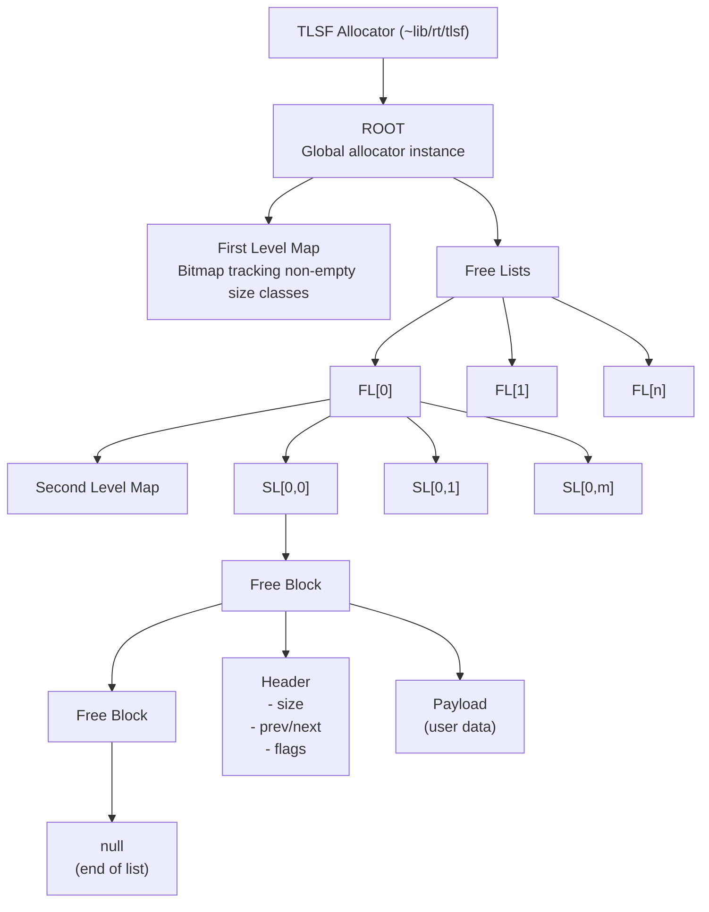
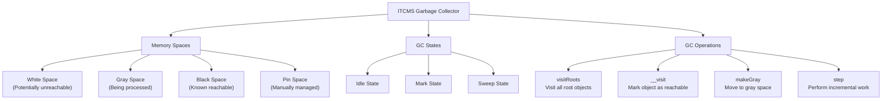
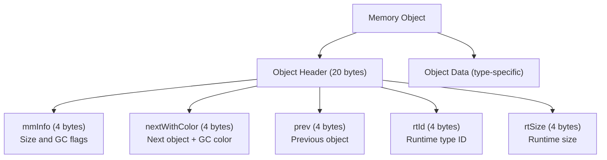

# Memory Management

<details>
<summary>Relevant source files</summary>

The following files were used as context for generating this wiki page:

- [std/assembly/polyfills.ts](https://github.com/AssemblyScript/assemblyscript/blob/4e7734b8/std/assembly/polyfills.ts)
- [tests/compiler/builtins.debug.wat](https://github.com/AssemblyScript/assemblyscript/blob/4e7734b8/tests/compiler/builtins.debug.wat)
- [tests/compiler/builtins.release.wat](https://github.com/AssemblyScript/assemblyscript/blob/4e7734b8/tests/compiler/builtins.release.wat)
- [tests/compiler/issues/2622.debug.wat](https://github.com/AssemblyScript/assemblyscript/blob/4e7734b8/tests/compiler/issues/2622.debug.wat)
- [tests/compiler/issues/2622.json](https://github.com/AssemblyScript/assemblyscript/blob/4e7734b8/tests/compiler/issues/2622.json)
- [tests/compiler/issues/2622.release.wat](https://github.com/AssemblyScript/assemblyscript/blob/4e7734b8/tests/compiler/issues/2622.release.wat)
- [tests/compiler/issues/2622.ts](https://github.com/AssemblyScript/assemblyscript/blob/4e7734b8/tests/compiler/issues/2622.ts)
- [tests/compiler/issues/2622/_a.ts](https://github.com/AssemblyScript/assemblyscript/blob/4e7734b8/tests/compiler/issues/2622/_a.ts)
- [tests/compiler/std/dataview.debug.wat](https://github.com/AssemblyScript/assemblyscript/blob/4e7734b8/tests/compiler/std/dataview.debug.wat)
- [tests/compiler/std/dataview.release.wat](https://github.com/AssemblyScript/assemblyscript/blob/4e7734b8/tests/compiler/std/dataview.release.wat)

</details>


This wiki page describes how memory is organized, allocated, tracked, and reclaimed in AssemblyScript. It covers the core memory management systems that enable safe and efficient memory usage in AssemblyScript programs. For information about specific memory operations like `memcpy` and logical operations, see [Memory Operations](#6.1).

## Overview

AssemblyScript's memory management consists of several integrated components:

1. **WebAssembly Linear Memory Model**: The fundamental memory architecture
2. **Memory Layout**: Organization of data, stack, and heap regions
3. **Memory Allocation**: Two-Level Segregated Fit (TLSF) algorithm for efficient allocation
4. **Garbage Collection**: Incremental Tri-Color Mark and Sweep (ITCMS) for automatic memory reclamation
5. **Runtime Safety Features**: Bounds checking and reference tracking

Sources: `tests/compiler/std/dataview.release.wat`, `tests/compiler/builtins.debug.wat`

## WebAssembly Memory Model

AssemblyScript, like all WebAssembly modules, uses a linear memory model - a contiguous array of bytes addressable from 0 to the memory size.

### Memory Layout Diagram



The memory consists of three main regions:
- **Data Region**: Contains static data such as string literals and constants
- **Stack Region**: Used for local variables and function call frames
- **Heap Region**: Used for dynamic allocations (objects, arrays, etc.)

Key global variables track memory boundaries:
- `__data_end`: End of the static data section
- `__stack_pointer`: Current top of the stack, updated during function calls
- `__heap_base`: Start of the heap region, where dynamic allocations begin

Sources: `tests/compiler/builtins.debug.wat:60-62`

## Memory Allocation System (TLSF)

AssemblyScript uses the Two-Level Segregated Fit (TLSF) algorithm for memory allocation, providing O(1) time complexity for allocation and deallocation operations.

### TLSF Architecture Diagram



The key components of the TLSF allocator:

1. **ROOT**: The global allocator instance that manages all memory
2. **First Level**: Divides memory into major size classes (powers of 2)
3. **Second Level**: Further divides each size class into smaller ranges
4. **Free Lists**: Linked lists of available memory blocks for each size class
5. **Blocks**: Memory chunks with headers containing metadata

Primary operations:
- `removeBlock`: Removes a block from the free lists
- `insertBlock`: Inserts a block into the appropriate free list
- `allocateBlock`: Finds and allocates a suitable memory block
- `freeBlock`: Returns a block to the free lists

Sources: `tests/compiler/std/dataview.release.wat:257-648`

## Garbage Collection (ITCMS)

AssemblyScript uses an Incremental Tri-Color Mark and Sweep (ITCMS) garbage collector to automatically reclaim memory that's no longer in use.

### ITCMS Architecture Diagram



The ITCMS uses a tri-color marking scheme to track object reachability:
- **White**: Objects that might be garbage
- **Gray**: Objects being processed (marked but children not yet processed)
- **Black**: Objects known to be reachable

Garbage collection proceeds through these phases:
1. **Mark Phase**: Starting from roots (globals, stack), identify all reachable objects
2. **Sweep Phase**: Free unreachable (white) objects
3. **Flip**: Swap white and black spaces for the next cycle

The collector works incrementally to avoid long pauses, performing a small amount of work per step.

Sources: `tests/compiler/std/dataview.release.wat:20-27`, `tests/compiler/std/dataview.release.wat:54-271`

## Object Memory Layout

All heap objects in AssemblyScript follow a consistent memory layout with a header followed by the object's data.

### Object Memory Layout Diagram



The 20-byte object header contains:
- Memory management information (size and GC flags)
- Doubly-linked list pointers for garbage collection
- Runtime type information for type checking and inheritance
- Size information used by the runtime

Different types have specialized layouts after the header:
- **String**: Length followed by character data
- **Array**: Length followed by element data
- **ArrayBuffer**: ByteLength followed by raw bytes
- **Class**: Fields in declaration order

Sources: `tests/compiler/std/dataview.debug.wat:224-227`, `tests/compiler/std/dataview.release.wat:111-116`

## Runtime Memory Operations

AssemblyScript provides low-level memory operations through WebAssembly instructions:

| Operation | Description | Examples |
|-----------|-------------|----------|
| Load | Read from memory | `i32.load`, `i64.load`, `f32.load`, `f64.load` |
| Store | Write to memory | `i32.store`, `i64.store`, `f32.store`, `f64.store` |
| Size | Get memory size | `memory.size` |
| Grow | Increase memory | `memory.grow` |

Example usage from builtins test:
```wat
// Load value from memory
i32.const 8
i32.load
global.set $builtins/i

// Store value to memory
i32.const 8
global.get $builtins/i
i32.store
```

The runtime also provides specialized load/store variants for different sizes (8-bit, 16-bit, 32-bit, 64-bit) and signedness (signed, unsigned).

Sources: `tests/compiler/builtins.release.wat:446-524`

## Memory Safety Features

AssemblyScript implements several memory safety features to prevent common memory-related bugs:

### Bounds Checking

Array and buffer accesses are automatically bounds-checked to prevent buffer overflows:

```wat
// Simplified bounds check
local.get $index
local.get $array_length
i32.ge_u
if
  // Throw "Index out of range" error
  i32.const 1248  // Error message pointer
  i32.const 1312  // File name pointer
  i32.const 21    // Line number
  i32.const 28    // Column number
  call $~lib/builtins/abort
  unreachable
end
```

### Stack Overflow Prevention

The runtime checks for stack overflows before function execution:

```wat
global.get $~lib/memory/__stack_pointer
global.get $~lib/memory/__data_end
i32.lt_s
if
  // Throw stack overflow error
  call $~lib/builtins/abort
  unreachable
end
```

Sources: `tests/compiler/builtins.debug.wat:387-398`

### Reference Counting and Type Safety

The runtime maintains reference counts for objects and performs type checking operations to ensure type safety. This helps prevent issues like use-after-free and invalid casts.

Sources: `tests/compiler/issues/2622.release.wat:42-78`

## Memory Polyfills

AssemblyScript provides polyfills for common memory operations that aren't natively available in WebAssembly:

```typescript
// Byte swap implementation example
export function bswap<T extends number>(value: T): T {
  if (isInteger<T>()) {
    if (sizeof<T>() == 1) {
      return value;
    }
    if (sizeof<T>() == 2) {
      return <T>(<u16>value << 8 | (<u16>value >> 8));
    }
    // Additional implementations for 4 and 8 bytes...
  }
  ERROR("Unsupported generic type");
}
```

These polyfills provide optimized implementations of operations that would otherwise require multiple WebAssembly instructions.

Sources: `std/assembly/polyfills.ts:1-27`

## Integration with the Runtime

The memory management system is tightly integrated with the AssemblyScript runtime. Programs compiled with AssemblyScript automatically have memory management code included, handling allocation, tracking, and deallocation without manual intervention.

When objects are created (e.g., using `new`), the compiler generates code to:
1. Allocate the appropriate memory using TLSF
2. Initialize the object header with type information
3. Add the object to the garbage collection system
4. Initialize the object's fields